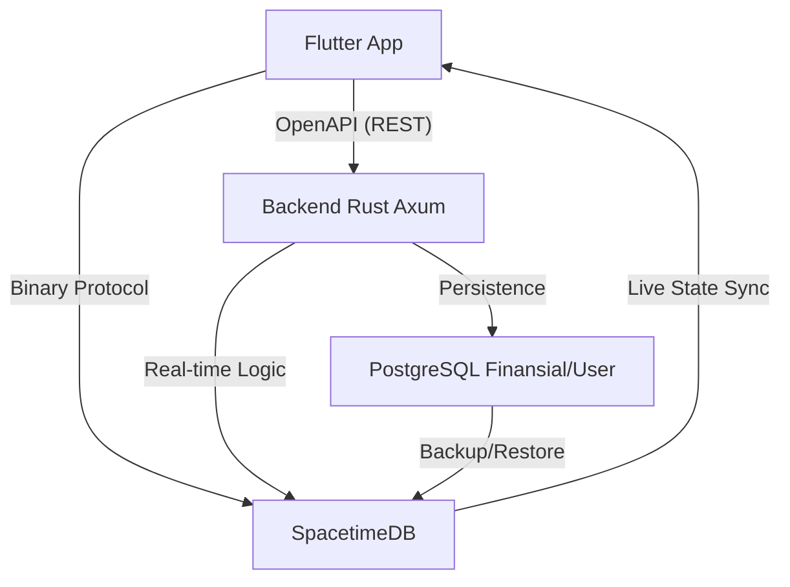

# Directory Structure
```
docs/
  AI-SPECS.md
  ECONOMICS.md
  GOVERNANCE.md
  STORAGE.md
README.md
repomix.config.json
SCREEN-LIST.md
TECHNICAL.md
WHITEPAPER.md
```

# Files

## File: README.md
````markdown
<div align="center">

# 🦀 SiapAja.id: The Ultra-Fast Real-time Gig Economy
**"Scroll medsos dapet duit. 0% Komisi. Tanpa Iuran Anggota. 100% Keadilan."**

[](#)
[](#)
[](#)
[](#)
[](#)
[](https://www.gnu.org/licenses/agpl-3.0)
[](#)

[Whitepaper (WIP)](#) • [Discord Devs](#) • [App Demo](#) • [Mulai Bertransaksi](#)

</div>

---

Selamat datang di *Ground Zero* pemberontakan gig economy. Repository ini bukan sekadar *source code* aplikasi ojol atau marketplace jasa biasa. Ini adalah **senjata digital** yang dibangun menggunakan performa brutal dari **Rust**, dan antarmuka mobile modern dari **Flutter**, serta real-time sync super cepat dari **SpacetimeDB**. 

Kita membangun platform di mana **komisi 0% untuk rakyat kecil**, tanpa beban Simpanan Pokok atau Wajib. Keanggotaan didapat murni dari partisipasi. Setiap baris kode atau setiap job yang diselesaikan diubah menjadi **Pamor Equity** (Kepemilikan Berbasis Kontribusi).

---

## BAB 1: ✊ Manifesto & Filosofi (Kenapa Kita Ada?)

### 1.1. Krisis Gig Economy Saat Ini
Kalian sadar nggak kalau sistem ojol dan platform *freelance* hari ini sudah berubah jadi mandor digital yang kejam? 
*   **Eksploitasi 30%:** Dulu narik 8 jam bisa bawa pulang Rp300rb. Sekarang 12 jam di jalan cuma dapet Rp100rb karena dipotong komisi aplikasi, biaya layanan, biaya platform, sampai biaya "gacor".
*   **Ilusi Kemitraan:** Dipanggil "Mitra", tapi nggak punya hak suara. Kalau kena *suspend* sepihak oleh algoritma, pekerja nggak bisa bela diri. 
*   **Fenomena "Santo Suruh":** Publik akhirnya mulai balik ke cara konvensional (pesan jasa lewat WA/offline) karena muak dengan harga aplikasi yang makin mahal, tapi pekerjanya makin miskin.

**Manifesto Kita:** 
> *"Platform digital seharusnya menjadi infrastruktur publik layaknya jalan tol. Jalan tol memfasilitasi kendaraan, bukan meminta jatah preman 30% dari gaji supirnya."*

### 1.2. The SiapAja Solution (Demand-Only Feed)
Platform sebelah isinya katalog jasa. Tukang AC, *driver*, dan *cleaner* harus banting harga dan bayar iklan biar jasanya dilirik. 

SiapAja.id membalik logika itu. Kita pakai sistem **Demand-Only Feed** yang bentuknya persis kayak timeline X/Threads. Isinya bukan orang pamer liburan, tapi kumpulan orang di radius 5km yang teriak: *"Genset mati nih, siapa bisa benerin sekarang? Budget Rp200.000!"* Jagoan tinggal *scroll*, nemu yang cocok, klik "Terima", dan langsung berangkat.

### 1.3. Zero-Commission & Tiered Scalability

> **📋 Source of Truth:** Untuk detail lengkap fee structure, distribution, dan escrow system, lihat [ECONOMICS.md](./docs/ECONOMICS.md)

Platform tetap gratis buat rakyat kecil. Tapi untuk menjaga keberlanjutan infrastruktur, kita menerapkan **Tiered Fee** hanya untuk transaksi kelas menengah ke atas:

| Budget Pekerjaan | Fee Platform | Beban Biaya (Pembuat Job : Jagoan)
|------------------|--------------|--------------------------------
| Dibawah Rp500.000 | **3%** | 100% Pembuat Job (Jagoan 0% Fee)
| Rp500rb - Rp2jt | **5%** | 50% Pembuat Job : 50% Jagoan
| Rp2jt - Rp10jt | **7.5%** | 50% Pembuat Job : 50% Jagoan
| Diatas Rp10jt | **10%** | 50% Pembuat Job : 50% Jagoan

**Alokasi Fee Platform (The Distribution):**
* **Community Treasury (Koperasi):** Menerima 100% surplus Platform Fee untuk SHU Anggota.
* **Technology Service (Solidarity-ID):** Dibayar berdasarkan penggunaan (SA-TEV) dan Lisensi IP tahunan.

**Untuk transaksi di bawah Rp500.000, Jagoan tetap terima 100% UTUH.**
Fee untuk transaksi besar dibebankan secara *adil* ke kedua belah pihak (split fee), bukan cuma memeras Jagoan.

### 1.4. Anti-Bakar Duit (Guerrilla Bootstrapping)
Kita nggak punya VC (*Venture Capitalist*) yang ngasih triliunan buat bakar duit ngasih promo diskon. Dan kita emang nggak butuh.
Strategi kita adalah **Hyper-Local Density**. Kita nggak akan rilis se-Indonesia sekaligus. Kita kuasai satu kecamatan dulu, sampai semua ibu-ibu dan pemuda nongkrong di kecamatan itu pakai aplikasi ini. Kalau satu ekosistem lokal sudah nyala, dia akan membiayai pertumbuhannya sendiri.

---

## BAB 2: 🚀 Konsep Utama & Killer Features

### 2.1. Timeline "Pay-to-Post" (Anti-Spam Mutlak)
Di sini, nggak ada cerita "Pembuat Job PHP" atau nanya-nanya doang trus ngilang. 
Mau bikin postingan butuh bantuan? **Duitnya harus di-lock di depan.** Kalau budget kerjaannya Rp100.000, sistem akan narik saldo Rp100.000 itu detik itu juga dan dikunci di *Virtual Escrow*. Feed kita 100% berisi duit mateng. Begitu Jagoan klik "Selesai", dana otomatis cair. 

### 2.2. Ultra-Fast State Sync
Data sinkron instan, tanpa loading, secepat aplikasi chat. User cuma lihat saldo "Rupiah", tapi di belakang layar sistem mengelola Virtual Ledger dengan latensi milidetik. Semua perubahan langsung terpropagasi ke semua client tanpa polling. *Magic!*

### 2.3. AI Man-Power Estimator (Perlindungan K3)

> **📋 Source of Truth:** Untuk detail lengkap AI pipeline, LLM models, dan JSON schemas, lihat [AI-SPECS.md](./docs/AI-SPECS.md)

Sering terjadi: Pembuat Job pelit minta pindahan kosan 3 lantai, barangnya ada kulkas 2 pintu, tapi bayarnya cuma buat 1 orang.
Di SiapAja.id, **text-only LLM** (via OpenRouter API) membaca postingan untuk ekstraksi terstruktur.
*   **Output AI:** *"Deteksi beban >70kg + Tangga. Risiko cedera tinggi. Pekerjaan ini wajib dikerjakan minimal 3 Jagoan. Harga dasar dikunci di Rp350.000."*
*   Sistem menolak postingan jika Pembuat Job memaksa menawar di bawah *Price Floor* (Harga Bawah) yang sudah dihitung AI. Kita jaga tulang punggung Jagoan!

### 2.4. Pembentukan Tim Otomatis (Squad Formation)

> **📋 Source of Truth:** Untuk detail lengkap squad formation logic dan threshold, lihat [AI-SPECS.md](./docs/AI-SPECS.md)

Kalau AI mendeteksi butuh 3 orang untuk angkat lemari raksasa, sistem nggak akan nge-lempar kerjaan ini ke 1 orang. Sistem otomatis bikin "Lobby" pencarian 3 Jagoan terdekat. Begitu 3 orang kumpul, mereka jalan bareng. Setelah kerjaan selesai, Virtual Ledger otomatis memecah pembayaran ke 3 akun Jagoan tersebut secara adil dalam waktu milidetik. Nggak ada lagi rebutan jatah di lapangan.

---

## BAB 3: 🏗️ Arsitektur "God Mode" (The Tech Stack)

### 3.1. Filosofi Pemilihan Stack
Kita punya satu prinsip: **"Performance of C++, Safety of Rust, Speed of SpacetimeDB, Modern Mobile with Flutter."**
Kita nggak mau bakar duit puluhan juta tiap bulan cuma buat bayar server AWS kayak *startup* sebelah. Dengan tumpukan teknologi ini, kita bisa menampung transaksi satu negara hanya dengan biaya server setara harga kopi *specialty* sebulan.

### 3.2. Backend (Rust + Axum)
API Gateway dan *Matching Engine* kita ditulis 100% menggunakan **Rust** dengan framework **Axum** (dibangun oleh tim Tokio). 
*   **Kenapa Rust?** *Memory-safe*, nggak ada *Garbage Collector* yang bikin server *freeze* tiba-tiba, dan sanggup memproses ratusan ribu *concurrent requests* secara asinkron.
*   **Efisiensi Gila:** Backend kita bisa di-*deploy* di VPS seharga $5 (Rp75.000) per bulan dengan RAM cuma 1GB, tapi sanggup melayani puluhan ribu user aktif sekaligus. Bandingkan dengan platform sebelah yang butuh cluster server raksasa cuma buat nampung chat customer.

### 3.3. Frontend (Flutter + Riverpod + Dart)
UI kita pakai **Flutter 3+** dengan **Riverpod** untuk state management dan **Dart** sebagai bahasa pemrograman.
*   **Native Mobile:** Aplikasi berjalan sebagai native app di Android/iOS dengan performa tinggi.
*   **OpenAPI Generated Client:** Backend Rust auto-generate dokumentasi API. Client Dart di-generate otomatis dari spec OpenAPI.
*   **Type-Safe:** Full Dart dengan type-safe API calls, nggak ada manual JSON mapping.
*   **Native Features:** Akses penuh ke fitur native device seperti GPS, camera, dan push notifications.

### 3.4. Data Layer (PostgreSQL + SpacetimeDB)
*   **PostgreSQL:** Data permanen (profil, transaksi, saldo akhir). diakses via REST API dengan OpenAPI auto-generation.
*   **SpacetimeDB:** Data real-time (GPS, status order, matching). In-memory dengan persistence, diakses via binary protocol dengan community Dart SDK untuk Flutter.

### 3.5. System Architecture Diagram


---

## BAB 4: ⚡ Virtual Ledger & State Sync

User login pakai No HP (OTP) atau Google Login. Di belakang layar, sistem langsung membuat session real-time.

### 4.1. Real-time Sync
Perubahan data langsung terpropagasi ke semua client dalam milidetik. Jagoan klik "Selesai"? Pembuat Job langsung lihat update. Nggak ada polling, nggak ada refresh. UI selalu fresh.

### 4.2. Xendit Escrow System
Kita nggak pakai koin yang harganya naik-turun. Dana ditampung oleh **Xendit Escrow** (berizin OJK).
*   **Deposit:** Pembuat Job bayar Rp100.000 via GoPay/OVO/VA/QRIS ke Xendit.
*   **Escrow Lock:** Dana dikunci di escrow, tidak bisa diambil sampai pekerjaan selesai.
*   **Release:** Jagoan terima uang (dikurangi 1% solidarity pool jika dipilih) langsung ke rekening bank/e-wallet.

---

## BAB 5: 🤖 Deep Dive: AI & Algoritma Perlindungan

> **📋 Source of Truth:** Untuk detail lengkap AI pipeline, LLM models, dan JSON schemas, lihat [AI-SPECS.md](./docs/AI-SPECS.md)

AI kita bukan cuma buat gaya-gayaan, tapi buat jadi "Bodyguard" pekerja.

### 5.1. Price Floor Mechanism (Anti-Perang Harga)
Kita benci kalau sesama Jagoan saling banting harga cuma buat dapet kerjaan. 
*   **The Logic:** AI akan menghitung biaya hidup per wilayah, tingkat kesulitan kerja, dan jarak tempuh. 
*   Kalau AI bilang harga wajar benerin pompa air adalah Rp150.000, maka tombol "Bidding" di bawah angka itu akan **dimatikan**. Kita memastikan kompetisi terjadi di *kualitas*, bukan di *kemiskinan*.

### 5.2. Text-to-Structured LLM Pipeline
Server Rust kita terhubung ke **OpenRouter API** (Claude 3 Haiku, GPT-3.5) - text-only extraction.
*   **Scanning Deskripsi:** Kalau Pembuat Job nulis "butuh orang buat nagih utang sambil bawa sajam", AI bakal otomatis nge-blok postingan itu karena melanggar hukum.
*   **Ekstraksi Data:** Dari teks tidak terstruktur ("bantu pindahan 3 lantai, kulkas 2 pintu") LLM mengekstrak budget, kategori, dan estimasi Jagoan needed.

---

## BAB 6: ⚖️ Decentralized Justice (Pengadilan Netizen)

> **📋 Source of Truth:** Untuk detail lengkap sistem keadilan, jury selection, dan dispute resolution, lihat [GOVERNANCE.md](./docs/GOVERNANCE.md)

Kalau ada masalah, kita nggak pake CS yang jawabannya "Mohon maaf atas ketidaknyamanannya". Kita pake hukum komunitas.

### 6.1. Alur Sengketa (Dispute Lifecycle)
1. Pembuat Job klaim: "Kerjaan nggak beres!" -> Dana di Virtual Escrow otomatis **BEKU**.
2. Juri Netizen voting (7 orang dipilih secara random dari pool Jagoan di kategori yang sama).
3. Jagoan & Pembuat Job upload bukti foto/video.
4. Juri voting secara *anonymous*. 
5. Pemenang voting dapet dananya, Juri dapet komisi kecil sebagai imbalan kejujuran.

### 6.2. Algoritma Pemilihan Juri (Expertise-Based)
*   Juri dipilih dari pool Jagoan yang punya **track record di kategori job yang sama**.
*   Contoh: Sengketa job "Tukang AC" → Juri adalah Jagoan dengan rating tinggi di kategori "AC & Elektronik".
*   Juri **nggak saling kenal** dan **nggak satu radius** dengan pelaku sengketa.
*   Juri nggak bisa lihat hasil voting juri lain sebelum dia sendiri submit. Ini buat menghindari "Ikut-ikutan" (*Herd Mentality*).

---

## BAB 7: 🎖️ Sistem Pamor & Tata Kelola (Governance)

> **📋 Source of Truth:** Untuk detail lengkap sistem Pamor, voting power, dan tier system, lihat [GOVERNANCE.md](./docs/GOVERNANCE.md)

Di SiapAja.id, uang bukan alat ukur utama kesuksesan seorang pekerja, melainkan **PAMOR**. Pamor adalah aset reputasi yang direkam permanen (tapi anonim) di database.

### 7.1. Metrik Profesional vs Moral
Banyak yang takut sistem Pamor kita bakal kayak "Skor Kredit Sosial" ala negara otoriter yang menilai orang dari pendapat politiknya. **Sama sekali tidak.**
*   **Pamor Naik (+):** Tepat waktu sampai lokasi, rating bintang 5 dari *Pembuat Job* (dinilai dari kualitas kerja), atau rajin jadi Juri sengketa yang adil.
*   **Pamor Turun (-):** Batalin orderan sepihak setelah setuju (Cancel), telat parah tanpa alasan, atau terbukti curang dalam sengketa.

### 7.2. Pamor Decay (Penyusutan Otomatis)
Kita percaya pada **Penebusan Dosa Digital**. Kalau Jagoan pernah salah (Pamor anjlok), mereka nggak dihukum seumur hidup.
*   Setiap 30 hari, poin Pamor negatif akan otomatis mengalami "Decay" (menyusut) sebesar 15% jika Jagoan terus berkelakuan baik.
*   Sistem ini diatur oleh *CRON Job* di server Rust yang secara efisien mengkalkulasi jutaan data setiap akhir bulan.

### 7.3. Hak Suara (Voting Power)
Pamor bukan cuma buat pamer. Semakin tinggi Pamor, semakin besar **Hak Suara (Voting Power)** user dalam menentukan arah platform.
*   Mau naikin *Price Floor* (Harga Bawah) di kota Jakarta? Voting!
*   Mau uang denda di *Treasury* dipakai buat bagi-bagi sembako atau asuransi kecelakaan? Voting!
*   100 Pamor = 1 Suara. Maksimal 10 Suara per orang (supaya *Sultan Pamor* tidak bisa memonopoli keputusan).

---

## BAB 8: 💸 Tokenomics & "Technology Service Model" (Model Bisnis)

> **📋 Source of Truth:** Untuk detail lengkap revenue streams, tokenomics roadmap, dan distribution, lihat [ECONOMICS.md](./docs/ECONOMICS.md)

*"Kalau komisi 0%, dari mana platform dan Solidarity-ID dapet duit? Jangan-jangan cuma tipu-tipu bakar duit VC?"* 
Ini adalah rahasia terbesar kita. Kita nggak memeras recehan dari keringat tukang angkut barang, kita mengambil keuntungan dari **Ekosistem dan Korporat**.

### 8.1. Tiered Protection (Janji Suci)
Untuk pekerja kecil (transaksi di bawah Rp500rb), Jagoan terima **100% utuh**. Titik. Tidak ada "Biaya Layanan Tersembunyi".

Fee hanya dikenakan untuk transaksi kelas menengah ke atas, dan dibebankan secara **adil ke kedua belah pihak** (split 50:50 Pembuat Job-Jagoan), bukan cuma memeras Jagoan.

### 8.2. The Sustainable Revenue Triple-Engine
1.  **Tiered Transaction Fee:** Dari proyek besar (renovasi, borongan kantor). Pekerja harian tetap bebas potongan.
2.  **Premium Blue Check (Trust Signal):** User bisa beli verifikasi centang biru. **PENTING:** Ini murni *signal*, BUKAN garansi. Platform TIDAK bertanggung jawab atas kerugian finansial/fisik. Sengketa diselesaikan Juri Netizen.
3.  **Hyper-Local Ads Marketplace:** Warung, laundry, toko bangunan di radius 2km bisa pasang iklan kontekstual di Feed. Iklan muncul pas user scroll nyari jasa relevan. Contoh: User cari "Tukang AC" → Sistem tampilin iklan "Toko Sparepart AC Terdekat".
4.  **B2B API Integration:** Mall atau Apartemen yang mau pakai Jagoan kita secara borongan wajib langganan API (*Enterprise Tier*).
*   **Solidarity Pool:** Setiap transaksi potong 1% (opsional/checkbox) buat asuransi.
*   Kalau ada Jagoan kecelakaan saat narik barang, klaim pengobatannya diambil dari *pool* ini lewat persetujuan (voting) pengurus Koperasi. 
*   **Bunganya (Yield):** Dibagikan sebagai dividen bulanan kepada pemegang Pamor tertinggi. Pekerja bukan cuma buruh, mereka adalah **Investor Ekosistem**.

### 8.5. Enterprise Licensing (SSPL - The Trillion Rupiah Path)
Ini cara Solidarity-ID (Research Lab) mendanai riset berkelanjutan secara elegan.
*   Teknologi SiapAja.id (stack Rust modern) sangat canggih. Kalau ada BUMN, Perusahaan Tambang, atau Startup lain yang mau me-rakit ulang (*fork*) kode kita untuk bisnis **komersial/privat** mereka...
*   Mereka diikat oleh Lisensi **SSPL (Server Side Public License)**. Artinya: Mereka wajib *open source*-kan seluruh bisnis mereka, **ATAU** membayar **Lisensi Komersial Triliunan Rupiah** ke perusahaan kita. 

---

## BAB 9: 💻 Integrasi GitHub to App (The Zero-Capital Engine)

Kita nggak punya modal awal. Jadi, kita mengubah **Setiap Baris Kode Menjadi Modal**.

### 9.1. Konsep "Build in Public" via Webhook
Kami membongkar sekat antara Developer (di GitHub) dan User (di Aplikasi).
*   Setiap kali ada *Issue* baru di repo GitHub ini (misal: `"Fix bug GPS di Xiaomi"`), server Axum kita akan menangkap webhook-nya.
*   *Issue* tersebut otomatis diposting ke **Timeline Aplikasi** (Feed utama) dengan tag khusus `#DevTask`. 
*   User biasa bisa melihat bahwa platform ini sedang dirajut bersama-sama, menciptakan transparansi tingkat dewa yang tidak dimiliki platform ojol mana pun.

### 9.2. Labeling System & Bounty
Issue di GitHub diklasifikasikan dengan label:
*   `[VOLUNTEER]`: Pekerjaan sukarela untuk belajar.
*   `[URGENT]`: Prioritas tinggi.
*   `[BOUNTY]`: Ada hadiah Rupiah jika *Community Pool* sedang memiliki saldo.

### 9.3. Sistem Tipping "Seikhlasnya"
Kita jujur dari awal: **Saat ini modal kita Rp0**. 
*   Kalau kamu (*Developer*) berkontribusi (*Pull Request* di-merge), jangan harap langsung cair Rp10 juta.
*   Namun, jika *Community Pool* (dari donasi/revenue platform) ada isinya, Koperasi atau Komunitas bisa mengklik tombol **"Appreciate"** pada kontributor tertentu. Bonus Rupiah akan otomatis masuk ke saldo akunmu sebagai bentuk terima kasih "seikhlasnya". Tanpa paksaan, tanpa eksploitasi.

---

## BAB 10: 🤝 Panduan Kontribusi (For Rustaceans & React Devs)

Kita nggak lagi bangun *to-do list app* buat tugas kuliah. Kita bangun **Infrastruktur Finansial Alternatif**. Kalau kamu alergi baca dokumentasi, nggak peduli sama *memory safety*, atau cuma nyari gaji instan dari *startup* bakar duit—repo ini bukan buat kamu.

### 10.1. Syarat Mutlak Kontributor
*   **Rust (Backend):** Wajib paham *Ownership/Borrowing*, Axum routing, dan SQLx. Kalau kode kamu kena *panic!* di *runtime* padahal bisa di-*handle* pakai `Result`, PR kamu otomatis kita *reject*.
*   **Flutter/Frontend:** Paham Flutter 3+ (Widgets, Riverpod), Dart, dan cara pakai generated code dari OpenAPI.
*   **Real-time Layer:** Paham cara kerja WebSocket subscriptions dan state sync. Jangan sampai ada race condition di matching engine kita.

### 10.2. Sistem "Pamor Dev" & Pamor Equity Points (Ekuitas Keringat)
*   Akun kamu otomatis dikirimi **Pamor Equity Points**.
*   **Apa itu Pamor Equity Points?** Saat ini harganya Rp0. Tapi, poin ini merepresentasikan **Porsi Kepemilikan (Shares)** dari platform. Kalau besok SiapAja.id jualan Lisensi SSPL senilai Rp10 Miliar ke BUMN, keuntungan itu akan dibagi dividen secara otomatis ke para pemegang Pamor Equity Points, sepadan dengan jumlah *commit* kode mereka.
*   Ini bukan eksploitasi kerja gratis. Ini adalah **Fair Equity Distribution**. Kalian adalah *Co-Founders* telat.

### 10.3. Git Workflow & PR Template
1.  **Cari Issue:** Buka tab `Issues`, filter label `good first issue` atau `[BOUNTY]`.
2.  **Branching:** Jangan pernah push langsung ke `main`. Buat branch baru: `git checkout -b feature/nama-fitur-keren`.
3.  **Code & Test:** Tulis kode. Wajib sertakan *Unit Test*. Jalankan `cargo test` (untuk Rust) atau `pnpm test` (untuk React). Kalau *coverage* turun di bawah 85%, GitHub Actions akan nolak PR kamu secara kasar.
4.  **Pull Request (PR):** Gunakan template PR yang sudah disediakan. Jelaskan *kenapa* kode ini ditulis, bukan cuma *apa* yang ditulis.

---

## BAB 11: ⚙️ Local Development Setup (Instalasi)

Mau nyoba jalanin "The God Mode Engine" di laptop kamu? Ikuti langkah ini.
*(Prasyarat: Docker, Rust 1.75+, Flutter SDK 3+)*

### 11.1. Menyiapkan Infrastruktur
Kita butuh PostgreSQL untuk data persisten dan SpacetimeDB untuk real-time.
```bash
git clone https://github.com/siapaja/siapaja-core.git
cd siapaja-core
docker-compose up -d
```

### 11.2. Menjalankan Backend (Rust Workspace)
```bash
# Clone dan setup
git clone https://github.com/siapaja/siapaja-core.git
cd siapaja-core

# Build workspace
cargo build --release

# Jalankan API server (sa-api crate)
cargo run -p sa-api
# Server menyala di http://localhost:8080 ⚡
```

### 11.3. Menjalankan Mobile App (Flutter)
```bash
cd frontend/mobile
flutter pub get
flutter run
# Dev server menyala di emulator/device ⚡
```

### 11.4. Generate API Client dari OpenAPI
Backend auto-generate dokumentasi OpenAPI.
```bash
# Download spec
curl http://localhost:8080/api/docs/openapi.json -o openapi.json
# Generate Dart client (pakai openapi_generator)
flutter pub run build_runner build
```

---

## BAB 12: 🔌 API Gateway Reference (Axum Specs)

Semua endpoint dilindungi oleh JWT dan terenkripsi. Berikut adalah *sneak peek* endpoint utama kita. Dokumentasi lengkap (OpenAPI/Swagger) bisa diakses di `/api/docs` saat server lokal berjalan.

### 12.1. Demand Creation API (Pay-to-Post)
`POST /api/v1/jobs/create`
*Endpoint ini dipanggil saat Pembuat Job menekan tombol "Posting Butuh Bantuan". Server Axum akan mengunci dana di Virtual Escrow.*

**Payload (JSON):**
```json
{
  "title": "Benerin genteng bocor cepet!",
  "description": "Lantai 2, butuh tangga panjang. Hujan makin deras.",
  "category": "home_repair",
  "budget_idr": 150000,
  "gps_lat": -6.200000,
  "gps_lng": 106.816666
}
```

**Response (200 OK):**
```json
{
  "status": "locked_and_live",
  "job_id": "JOB-998-XTZ",
  "escrow_id": "ESC-12345-ABC",
  "ai_analysis": {
    "risk_level": "medium",
    "workers_required": 1,
    "price_floor_ok": true
  },
  "message": "Rp150.000 sukses ditarik ke Virtual Escrow. Menyiarkan ke Jagoan radius 2KM..."
}
```

### 12.2. GitHub Webhook Receiver
`POST /api/v1/webhooks/github`
*Ini adalah mesin "Build in Public" kita. GitHub memanggil endpoint ini saat ada PR baru atau Issue baru, lalu Axum akan me-masukkannya ke timeline React PWA lewat WebSocket.*

---

## BAB 13: 📜 Virtual Ledger Reference (Escrow System)

> **📋 Source of Truth:** Untuk detail lengkap escrow integration dan payment flow, lihat [ECONOMICS.md](./docs/ECONOMICS.md)

Virtual Ledger kita (ditulis dalam Rust) hanya melakukan 3 hal, tapi melakukannya dengan sempurna tanpa celah keamanan.

### 13.1. Escrow Initialization (InitJob)
*   **Fungsi:** Membuat *Escrow Account* khusus untuk satu pekerjaan.
*   **Keamanan:** Uang (IDR) dipindahkan dari saldo Pembuat Job ke Escrow ini. Hanya instruksi `ReleaseFund` atau `Refund` dari platform yang bisa mengeluarkan uang ini.
*   **Fungsi:** Menyerahkan 100% uang ke Jagoan setelah Pembuat Job klik "Selesai", minus 1% (jika checkbox Solidarity Pool diaktifkan).
*   **Speed:** Transaksi selesai dan masuk ke saldo Jagoan dalam milidetik.

### 13.3. Dispute Freeze (LockJob)
*   **Fungsi:** Kalau ada sengketa, status Escrow diubah menjadi `FROZEN`. Uang tidak bisa ditarik oleh siapapun sampai 7 Juri Komunitas memberikan *voting* final ke server Rust kita.

---

## BAB 14: 🛡️ Keamanan & Mitigasi "Dark Economy"

Dunia gig economy itu keras. Kalau platform ini besar, mafia pangkalan, korporat sebelah, dan bot-bot jahat pasti akan nyerang. Kita sudah siapkan "Sabuk Hitam" di arsitektur kita.

### 14.1. Anti-Front-Running (Mencegah Bot Nyamber Orderan)
Kalau ada orderan renovasi senilai Rp5 Juta, pasti ada *developer* nakal yang bikin bot buat ngeklik "Terima" dalam 0.01 detik.
*   **Mitigasi Rust:** Server kita menerapkan *Delay-Jitter* acak (1-3 detik) sebelum melempar notifikasi orderan besar ke Jagoan. Selain itu, Jagoan dengan *Pamor tinggi* dan *radius terdekat* akan mendapatkan notifikasi 5 detik lebih awal. Bot yang jaraknya jauh nggak akan dapet jatah.
Di era di mana data adalah emas hitam, kita nggak akan jual data KTP atau histori penghasilan Jagoan ke perusahaan Pinjol (meskipun godaannya miliaran).
*   **Enkripsi Zero-Knowledge:** Data penghasilan dan alamat tersimpan dalam bentuk *hash* di database Postgres. Pihak ketiga nggak bisa nge-*scraping* data profil Jagoan untuk dijadiin target iklan kredit motor atau pinjaman *payday*.

### 14.3. Enkripsi Database & Security
Karena kita pakai Virtual Ledger (user nggak pegang *Private Key*), server kitalah yang mengelola miliaran Rupiah di Escrow.
*   **Benteng Terakhir:** Data sensitif tidak pernah menyentuh memori RAM dalam bentuk *plaintext*. Semua operasi kriptografi dilakukan di dalam HSM atau layanan KMS (Key Management Service) yang terisolasi. Kalaupun server VPS kita di-hack, *hacker* nggak bisa mencuri uang di Escrow.

### 14.4. Rate Limiting di Axum (Anti-DDoS)
Axum dilengkapi dengan *middleware* `tower::limit` yang sangat agresif. Kalau kompetitor nyoba nge-DDoS endpoint `/api/v1/jobs/create` kita, Rust akan memblokir IP mereka di level *layer 4* (TCP) sebelum request itu sempat menyentuh logika aplikasi. *CPU kita bahkan nggak akan kerasa.*

---

## BAB 15: 🗺️ Roadmap Taktis (Eksekusi Bertahap)

Kita nggak halu pengen ngalahin Gojek besok pagi. Ini adalah maraton yang terukur.

### 15.1. Phase 1: Bootstrapping (Bulan 1-3) - *Kita Di Sini*
*   [x] Desain arsitektur.
*   [x] Basic UI/UX Flutter.
*   [ ] Integrasi Virtual Ledger.
*   [ ] Rilis MVP.

### 15.2. Phase 2: Beta Lokal (Bulan 4-6)
*   [ ] Uji coba *real-money* di 1 Kecamatan.
*   [ ] Fitur "Pengadilan Netizen".
*   [ ] Integrasi Payment Gateway.

### 15.3. Phase 3: Skalabilitas (Bulan 7-9)
*   [ ] Optimasi performa.
*   [ ] B2B API untuk korporasi.

### 15.4. Phase 4: Ekspansi (Tahun ke-2)
*   [ ] Integrasi BI-FAST.
*   [ ] Ekspansi ke kota-kota lapis kedua.
*   [ ] Dividen perdana untuk pemegang Pamor.

---

## BAB 16: 🏛️ Struktur Legal, Koperasi & Non-Liability

### 16.1. Platform Cooperative Model
Kita nggak akan mendaftar sebagai PT (Perseroan Terbatas) konvensional yang tunduk pada *Venture Capital*. 
*   SiapAja.id adalah **Koperasi Jasa Multi-Pihak**. Tidak ada biaya pendaftaran, Simpanan Pokok, maupun Simpanan Wajib. Anggota cukup berkontribusi melalui jasa atau penggunaan platform. 
*   Jagoan bukan sekadar "Mitra", mereka adalah **Anggota Koperasi** yang sah di mata hukum Indonesia. Mereka berhak atas Sisa Hasil Usaha (SHU) tahunan.

### 16.2. ⚠️ Non-Liability Disclaimer (FFFI Principle)
SiapAja.id bertindak **MURNI sebagai penyedia infrastruktur kode** (Software-as-a-Service).

*   **Zero Responsibility:** Platform TIDAK bertanggung jawab atas:
    - Kualitas hasil kerja
    - Penipuan antar user
    - Kecelakaan kerja
    - Kerugian finansial/fisik apapun
*   **Jury-Led Resolution:** Semua sengketa diselesaikan secara *peer-to-peer* melalui sistem Juri Netizen. Keputusan juri adalah **FINAL** dan mengikat secara algoritma (auto-execute di Virtual Ledger).
*   **User Autonomy:** Dengan menggunakan aplikasi ini, user setuju bahwa penggunaan adalah **atas resiko sendiri** (*Use at your own risk*).
*   **Blue Check ≠ Guarantee:** Verifikasi centang biru hanyalah *trust signal* bahwa identitas sudah diverifikasi, BUKAN jaminan kualitas atau karakter user.

---

## BAB 17: 📄 Lisensi (The Dual-License Strategy)

*Software* publik harus gratis untuk publik, tapi korporat yang mencari untung harus bayar.
1.  **Backend & Core (AGPL v3):** Bebas di-*fork*, dimodifikasi, dan dipakai oleh BEM Kampus, Karang Taruna, atau komunitas RT/RW secara **GRATIS**. Syaratnya: kalian harus *open source*-kan juga perubahannya.
2.  **Commercial/Enterprise (SSPL):** Kalau ada BUMN, korporat raksasa, atau perusahaan asing yang mau mengambil infrastruktur SiapAja.id ini untuk dijalankan secara tertutup (*Closed-source SaaS*) demi meraup triliunan... **Mereka wajib membeli lisensi komersial dari kami.** 

*(Disclaimer: Kontributor GitHub yang dibayar dengan Pamor Equity Points akan mendapatkan porsi bagi hasil dari setiap penjualan lisensi SSPL ini).*
**Q: Gimana kalau setelah ketemu di aplikasi, Jagoan dan Pembuat Job janjian *offline* lewat WA biar nggak susah pakai platform lagi?**
> A: *Bagus!* Silakan. Platform kita tidak memungut komisi, jadi kita tidak rugi apa-apa kalau kalian transaksi *offline*. Tapi ingat, transaksi *offline* berarti kalian **kehilangan perlindungan Escrow** (kalau ditipu uangnya hilang), **kehilangan Asuransi Kecelakaan 1%**, dan **tidak mendapat poin Pamor**. Pilihan di tangan kalian.

**Q: Ini kan butuh modal gede buat promosi (bakar uang)?**
> A: Kita pakai strategi *Word-of-Mouth* hiper-lokal. Ketika seorang Ketua RT di satu komplek mewajibkan warganya pakai aplikasi ini untuk cari tukang atau satpam panggilan, aplikasi ini akan viral dengan sendirinya tanpa perlu baliho di jalan protokol.

**Q: Kenapa nggak pakai database biasa aja?**
> A: Karena kita butuh kecepatan real-time. Data sinkron instan tanpa polling. Matching engine bisa proses jutaan lokasi GPS per detik. Performa adalah prioritas utama.

---

## BAB 19: 🧪 Testing & CI/CD (Biar Nggak Malu-Maluin)

Kita benci kode yang asal jalan.
*   **Rust:** Coverage minimal 85%. `cargo clippy -- -D warnings` sebelum PR.
*   **Flutter/Dart:** Widget testing wajib untuk flow utama. `flutter test` sebelum PR.
*   **Real-time:** Module testing untuk state transitions.

---

## BAB 20: 📬 Komunikasi & Dukungan (Join The Rebellion)

Punya ide sinting? Nemu *bug* di sistem AI kita? Atau BUMN yang mau beli lisensi SSPL kita seharga Rp100 Miliar? Hubungi kami:

*   **Discord Developer:** [Join the Backroom](#)
*   **Channel Telegram (Komunitas Jagoan/User):** [Warga SiapAja](#)
*   **Email Business & Licensing:** `core@siapaja.id`

---
<div align="center">

*"Kita tidak bisa menghancurkan monopoli raksasa dengan membakar uang. Kita menghancurkannya dengan membuat infrastruktur mereka menjadi usang."*

**Built with 🦀, 💙, and Anger in Indonesia. LFG!**

</div>
````

## File: repomix.config.json
````json
{
  "$schema": "https://repomix.com/schemas/latest/schema.json",
  "input": {
    "maxFileSize": 52428800
  },
  "output": {
    "filePath": "dev-docs/repomix.md",
    "style": "markdown",
    "parsableStyle": true,
    "fileSummary": false,
    "directoryStructure": true,
    "files": true,
    "removeComments": false,
    "removeEmptyLines": false,
    "compress": false,
    "topFilesLength": 5,
    "showLineNumbers": false,
    "truncateBase64": false,
    "copyToClipboard": true,
    "includeFullDirectoryStructure": false,
    "tokenCountTree": false,
    "git": {
      "sortByChanges": true,
      "sortByChangesMaxCommits": 100,
      "includeDiffs": false,
      "includeLogs": false,
      "includeLogsCount": 50
    }
  },
  "include": [],
  "ignore": {
    "useGitignore": true,
    "useDotIgnore": true,
    "useDefaultPatterns": true,
    "customPatterns": []
  },
  "security": {
    "enableSecurityCheck": true
  },
  "tokenCount": {
    "encoding": "o200k_base"
  }
}
````

## File: docs/AI-SPECS.md
````markdown
# AI-SPECS.md

## Pusat Spesifikasi AI & LLM Pipeline SiapAja.id

**Dokumen ini adalah "Source of Truth" untuk semua hal terkait AI, LLM, dan automasi. Semua dokumen lain HARUS me-reference dokumen ini.**

---

## 1. Terminologi

| Teknis (Backend) | Publik (UI) | Deskripsi |
|------------------|-------------|-----------|
| `price_floor` | **Harga Bawah** | Harga minimum yang direkomendasikan AI. |
| `taskee_count_required` | **Jagoan Dibutuhkan** | Jumlah Jagoan untuk satu job. |
| `risk_level` | **Tingkat Risiko** | low/medium/high dari AI assessment. |

---

## 2. OpenRouter Architecture

### Why OpenRouter?
- Single API key untuk access 200+ LLM models
- Fallback otomatis jika satu model down
- Cost optimization (pilih model berdasarkan price/performance)
- Tidak perlu manage multiple API keys (OpenAI, Anthropic, etc)

### Implementation
- HTTP client menggunakan `reqwest` dengan connection pooling
- Async calls dengan timeout 10 detik
- Retry logic: 3 attempts dengan exponential backoff
- Caching: identical prompts di-cache 1 jam (SpacetimeDB)

---

## 3. AI Use Cases

### 3.1 Price Floor Estimation

**Purpose:** Mencegah perang harga yang tidak manusiawi

**Input:**
- Job title
- Job description
- Category
- Location (GPS coordinates)

**Prompt Template:**
```
Estimate fair price for [job description] in [location]. 
Consider: labor cost, difficulty, market rate, distance.
Return JSON: {
  "min_price": number,
  "recommended_price": number,
  "confidence": number (0-1),
  "reasoning": string
}
```

**Model:** Claude 3 Haiku (fast, cheap, good enough)
**Fallback:** GPT-3.5 Turbo

**Logic (Anti-Guling Koperasi):**
- AI memastikan harga tidak jatuh di bawah titik layak. Ini melindungi pemasukan anggota sekaligus memastikan *platform fee* yang masuk ke kas koperasi tetap stabil untuk mendanai infrastruktur tanpa perlu menarik iuran anggota.

---

### 3.2 Manpower Estimation (Squad Formation)

**Purpose:** Menentukan apakah pekerjaan butuh multiple workers

**Input:**
- Job description
- Image URL (optional - worker upload foto, AI analyze)

**Prompt Template:**
```
Analyze if this job needs multiple workers.
Consider: weight, stairs, tools, complexity, hazard level.
Return JSON: {
  "workers_needed": number (1-5),
  "reasoning": string,
  "risk_level": "low" | "medium" | "high",
  "required_skills": string[]
}
```

**Threshold:** >50kg beban → wajib minimal 2 worker

**Squad Formation Logic:**
- Jika AI mendeteksi butuh 3 orang untuk angkat lemari raksasa
- Sistem otomatis bikin "Lobby" pencarian 3 worker terdekat
- Begitu 3 orang kumpulkan, mereka jalan bareng
- Setelah kerjaan selesai, Virtual Ledger otomatis pecah pembayaran ke 3 akun worker secara adil

---

### 3.3 Content Moderation

**Purpose:** Mencegah konten ilegal/berbahaya

**Input:**
- Job title
- Job description

**Prompt Template:**
```
Check if this content violates safety guidelines.
Return JSON: {
  "approved": boolean,
  "reason": string? (if not approved),
  "flags": string[] (e.g., "illegal", "dangerous", "scam")
}
```

**Model:** Claude 3 Haiku

**Examples of Blocked Content:**
- "butuh orang buat nagih utang sambil bawa sajam" → BLOCKED
- Illegal activities → BLOCKED
- Dangerous requests → BLOCKED

---

### 3.4 Feed Personalization (Batch)

**Purpose:** Menyajikan feed yang relevan untuk setiap user

**Input:**
- User history (categories, budgets, locations)
- Recent job claims
- Rating patterns

**Prompt Template:**
```
Given user history, predict preferred job categories and price range.
Return JSON: {
  "preferred_categories": string[],
  "avg_budget": number,
  "price_sensitivity": number (0-1, lower = suka job mahal)
}
```

**Frequency:** Daily batch untuk semua active users
**Cache:** Store di SpacetimeDB `feed_personalization` table

---

## 4. AI Output JSON Schema

### 4.1 PriceEstimation Response (OpenRouter)
```json
{
  "price_floor": 150000,
  "recommended_price": 200000,
  "is_heavy_lift": false,
  "taskee_count_required": 1,
  "risk_level": "low"
}
```

### 4.2 ManpowerEstimation Response
```json
{
  "workers_needed": 3,
  "reasoning": "Heavy furniture (refrigerator + oven) estimated >50kg, 4th floor no elevator",
  "risk_level": "high",
  "required_skills": ["heavy_lifting", "moving"]
}
```

### 4.3 ContentModeration Response
```json
{
  "approved": true,
  "reason": null,
  "flags": []
}
```

---

## 5. Error Handling AI

- **Timeout:** fallback ke rule-based heuristic
- **API error:** log dan retry, jika gagal gunakan default values
- **Invalid JSON response:** retry dengan stricter prompt

---

## 6. Model Selection Matrix

| Use Case | Primary Model | Fallback Model | Timeout |
|----------|---------------|----------------|---------|
| Price Floor | Claude 3 Haiku | GPT-3.5 Turbo | 10s |
| Manpower | Claude 3 Haiku | GPT-3.5 Turbo | 10s |
| Content Moderation | Claude 3 Haiku | None (strict) | 5s |
| Feed Personalization | GPT-3.5 Turbo | Claude 3 Haiku | 15s |

---

## Revision History

| Version | Date | Changes |
|---------|------|---------|
| 1.0 | 2026-03-16 | Initial creation - consolidated from readme.md, WHITEPAPER.md & TECHNICAL.md |
| 1.1 | 2026-03-16 | Added terminology table, updated PriceEstimation schema with price_floor, is_heavy_lift, taskee_count_required. Fixed section numbering. |

---

*Dokumen ini adalah Source of Truth. Untuk detail implementasi teknis, rujuk ke TECHNICAL.md.*
````

## File: docs/STORAGE.md
````markdown
# Storage & Data Lifecycle Policy

## 1. Object Storage (S3 Compatible)

Kita pake S3-Compatible storage (Cloudflare R2 atau DigitalOcean Spaces) buat ngejar **Zero Egress Fee**.

**Rekomendasi Provider:**
| Provider | Egress Fee | Storage Cost | Recommendation |
|----------|------------|--------------|----------------|
| **Cloudflare R2** | **$0/GB** | $0.015/GB/mo | ✅ **Primary Choice** |
| DigitalOcean Spaces | $0/GB (within DO ecosystem) | $5/100GB/mo | Alternative if hosting on DO |
| AWS S3 | $0.09/GB | $0.023/GB/mo | ❌ Avoid (egress fee mahal) |

---

## 2. Bucket Structure & Hierarchy

Kita bagi bucket berdasarkan **Urgency**, **Privacy**, dan **Access Pattern**:

| Folder / Prefix | Isi | Access Level | Retention (Age) |
|-----------------|-----|--------------|-----------------|
| `/profiles` | Foto Profil Jagoan & Tasker | Public-Read | Selamanya (atau sampai akun didelete) |
| `/jobs-evidence` | Foto Sebelum/Sesudah Kerja | Presigned-URL (15 min expiry) | **30 Hari** setelah job selesai |
| `/disputes` | Bukti Sengketa (Sangat Sensitif) | Restricted/Private | **1 Tahun** (Setelah itu Hard Delete) |
| `/kyc-vault` | Foto KTP & Selfie (Enkripsi!) | Super-Private (AES-256) | Sesuai regulasi / Cold Storage |
| `/invoices` | PDF Invoice & Transaksi | Presigned-URL | 1 tahun → Glacier |
| `/logs` | System & Audit Logs | Private | 7 hari Standard → 30 hari Glacier |

---

## 3. Data Retention Rules

### 3.1 Automatic Cleanup Policy

| Data Type | Standard Storage | Archival (Glacier) | Deletion Policy |
|-----------|------------------|--------------------|-----------------|
| Job Photos (`/jobs-evidence`) | 30 Days | N/A | Hard Delete |
| Dispute Evidence (`/disputes`) | 1 Year | N/A | Hard Delete + Secure Wipe |
| Profile Photos (`/profiles`) | Indefinite | N/A | Delete on account deletion |
| KYC Documents (`/kyc-vault`) | 1 Year | 7 Years (Compliance) | Secure Delete after 7 years |
| Invoices (`/invoices`) | 1 Year | 6 Years (Glacier) | Delete after 7 years |
| System Logs (`/logs`) | 7 Days | 30 Days | Auto Cleanup |

### 3.2 S3 Lifecycle Rules Configuration

**Rule 1: Job Evidence Cleanup**
```json
{
  "Rule": {
    "ID": "DeleteJobEvidenceAfter30Days",
    "Prefix": "jobs-evidence/",
    "Status": "Enabled",
    "Expiration": { "Days": 30 },
    "NoncurrentVersionExpiration": { "NoncurrentDays": 1 }
  }
}
```

**Rule 2: Dispute Evidence Cleanup**
```json
{
  "Rule": {
    "ID": "DeleteDisputeEvidenceAfter1Year",
    "Prefix": "disputes/",
    "Status": "Enabled",
    "Expiration": { "Days": 365 },
    "NoncurrentVersionExpiration": { "NoncurrentDays": 1 }
  }
}
```

**Rule 3: Invoice Archival**
```json
{
  "Rule": {
    "ID": "ArchiveInvoicesAfter1Year",
    "Prefix": "invoices/",
    "Status": "Enabled",
    "Transitions": [
      {
        "Days": 365,
        "StorageClass": "GLACIER_INSTANT_RETRIEVAL"
      }
    ],
    "Expiration": { "Days": 2555 }
  }
}
```

**Rule 4: Log Rotation**
```json
{
  "Rule": {
    "ID": "LogRotation",
    "Prefix": "logs/",
    "Status": "Enabled",
    "Transitions": [
      { "Days": 7, "StorageClass": "GLACIER" }
    ],
    "Expiration": { "Days": 30 }
  }
}
```

---

## 4. Privacy & Security

### 4.1 Access Control

| Folder | Public | Presigned URL | IAM Policy |
|--------|--------|---------------|------------|
| `/profiles` | ✅ Read | ❌ | `s3:GetObject` for public |
| `/jobs-evidence` | ❌ | ✅ 15 min expiry | `s3:GetObject` restricted |
| `/disputes` | ❌ | ✅ 15 min expiry (jury only) | `s3:GetObject` restricted |
| `/kyc-vault` | ❌ | ❌ | `s3:GetObject` + decryption key |
| `/invoices` | ❌ | ✅ 15 min expiry | `s3:GetObject` restricted |

### 4.2 Presigned URL Requirements

Semua file di `/jobs-evidence`, `/disputes`, dan `/invoices` **WAJIB** diakses lewat **Presigned URL** dengan:

- **Expiry Time:** 15 menit maximum
- **HTTP Method:** GET only
- **IP Restriction:** Optional (untuk dispute evidence)
- **User Identity:** Logged in JWT required untuk generate

**Contoh Generate Presigned URL (Rust):**
```rust
use aws_sdk_s3::presigning::PresigningConfig;
use std::time::Duration;

async fn generate_evidence_presigned_url(
    s3_client: &s3::Client,
    bucket: &str,
    key: &str,
) -> Result<String> {
    let presign_config = PresigningConfig::builder()
        .expires_in(Duration::from_secs(900)) // 15 menit
        .build();
    
    let presigned = s3_client
        .get_object()
        .bucket(bucket)
        .key(key)
        .presigned(presign_config)
        .await?;
    
    Ok(presigned.uri().to_string())
}
```

### 4.3 Encryption Requirements

**At-Rest Encryption:**
- Semua file: AES-256 (S3 managed keys)
- `/kyc-vault`: Customer-Managed Keys (CMK) via AWS KMS / HashiCorp Vault

**In-Transit Encryption:**
- TLS 1.3 mandatory untuk semua S3 requests
- Certificate pinning di Flutter App

---

## 5. Cost Optimization

### 5.1 Image Compression (Client-Side)

**Flutter App Requirements:**
- **Max Resolution:** 1920x1080 (Full HD) untuk evidence foto
- **Max File Size:** 500KB - 1MB per image
- **Format:** JPEG quality 80% atau WebP
- **Compression:** Lakukan sebelum upload (bukan di server)

**Contoh Flutter Compression:**
```dart
import 'package:image_cropper/image_cropper.dart';
import 'package:image_compression/image_compression.dart';

Future<File> compressEvidenceImage(File imageFile) async {
  // Crop & resize first
  final cropped = await ImageCropper().cropImage(
    sourcePath: imageFile.path,
    maxWidth: 1920,
    maxHeight: 1080,
    compressQuality: 80,
  );
  
  // Compress to target size
  final compressed = await ImageCompression.compressWithFile(
    File(cropped!.path),
    targetSize: 500 * 1024, // 500KB
  );
  
  return compressed;
}
```

### 5.2 Upload Strategy

**Multipart Upload:**
- Trigger untuk file > 5MB
- Chunk size: 5MB per part
- Parallel upload: 3 concurrent parts

**Retry Logic:**
- Exponential backoff: 1s, 2s, 4s, 8s, 16s
- Max retries: 5
- Circuit breaker: Fail fast setelah 3 consecutive failures

### 5.3 Egress Fee Mitigation

**Strategi:**
1. **Cloudflare R2** untuk zero egress fee (prioritas utama)
2. **CDN Caching** untuk `/profiles` (public assets)
3. **Presigned URL Caching** di client (15 min cache)
4. **Bandwidth Monitoring** dengan alert threshold $50/bulan

---

## 6. Implementation Checklist

### 6.1 Backend (Rust)

- [ ] S3 client initialization dengan Cloudflare R2 endpoint
- [ ] Presigned URL generation untuk `/jobs-evidence`, `/disputes`, `/invoices`
- [ ] File upload endpoint dengan multipart support
- [ ] Image metadata stripping (EXIF removal untuk privacy)
- [ ] S3 Lifecycle Rules deployment via Terraform/CloudFormation

### 6.2 Frontend (Flutter)

- [ ] Image compression sebelum upload
- [ ] EXIF data removal (GPS location stripping)
- [ ] Multipart upload untuk large files
- [ ] Retry logic dengan exponential backoff
- [ ] Presigned URL caching (15 min)

### 6.3 Infrastructure

- [ ] S3 bucket creation dengan versioning enabled
- [ ] Lifecycle rules configuration
- [ ] CORS policy untuk Flutter App
- [ ] Bucket policy untuk public `/profiles`
- [ ] CloudWatch alarm untuk storage cost monitoring

---

## 7. Disaster Recovery

### 7.1 Backup Strategy

| Data Type | Backup Frequency | Retention | Recovery Point Objective |
|-----------|------------------|-----------|--------------------------|
| `/profiles` | Daily snapshot | 30 days | 24 hours |
| `/jobs-evidence` | None (ephemeral) | N/A | N/A (can be re-uploaded) |
| `/disputes` | Weekly snapshot | 90 days | 7 days |
| `/kyc-vault` | Daily snapshot + Cross-region | 7 years | 1 hour |
| `/invoices` | Daily snapshot | 7 years | 24 hours |

### 7.2 Data Recovery Procedure

**Scenario: Accidental Deletion**
1. Check S3 Versioning → restore previous version
2. If versioning disabled → restore from daily snapshot
3. If snapshot unavailable → request user re-upload (untuk ephemeral data)

**Scenario: Bucket Corruption**
1. Failover to cross-region replica (untuk `/kyc-vault`)
2. Restore from latest snapshot
3. Verify integrity dengan checksum validation

---

## 8. Compliance & Audit

### 8.1 Data Sovereignty

- Semua data disimpan di region **Indonesia (Jakarta)** untuk compliance
- Cross-border transfer: prohibited untuk KYC data
- Audit log: semua akses ke `/kyc-vault` dan `/disputes` dicatat

### 8.2 Right to Erasure (GDPR-like)

**User Account Deletion Flow:**
1. Delete `/profiles/{user_id}/*` immediately
2. Soft-delete `/jobs-evidence` (30 days grace period)
3. Hard-delete `/jobs-evidence` setelah 30 days
4. Retain `/kyc-vault` sesuai regulasi (7 years)
5. Anonymize `/disputes` (remove PII, retain evidence)

---

## 9. Monitoring & Alerting

### 9.1 Metrics to Track

| Metric | Threshold | Alert Channel |
|--------|-----------|---------------|
| Storage Growth Rate | > 10GB/hour | Slack #infra-alerts |
| Egress Cost | > $50/month | Email + Slack |
| Failed Upload Rate | > 1% | PagerDuty |
| Presigned URL Error Rate | > 5% | Slack #infra-alerts |

### 9.2 Cost Monitoring Dashboard

**Daily Report:**
- Total storage per prefix
- Egress bandwidth per prefix
- Estimated monthly cost projection
- Top 10 users by storage usage

**Weekly Report:**
- Storage growth trend
- Cost per user segment
- Lifecycle rule effectiveness (GB saved)

---

## 10. Related Documents

- [`TECHNICAL.md`](../TECHNICAL.md) - Technical specification overview
- [`TECHNICAL.md#security-architecture`](../TECHNICAL.md#10-security-architecture) - Security requirements
- [`TECHNICAL.md#infrastructure`](../TECHNICAL.md#11-infrastructure--deployment) - Deployment guidelines

---

**Document Control:**
- **Author:** Core Technical Team
- **Version:** 1.0
- **Date:** 2026-03-16
- **Next Review:** 2026-06-16

---

*End of Document*
````

## File: docs/ECONOMICS.md
````markdown
# ECONOMICS.md

## Pusat Informasi Ekonomi & Fee Platform SiapAja.id

**Dokumen ini adalah "Source of Truth" untuk semua hal terkait finansial. Semua dokumen lain HARUS me-reference dokumen ini.**

---

## 1. Terminologi Data vs UI

| Teknis (Backend) | Publik (UI) | Deskripsi |
|------------------|-------------|-----------|
| `tasker` | **Pembuat Job** | User yang posting kebutuhan & bayar escrow. |
| `taskee` | **Jagoan** | User yang ambil job & ngerjain tugas. |
| `platform_fee` | **Kontribusi Koperasi** | Kontribusi transaksi untuk dana bersama & pengembangan. |
| `solidarity_pool` | **Dana Solidaritas** | Asuransi komunitas untuk kecelakaan kerja. |

---

## 2. Tiered Fee Structure

Koperasi tidak menarik iuran anggota. Sebagai gantinya, dana bersama (Treasury) dibangun melalui kontribusi progresif per transaksi:

| Budget Pekerjaan | Fee Platform | Beban Biaya |
|------------------|--------------|-------------|
| Dibawah Rp500.000 | **3%** | 100% Pembuat Job (Jagoan 0% Fee) |
| Rp500rb - Rp2jt | **5%** | 50% Pembuat Job : 50% Jagoan |
| Rp2jt - Rp10jt | **7.5%** | 50% Pembuat Job : 50% Jagoan |
| Diatas Rp10jt | **10%** | 50% Pembuat Job : 50% Jagoan |

**Catatan:**
- Transaksi di bawah Rp500.000: Jagoan terima 100% utuh (Zero Commission)
- Fee transaksi besar dibebankan secara adil ke kedua belah pihak (split fee), bukan cuma memeras Jagoan

---

## 3. Revenue & Technology Service Model

Seluruh porsi **Platform Fee** (100%) masuk ke dalam **Community Treasury (Kas Koperasi)**. Koperasi kemudian membayar biaya operasional teknologi kepada **Solidarity-ID** sebagai vendor infrastruktur eksklusif.

### 3.1 Komponen Biaya Teknologi (Triple-Tax Logic)
Solidarity-ID menagih Koperasi berdasarkan penggunaan nyata di server lokal (Self-Hosted):

1. **SA-TEV (SiapAja Total Execution Value):** Biaya per unit komputasi (CPU/RAM/IO) pada setiap interaksi aplikasi. Solidarity-ID berhak mengatur harga unit SA-TEV secara mandiri.
2. **Success Transaction Fee:** Biaya tetap (Fixed Fee) per transaksi sukses untuk pemeliharaan ledger.
3. **Annual License Fee:** Biaya tahunan hak pakai kekayaan intelektual (SSPL) dan dukungan R&D inti.

### 3.2 Prinsip Surplus Optimasi (Non-Audit)
Solidarity-ID memiliki hak penuh atas efisiensi kode Rust yang dikembangkan. 
- Jika pengembang Solidarity-ID berhasil mengoptimasi kode sehingga penggunaan **SA-TEV** menjadi rendah (murah), margin keuntungan tetap milik Solidarity-ID sebagai insentif inovasi.
- Koperasi tidak berhak meminta pengembalian atau audit atas margin efisiensi teknis Solidarity-ID.

### 3.3 Aliran Dana (The Flow)
1. **Platform Fee** ditarik dari transaksi besar → Masuk **100%** ke Kas Koperasi.
2. **SA-TEV Tracker** mencatat beban kerja server per request/action.
3. **Invoice Bulanan:** Solidarity-ID menagih Koperasi berdasarkan akumulasi SA-TEV + Transaction Fee.
4. **Settlement:** Koperasi membayar tagihan dari Kas Treasury. Sisa saldo Treasury sepenuhnya milik Koperasi untuk SHU dan asuransi.

---

## 4. Solidarity Pool (Dana Solidaritas)

- **Rate:** Opsional 1% (Checkbox pilihan Pembuat Job/Jagoan)
- **Tujuan:** Asuransi komunitas untuk kecelakaan kerja
- **Mekanisme:** Jika checkbox dipilih, potong 1%, masuk ke Solidarity Pool di Virtual Ledger
- **Klaim:** Jagoan kecelakaan saat narik barang → klaim diambil dari pool ini lewat persetujuan pengurus Koperasi melalui voting juri.

---

## 3. Immutable Financial Ledger
Semua mutasi Rupiah (IDR) wajib masuk ke tabel `ledger_entries` yang bersifat *append-only*.

- **Hash Chain**: Tiap transaksi punya `previous_hash`.
- **Integrity**: Perubahan saldo tanpa entry di ledger dianggap invalid oleh logic Rust.
- **Transparency**: Tasker & Jagoan bisa nge-cek "Hash Bukti Transaksi" via dashboard.
- **Audit Trail**: Setiap entry mengandung SHA-256 hash yang bisa diverifikasi publik.

---

## 4. Xendit Escrow Integration

Platform menggunakan Xendit Escrow (berizin OJK) untuk menampung dana:

### Alur Pembayaran:
1. **Deposit:** Pembuat Job bayar via GoPay/OVO/VA/QRIS ke Xendit
2. **Escrow Lock:** Dana dikunci di escrow, tidak bisa diambil sampai pekerjaan selesai
3. **Release:** Jagoan terima uang (dikurangi 1% solidarity pool) langsung ke rekening bank/e-wallet
4. **Ledger Record:** Backend otomatis catat di `ledger_entries` dengan cryptographic hash

### Keuntungan:
- SiapAja tidak perlu izin OJK karena dana tidak pernah menyentuh rekening perusahaan
- Fraud risk ditanggung Xendit (licensed payment gateway)
- Compliance: Xendit sudah licensed sebagai Payment Gateway oleh BI
- **Auditability**: Jagoan bisa verifikasi sendiri transaksi mereka masuk ledger yang immutable

---

## 6. Revenue Streams (Triple-Engine)

### 5.1 Tiered Transaction Fee
Dari proyek besar (renovasi, borongan kantor). Pekerja harian tetap bebas potongan.

### 5.2 Premium Blue Check (Trust Signal)
User bisa beli verifikasi centang biru. **PENTING:** Ini murni signal, BUKAN garansi. Platform TIDAK bertanggung jawab atas kerugian finansial/fisik. Sengketa diselesaikan Juri Netizen.

### 5.3 Hyper-Local Ads Marketplace
Warung, laundry, toko bangunan di radius 2km bisa pasang iklan kontekstual di Feed. Iklan muncul pas user scroll nyari jasa relevan.

### 5.4 Revenue Surplus: Partisipasi sebagai Modal
Karena tidak ada Simpanan Pokok, modal koperasi berasal dari akumulasi surplus transaksi. Anggota yang aktif bertransaksi secara otomatis meningkatkan "Penyertaan Modal" mereka yang tercatat di sistem sebagai SMD (Sertifikat Modal Digital) berbasis partisipasi.

### 5.5 B2B API Integration
Mall atau Apartemen yang mau pakai worker kita secara borongan wajib langganan API (Enterprise Tier).

---

## 7. Auto-Yield Treasury

Dana Treasury (dari denda dan sisa fee) yang belum terpakai tidak dibiarkan nganggur:

- **Mekanisme:** Sistem otomatis memutar dana di instrumen Reksadana Pasar Uang berisiko rendah
- **Hasil (Yield):** Dibagikan sebagai dividen bulanan kepada pemegang Pamor tertinggi
- **Filosofi:** Pekerja menjadi investor melalui keringat (jasa), bukan melalui iuran tunai.

---

## 8. Downvote sebagai Social Price Controller

Di feed **Demand**, Jagoan bisa downvote postingan Pembuat Job yang naruh harga "Ngehe" (misal: "Pindahan rumah 3 lantai, bayar 50rb").

### 7.1 Mekanisme Price Downvote
- **Threshold:** Kalau downvote tembus **-10 bersih**, postingan otomatis di-*hide* dari feed utama
- **Notifikasi:** Pembuat Job تلقى notif: *"Warga ngerasa harga lo kemurahan, coba cek AI Price Floor lagi deh."*
- **AI Price Floor:** Sistem AI bakal rekomendasikan harga fair berdasarkan histori pekerjaan sejenis di radius yang sama

### 7.2 Filosofi
Ini bukan monopoli harga. Ini **Social Correction** - komunitas punya suara buat ngasih tau kalau harga terlalu rendah (yang bisa menyebabkan worker melayani dengan kualitas rendah) atau terlalu tinggi (yang bisa tanda scam).

---

## 9. Tokenomics Roadmap

### Phase 1: Sertifikat Modal Digital (SMD)
- Status hukum: Bukti penyertaan modal berbasis akumulasi kontribusi transaksi (bukan setoran tunai).
- Fokus: Kepatuhan regulasi Indonesia (Kemenkop & OJK)

### Phase 4: Global Tokenization ($SIAP)
- Status hukum: Token tata kelola yang dirilis melalui Offshore Foundation
- Mekanisme: Pemegang SMD memiliki hak prioritas untuk konversi (swap) menjadi $SIAP Token

---

## Revision History

| Version | Date | Changes |
|---------|------|---------|
| 1.0 | 2026-03-16 | Initial creation - consolidated from readme.md & WHITEPAPER.md |
| 1.1 | 2026-03-16 | Added Bab 7: Downvote sebagai Social Price Controller (Anti-Price Gouging via Community Voting) |
| 1.2 | 2026-03-16 | Terminology update: Worker → Jagoan, Customer → Pembuat Job. Added UI vs Technical terminology tables. |
| 1.3 | 2026-03-16 | Added Immutable Financial Ledger section with hash chain architecture for audit trail |

---

*Dokumen ini adalah Source of Truth. Untuk detail implementasi teknis, rujuk ke TECHNICAL.md.*
````

## File: docs/GOVERNANCE.md
````markdown
# GOVERNANCE.md

## Pusat Informasi Sistem Pamor & Pemerintahan Komunitas SiapAja.id

**Dokumen ini adalah "Source of Truth" untuk semua hal terkait reputasi, voting, dan sistem keadilan. Semua dokumen lain HARUS me-reference dokumen ini.**

---

## 1. Terminologi

| Teknis (Backend) | Publik (UI) | Deskripsi |
|------------------|-------------|-----------|
| `pamor_score` | **Pamor** | Skor reputasi user di komunitas. |
| `pamor_score` | **Pamor** | Alias untuk backward compatibility. |
| `downvote` | **Downvote** | Sinyal bahwa konten/行为 violate norma komunitas. |

---

## 2. Sistem Pamor

Pamor adalah **Modal Sosial** sekaligus bukti keanggotaan aktif. Di SiapAja, Anda tidak "membeli" hak suara dengan uang simpanan, Anda "menanam" hak suara melalui kualitas kerja.

### 2.1 Metrik Pamor

**Pamor Naik (+):**
- Tepat waktu sampai lokasi
- Rating bintang 5 dari Pembuat Job (dinilai dari kualitas kerja)
- Rajin jadi Juri sengketa yang adil
- Kontribusi kode (GitHub PR merge)

**Pamor Turun (-):**
- Batalin orderan sepihak setelah setuju (Cancel)
- Telat parah tanpa alasan
- Terbukti curang dalam sengketa
- Membuang sampah sembarangan di lokasi Pembuat Job

### 2.2 Pamor Decay (Penyusutan Otomatis)

Kami percaya pada **Penebusan Dosa Digital**:

- **Rate:** Setiap 30 hari, poin Pamor negatif akan otomatis mengalami "Decay" (menyusut) sebesar **15%** jika Jagoan terus berkelakuan baik
- **Mekanisme:** CRON Job di server Rust secara efisien mengkalkulasi jutaan data setiap akhir bulan
- **Filosofi:** Jagoan tidak dihukum seumur hidup. Mereka bisa redemption.

---

## 3. Pamor Tier System

| Tier | Pamor Range | Benefits |
|------|-------------|----------|
| **Bronze** | 0-99 | Basic access |
| **Silver** | 100-499 | Priority feed, higher rate limits |
| **Gold** | 500-999 | Priority matching, voting power |
| **Platinum** | 1000+ | Premium jobs, maximum voting, priority support |

---

## 4. Immutable Pamor Audit
Pamor bukan sekadar angka di profil, tapi deretan event yang di-hash.

- **Event Sourcing**: Pamor dihitung ulang dari nol setiap ada audit, atau pake snapshot yang di-verify hash-nya.
- **Audit Log**: "Pamor Lu naik +10 karena Job #123 (Hash: 0xabc...)"
- **Anti-Manipulation**: Admin gak punya akses `UPDATE pamor_score`. Perubahan skor hanya bisa lewat `Reducer` di SpacetimeDB/Rust yang sudah terprogram.
- **Public Verifiability**: Jagoan bisa export seluruh riwayat Pamor mereka dalam format JSON + hash chain untuk bukti portabilitas reputasi.

---

## 5. Voting Power (Hak Suara)

Pamor menggantikan fungsi Simpanan Wajib sebagai syarat hak suara:

- **Konversi:** 100 Pamor = 1 Suara
- **Maksimal:** 10 Suara per orang (supaya Sultan Pamor tidak bisa memonopoli keputusan)
- **Use Cases:**
  - Mau naikin Price Floor (Harga Bawah) di kota Jakarta? Voting!
  - Mau uang denda di Treasury dipakai buat bagi-bagi sembako atau asuransi kecelakaan? Voting!
  - Pemilihan pengurus wilayah

---

## 5. Mekanisme Downvote & Sanksi Sosial

### 5.1 Downvote sebagai Instrumen Akuntabilitas
Downvote bukan sekadar tombol dislike, melainkan sinyal bahwa konten atau perilaku user melanggar norma komunitas.

| Tipe Konten | Dampak Downvote | Syarat Pemberi Suara |
|-------------|-----------------|----------------------|
| **Discussion** | Mengurangi visibilitas (Ranking Drop) | Semua User |
| **Flex/Portfolio** | Mengurangi akumulasi Pamor dari post tsb | Verified User |
| **Demand (Job)** | Alert ke AI/Admin (Potensi Scam/Spam) | Verified User |

### 5.2 Pencegahan Abuse (Anti-Brigading)

1. **Pamor Weighting**: Satu downvote dari user Pamor 1000 lebih berasa dibanding dari user Pamor 100.
2. **Rate Limiting**: User tidak bisa memberikan >5 downvote dalam 1 jam (mencegah botting).
3. **Transparency**: User yang di-downvote bisa melihat "Alasan" (dipilih dari preset: Spam, Harga Gak Masuk Akal, Kasar, dll).
4. **Anti-Spam**: Downvote berulang dari orang yang sama ke target yang sama dalam waktu singkat bakal di-*ignore* sama Rust backend.

### 5.3 Cost of Downvoting
- Memberikan downvote akan mengurangi **1 poin Pamor** dari pemberi suara
- Ini memastikan downvote bukanlah tindakan ringan, melainkan pernyataan serius

### 5.4 Pamor Decay on Negative Feedback
Setiap **10 downvote bersih (net)** pada konten user akan otomatis mengurangi **1 poin Pamor permanen**, yang hanya bisa dipulihkan melalui mekanisme "Penebusan Dosa Digital" (Bagian 2.2).

### 5.5 Appeal Mechanism
Kalau user merasa jadi korban downvote massal tanpa alasan jelas, user bisa ajukan **Dispute** ke Juri (lihat Bagian 6).

---

## 6. Decentralized Justice (Pengadilan Netizen)

Kami nggak pakai CS yang jawabannya "Mohon maaf atas ketidaknyamanannya". Kami pake hukum komunitas.

### 6.1 Alur Sengketa (Dispute Lifecycle)

1. **Trigger:** Pembuat Job klaim "Kerjaan nggak beres!" → Dana di Virtual Escrow otomatis **BEKU**
2. **Jury Selection:** Sistem mencari 7 Juri dengan **expertise di bidang yang sama**
3. **Evidence Upload:** Jagoan & Pembuat Job upload bukti foto/video
4. **Blind Voting:** Juri voting secara anonymous. Juri nggak bisa lihat hasil voting juri lain sebelum submit
5. **Resolution:** Pemenang voting dapet dananya, Juri dapet komisi kecil sebagai imbalan kejujuran

### 6.2 Algoritma Pemilihan Juri (Expertise-Based)

- **Kriteria:** Juri dipilih dari pool Jagoan yang punya **track record di kategori job yang sama**
- **Contoh:** Sengketa job "Tukang AC" → Juri adalah Jagoan dengan rating tinggi di kategori "AC & Elektronik"
- **Netralitas:** Juri **nggak saling kenal** dan **nggak satu radius** dengan pelaku sengketa
- **Anti-Herd:** Juri nggak bisa lihat hasil voting juri lain sebelum dia sendiri submit (mencegah "Ikut-ikutan")

### 6.3 Voting Rules

- **Quorum:** Minimal 5 dari 7 juri harus voting
- **Outcome:** Suara mayoritas (misal 4 vs 3) menjadi keputusan final
- **Finality:** Keputusan juri adalah **FINAL** dan dieksekusi oleh Virtual Ledger secara otomatis

---

## 7. Contribution Logic: Technology vs Operations

Sistem ini memisahkan kontribusi menjadi dua jalur:
1. **Jalur Operasional (Koperasi):** Jagoan berkontribusi melalui kerja lapangan dan mendapatkan SHU dari surplus pendapatan Koperasi.
2. **Jalur Riset (Solidarity-ID):** Solidarity-ID bertindak sebagai mitra vendor teknologi eksklusif yang dibayar melalui mekanisme **SA-TEV (Usage Billing)** dan biaya Lisensi IP.

Koperasi tidak mempekerjakan developer secara internal. Hubungan bersifat kemitraan strategis di mana Solidarity-ID bertanggung jawab penuh atas ketersediaan sistem dan keamanan data (SLA) dengan skema bayar-sesuai-penggunaan (SA-TEV).

---

## 8. User States (Not Roles)

| State | Description | Unlocks |
|-------|-------------|---------|
| Unverified | Phone only | Browse Only |
| Verified | KTP Verified | Post Job, Claim Job, Chat, Wallet |
| Active | Completed 1+ job | Full platform access |
| Boosted | First 10 jobs | Pamor display boost, "New Jagoan" badge |

---

## Revision History

| Version | Date | Changes |
|---------|------|---------|
| 1.0 | 2026-03-16 | Initial creation - consolidated from readme.md, WHITEPAPER.md & SCREEN-LIST.md |
| 1.1 | 2026-03-16 | Added Bab 3: Mekanisme Downvote & Sanksi Sosial (Anti-Brigading, Cost of Downvoting, Pamor Decay on Negative Feedback) |
| 1.2 | 2026-03-16 | Terminology update: Pamor → Pamor, Worker → Jagoan, Customer → Pembuat Job. Added UI vs Technical terminology tables. |
| 1.3 | 2026-03-16 | Added Immutable Pamor Audit section with event sourcing and hash chain verification |

---

*Dokumen ini adalah Source of Truth. Untuk detail implementasi teknis, rujuk ke TECHNICAL.md. Untuk detail economics, rujuk ke ECONOMICS.md.*
````

## File: TECHNICAL.md
````markdown
# Technical Specification: SiapAja.id Platform

---

## 1. Executive Summary

SiapAja.id adalah platform gig economy real-time yang dibangun dengan arsitektur modern berbasis Rust workspace monorepo, Flutter Mobile App, dan SpacetimeDB. Dokumen ini menjelaskan secara komprehensif arsitektur sistem, komponen teknis, alur data, dan spesifikasi implementasi tanpa menyertakan kode sumber.

**Target Pembaca:**
- Software Architects evaluating the platform
- Backend Engineers (Rust)
- Frontend Engineers (Flutter/Dart)
- DevOps/Infrastructure Engineers
- Technical Product Managers

---

## 2. System Overview

### 2.1 Problem Domain
Platform gig economy konvensional memiliki masalah fundamental:
- **Latency tinggi:** Polling-based updates menciptakan delay 5-30 detik
- **Biaya infrastruktur mahal:** Arsitektur monolitik membutuhkan cluster server besar
- **Komisi tidak proporsional:** 20-30% dipotong dari pekerja
- **Regulasi berat:** Menampung dana user membutuhkan izin OJK sebagai e-money/payment gateway

### 2.2 Solution Approach
SiapAja.id menyelesaikan ini melalui:
1. **Third-party Escrow Integration** - Xendit/Flip/ Midtrans Escrow API menampung dana, bukan SiapAja
2. **Dual Database Architecture:**
   - **PostgreSQL:** REST API (Axum) dengan OpenAPI auto-generation untuk persistent data (user profiles, transactions, financial records)
   - **SpacetimeDB:** Binary protocol dengan community Dart SDK untuk real-time state (job feed, GPS tracking, live notifications)
3. **Ultra-efficient backend** dalam Rust workspace dengan clean architecture
4. **Native Mobile App** dengan personalized feed recommendation
5. **Dual-role architecture** - satu user bisa switch antara customer dan worker

### 2.3 Core Value Proposition
- **3% fee** untuk transaksi di bawah Rp500.000 (100% dari customer, worker 0%)
- **Tanpa izin OJK** - tidak menampung dana user
- **Sub-millisecond latency** untuk state updates
- **VPS $5/bulan** bisa handle 50.000+ concurrent users
- **Personalized feed** - tiap user lihat content berbeda berdasarkan preferensi dan lokasi

---

## 3. Architectural Philosophy

### 3.1 Design Principles

**Performance First**
- Setiap milidetik latency berarti kehilangan competitive advantage
- Memory efficiency lebih penting dari developer convenience
- Compile-time safety lebih baik dari runtime checks

**Zero Regulatory Burden**
- Tidak menampung uang user di rekening perusahaan
- Escrow di-handle oleh licensed payment gateway (Xendit/Flip)
- SiapAja hanya sebagai "platform introducer", bukan payment provider

**Zero External Cache Dependency**
- Tidak menggunakan Redis - SpacetimeDB cukup untuk real-time state
- Session management menggunakan JWT stateless + SpacetimeDB temporary storage
- Rate limiting menggunakan in-memory Axum middleware (tower-governor)

**Modularity & Separation of Concerns**
- Clean Architecture (Onion/Hexagonal) - domain logic di center, infrastructure di outer layer
- Workspace crates dengan dependencies yang jelas
- Trait-based abstractions untuk testability

### 3.2 Technology Selection Rationale

| Layer | Technology | Justification |
|-------|------------|---------------|
| Backend Runtime | Rust + Tokio | Zero-cost async, memory safety, no GC pauses |
| Web Framework | Axum | Built by Tokio team, Tower ecosystem, type-safe routing |
| Database (Persistent) | PostgreSQL | ACID compliance untuk financial records, SQLx untuk compile-time checked queries |
| Database (Real-time) | SpacetimeDB | In-memory speed dengan persistence, native WebSocket subscriptions, community Dart SDK (production ready), replaced Redis |
| AI Integration | OpenRouter API | Access 200+ LLM models (Claude, GPT, Llama) with single API key, text-only calls |
| API Documentation | Utoipa | Compile-time OpenAPI generation for REST API (Axum → Flutter) |
| Frontend Framework | Flutter 3+ | Native mobile app dengan performant rendering, Riverpod untuk state management |
| Build Tool | Flutter CLI + FVM | Flutter version management, fast compilation |
| State Management | Riverpod | Compile-time safe, testable, scalable state management |
| Styling | Flutter Widgets | Material Design 3, customizable theming |

### 3.3 Clean Architecture Layers (Onion Architecture)

```
┌─────────────────────────────────────────┐
│         Infrastructure Layer            │
│  - Axum handlers, middleware            │
│  - SQLx repositories                    │
│  - OpenRouter client                    │
│  - Xendit API client                    │
│  - SpacetimeDB client                   │
├─────────────────────────────────────────┤
│         Application Layer               │
│  - Use cases (services)                 │
│  - DTOs (Request/Response)              │
│  - Application errors                   │
│  - Transaction coordination             │
├─────────────────────────────────────────┤
│           Domain Layer                  │
│  - Entities (User, Job, Escrow)         │
│  - Repository traits                    │
│  - Domain errors                        │
│  - Business rules (Pamor, Price Floor)  │
├─────────────────────────────────────────┤
│         Presentation Layer              │
│  - Axum routes (thin adapters)         │
│  - Request validation                   │
│  - Response mappers                     │
└─────────────────────────────────────────┘
```

---

## 4. Project Structure (Detailed File-Level)

### 4.1 Workspace Root Structure

```
siapaja-core/
├── Cargo.toml                    # Workspace root definition
├── Cargo.lock                    # Locked dependencies
├── rust-toolchain.toml           # Rust version pinning
├── .env.example                  # Environment template
├── docker-compose.yml            # Local development stack
├── Dockerfile                    # Production build
├── Makefile                      # Common commands
├── README.md                     # User-facing readme
├── TECHNICAL.md                  # This document
├── WHITEPAPER.md                 # Business logic
├── migrations/                   # SQLx migrations
│   ├── 001_initial_schema.sql
│   ├── 002_add_karma_system.sql
│   └── 003_add_escrow_tables.sql
├── docs/                         # Additional documentation
│   ├── ARCHITECTURE.md
│   ├── API_GUIDELINES.md
│   └── DEPLOYMENT.md
└── crates/                       # Workspace members
    ├── sa-schema/                # #1 Shared domain models & types
    ├── sa-domain/                # #2 Domain logic (entities, traits)
    ├── sa-application/           # #3 Use cases & services
    ├── sa-infrastructure/        # #4 External implementations
    ├── sa-api/                   # #5 Axum HTTP handlers
    ├── sa-spacetimedb/           # #6 SpacetimeDB module
    ├── sa-worker/                # #7 Background jobs
    └── sa-cli/                   # #8 CLI tools & admin
```

### 4.2 Crate Details

#### Crate: `sa-schema` (Shared Types)
**Purpose:** Domain models yang shared across semua crates. Tidak punya dependencies ke infrastructure.

```
crates/sa-schema/
├── Cargo.toml
└── src/
    ├── lib.rs
    ├── models/
    │   ├── mod.rs
    │   ├── user.rs                 # User, UserRole, KarmaScore
    │   ├── job.rs                  # Job, JobStatus, Category
    │   ├── escrow.rs               # Escrow, EscrowStatus (Xendit integration)
    │   ├── payment.rs              # Payment, Withdrawal, Deposit
    │   ├── location.rs             # GeoPoint, Radius
    │   └── dispute.rs              # Dispute, Vote, Jury
    ├── dto/
    │   ├── mod.rs
    │   ├── request/                # API request payloads
    │   │   ├── mod.rs
    │   │   ├── auth.rs
    │   │   ├── job.rs
    │   │   └── payment.rs
    │   └── response/               # API response types
    │       ├── mod.rs
    │       ├── auth.rs
    │       ├── job.rs
    │       └── payment.rs
    ├── enums/
    │   ├── mod.rs
    │   ├── job_category.rs
    │   ├── payment_status.rs
    │   └── dispute_outcome.rs
    └── primitives/
        ├── mod.rs
        ├── phone_number.rs         # Validated phone type
        ├── money.rs                  # IDR amount type
        └── email.rs                # Validated email type
```

#### Crate: `sa-domain` (Domain Logic)
**Purpose:** Pure business logic. Tidak punya external dependencies (no SQLx, no HTTP clients).

```
crates/sa-domain/
├── Cargo.toml
└── src/
    ├── lib.rs
    ├── entities/
    │   ├── mod.rs
    │   ├── user.rs                 # User entity dengan behavior
    │   ├── job.rs                  # Job entity dengan state machine
    │   ├── escrow.rs               # Escrow domain logic
    │   └── pamor.rs                # Pamor calculation rules
    ├── repositories/
    │   ├── mod.rs
    │   ├── user_repo.rs            # Trait: UserRepository
    │   ├── job_repo.rs             # Trait: JobRepository
    │   ├── escrow_repo.rs          # Trait: EscrowRepository
    │   └── payment_repo.rs         # Trait: PaymentRepository
    ├── services/
    │   ├── mod.rs
    │   ├── pricing_engine.rs       # Price floor calculation
    │   ├── matching_engine.rs      # Job-worker matching logic
    │   ├── karma_engine.rs         # Pamor decay & calculation
    │   └── dispute_resolver.rs     # Jury selection & voting
    ├── errors/
    │   ├── mod.rs
    │   └── domain_error.rs         # Domain-level errors
    └── traits/
        ├── mod.rs
        └── identifiable.rs         # Common entity traits
```

#### Crate: `sa-application` (Use Cases)
**Purpose:** Application services yang orchestrate domain logic. Dependencies: sa-domain, sa-schema.

```
crates/sa-application/
├── Cargo.toml
└── src/
    ├── lib.rs
    ├── services/
    │   ├── mod.rs
    │   ├── auth_service.rs         # Login, OTP, JWT generation
    │   ├── job_service.rs          # Create, claim, complete jobs
    │   ├── feed_service.rs         # Personalized feed generation
    │   ├── payment_service.rs      # Deposit, withdrawal, escrow ops
    │   ├── dispute_service.rs      # Dispute lifecycle management
    │   ├── user_service.rs         # Profile, pamor, settings
    │   └── ai_service.rs           # OpenRouter integration
    ├── commands/
    │   ├── mod.rs
    │   ├── create_job.rs           # CreateJobCommand handler
    │   ├── claim_job.rs            # ClaimJobCommand handler
    │   ├── complete_job.rs         # CompleteJobCommand handler
    │   └── initiate_dispute.rs     # InitiateDisputeCommand handler
    ├── queries/
    │   ├── mod.rs
    │   ├── get_feed.rs             # GetFeedQuery handler
    │   ├── get_job_details.rs      # GetJobDetailsQuery handler
    │   └── get_user_profile.rs     # GetUserProfileQuery handler
    ├── dto/
    │   ├── mod.rs
    │   └── mappers/                # Domain → DTO conversions
    │       ├── mod.rs
    │       ├── job_mapper.rs
    │       └── user_mapper.rs
    └── errors/
        ├── mod.rs
        └── application_error.rs    # Application-level errors
```

#### Crate: `sa-infrastructure` (External Implementations)
**Purpose:** Implementasi konkret untuk external services. Dependencies: SQLx, reqwest, etc.

```
crates/sa-infrastructure/
├── Cargo.toml
└── src/
    ├── lib.rs
    ├── persistence/
    │   ├── mod.rs
    │   ├── postgres/
    │   │   ├── mod.rs
    │   │   ├── connection.rs       # Connection pooling
    │   │   ├── user_repository.rs  # Impl UserRepository untuk SQLx
    │   │   ├── job_repository.rs   # Impl JobRepository untuk SQLx
    │   │   ├── escrow_repository.rs
    │   │   └── payment_repository.rs
    │   └── spacetimedb/
    │       ├── mod.rs
    │       ├── client.rs           # SpacetimeDB client wrapper
    │       ├── job_cache.rs        # Real-time job state cache
    │       ├── location_cache.rs   # Worker GPS cache
    │       └── subscription.rs     # WebSocket subscription mgmt
    ├── external/
    │   ├── mod.rs
    │   ├── xendit/
    │   │   ├── mod.rs
    │   │   ├── client.rs           # Xendit Escrow API client
    │   │   ├── escrow_api.rs       # Create, release, refund escrow
    │   │   ├── payment_api.rs      # Virtual account, e-wallet
    │   │   └── webhooks.rs         # Xendit webhook handlers
    │   ├── openrouter/
    │   │   ├── mod.rs
    │   │   ├── client.rs           # OpenRouter API client
    │   │   ├── chat_completion.rs  # LLM text completion
    │   │   ├── price_estimation.rs # Price floor AI prompt
    │   │   └── manpower_estimate.rs # Manpower estimation AI
    │   ├── sms/
    │   │   ├── mod.rs
    │   │   ├── twilio_client.rs
    │   │   └── whatsapp_client.rs
    │   └── storage/
    │       ├── mod.rs
    │       └── s3_client.rs        # Buat upload evidence foto
    ├── security/
    │   ├── mod.rs
    │   ├── jwt.rs                  # JWT generation & validation
    │   ├── password.rs             # Argon2 hashing
    │   └── encryption.rs           # AES-256 untuk sensitive data
    └── config/
        ├── mod.rs
        └── app_config.rs           # Environment configuration
```

#### Crate: `sa-api` (HTTP Layer)
**Purpose:** Axum HTTP handlers dan middleware. Thin layer, hanya adapter.

```
crates/sa-api/
├── Cargo.toml
└── src/
    ├── lib.rs
    ├── routes/
    │   ├── mod.rs                  # Router aggregation
    │   ├── health.rs               # Health check endpoints
    │   ├── auth.rs                 # /auth/* routes
    │   ├── users.rs                # /users/* routes
    │   ├── jobs.rs                 # /jobs/* routes
    │   ├── feed.rs                 # /feed/* routes (personalized)
    │   ├── payments.rs             # /payments/* routes
    │   ├── disputes.rs             # /disputes/* routes
    │   └── webhooks.rs             # /webhooks/* (Xendit, GitHub)
    ├── handlers/
    │   ├── mod.rs
    │   ├── auth_handler.rs
    │   ├── job_handler.rs
    │   ├── feed_handler.rs         # Handler untuk personalized feed
    │   ├── payment_handler.rs
    │   └── dispute_handler.rs
    ├── middleware/
    │   ├── mod.rs
    │   ├── auth_middleware.rs      # JWT validation
    │   ├── rate_limit.rs           # Tower governor implementation
    │   ├── logging.rs              # Tracing middleware
    │   └── error_handler.rs        # Global error to response
    ├── extractors/
    │   ├── mod.rs
    │   ├── current_user.rs         # Extract User dari JWT
    │   └── validated_json.rs       # JSON + validation
    ├── openapi/
    │   ├── mod.rs
    │   └── api_doc.rs              # Utoipa OpenAPI spec definition
    └── state.rs                    # Axum shared state (AppState)
```

#### Crate: `sa-spacetimedb` (Real-time Module)
**Purpose:** SpacetimeDB module definition untuk real-time state.

```
crates/sa-spacetimedb/
├── Cargo.toml
└── src/
    ├── lib.rs
    ├── tables/
    │   ├── mod.rs
    │   ├── active_jobs.rs          # #[table] definition untuk jobs
    │   ├── worker_locations.rs     # #[table] untuk GPS tracking
    │   ├── user_sessions.rs        # #[table] untuk online status
    │   └── escrow_states.rs        # #[table] untuk escrow cache
    ├── reducers/
    │   ├── mod.rs
    │   ├── job_reducers.rs         # #[reducer] untuk job ops
    │   ├── location_reducers.rs    # #[reducer] untuk GPS updates
    │   └── escrow_reducers.rs      # #[reducer] untuk escrow state
    ├── subscriptions/
    │   ├── mod.rs
    │   ├── feed_subscription.rs    # Logic untuk feed subscriptions
    │   └── job_subscription.rs     # Logic untuk job-specific subs
    └── client_bindings/
        └── mod.rs                  # Auto-generated client code
```

#### Crate: `sa-worker` (Billing & SA-TEV Module)
**Purpose:** Menghitung penggunaan sumber daya server untuk invoice teknologi.

- **CPU Cycles Tracker:** Menghitung waktu eksekusi setiap `Reducer` (SpacetimeDB) dan `Handler` (Axum).
- **I/O Metering:** Mencatat volume data yang ditulis/dibaca dari PostgreSQL dan SpacetimeDB.
- **SA-TEV Integrator:** Mengonversi metrik teknis menjadi unit SA-TEV berdasarkan koefisien yang ditetapkan Solidarity-ID.
- **Billing Ledger:** Mencatat tagihan harian ke tabel `solidarity_usage_logs` untuk transparansi audit Koperasi.

```
crates/sa-worker/
├── Cargo.toml
└── src/
    ├── lib.rs
    ├── billing/
    │   ├── mod.rs
    │   ├── cpu_cycles.rs              # CPU execution time tracking
    │   ├── io_metering.rs             # Data I/O volume tracking
    │   ├── sa_tev_calculator.rs       # SA-TEV unit conversion
    │   └── billing_ledger.rs         # Daily invoice generation
    ├── jobs/
    │   ├── mod.rs
    │   ├── karma_decay.rs          # Monthly pamor decay job
    │   ├── escrow_cleanup.rs       # Expired escrow refund
    │   ├── treasury_yield.rs       # Monthly yield calculation
    │   ├── feed_refresh.rs         # Feed personalization refresh
    │   └── dispute_timeout.rs      # Auto-resolve disputes
    ├── scheduler.rs                # Job scheduling (tokio-cron)
    └── worker_pool.rs              # Concurrent job execution
```

#### Crate: `sa-cli` (CLI Tools)
**Purpose:** Admin CLI dan development tools.

```
crates/sa-cli/
├── Cargo.toml
└── src/
    ├── main.rs
    ├── commands/
    │   ├── mod.rs
    │   ├── db.rs                   # Database migrations, reset
    │   ├── user.rs                 # User management (create, ban)
    │   ├── job.rs                  # Job inspection, manual fix
    │   ├── escrow.rs               # Escrow inspection
    │   └── generate.rs             # Code generation (API client)
    └── config.rs                   # CLI configuration
```

### 4.3 Frontend Structure (Flutter Mobile App)

```
frontend/
├── pubspec.yaml
├── analysis_options.yaml
├── lib/
│   ├── main.dart                    # Entry point
│   ├── app.dart                     # Root widget with MaterialApp
│   ├── core/
│   │   ├── config/
│   │   │   ├── app_config.dart      # Environment configuration
│   │   │   └── api_config.dart      # API endpoints
│   │   ├── theme/
│   │   │   ├── app_theme.dart       # Material 3 theme
│   │   │   └── colors.dart          # Color palette
│   │   ├── constants/
│   │   │   └── app_constants.dart   # App-wide constants
│   │   └── utils/
│   │       ├── formatters.dart      # Currency, date formatting
│   │       ├── validators.dart      # Input validation
│   │       └── geo.dart             # Geolocation helpers
│   ├── data/
│   │   ├── models/                  # Data models
│   │   │   ├── user_model.dart
│   │   │   ├── job_model.dart
│   │   │   ├── escrow_model.dart
│   │   │   └── location_model.dart
│   │   ├── repositories/             # Data repositories
│   │   │   ├── auth_repository.dart
│   │   │   ├── job_repository.dart
│   │   │   └── payment_repository.dart
│   │   └── services/
│   │       ├── api_service.dart     # HTTP client
│   │       ├── auth_service.dart
│   │       ├── job_service.dart
│   │       ├── feed_service.dart
│   │       ├── payments_service.dart
│   │       └── spacetimedb_service.dart
│   ├── domain/
│   │   ├── entities/                # Domain entities
│   │   │   ├── user.dart
│   │   │   ├── job.dart
│   │   │   └── escrow.dart
│   │   └── repositories/            # Repository interfaces
│   │       ├── user_repository.dart
│   │       └── job_repository.dart
│   ├── presentation/
│   │   ├── providers/               # Riverpod providers
│   │   │   ├── auth_provider.dart
│   │   │   ├── feed_provider.dart
│   │   │   ├── job_provider.dart
│   │   │   ├── location_provider.dart
│   │   │   └── payments_provider.dart
│   │   ├── screens/
│   │   │   ├── splash/
│   │   │   │   └── splash_screen.dart
│   │   │   ├── auth/
│   │   │   │   ├── login_screen.dart
│   │   │   │   └── otp_screen.dart
│   │   │   ├── home/
│   │   │   │   └── home_screen.dart
│   │   │   ├── feed/
│   │   │   │   ├── feed_screen.dart
│   │   │   │   └── feed_card.dart
│   │   │   ├── job/
│   │   │   │   ├── job_detail_screen.dart
│   │   │   │   ├── create_job_screen.dart
│   │   │   │   └── job_form.dart
│   │   │   ├── profile/
│   │   │   │   ├── profile_screen.dart
│   │   │   │   └── edit_profile_screen.dart
│   │   │   ├── wallet/
│   │   │   │   └── wallet_screen.dart
│   │   │   ├── disputes/
│   │   │   │   └── disputes_screen.dart
│   │   │   └── settings/
│   │   │       └── settings_screen.dart
│   │   └── widgets/
│   │       ├── common/              # Reusable widgets
│   │       │   ├── app_button.dart
│   │       │   ├── app_text_field.dart
│   │       │   ├── app_card.dart
│   │       │   └── loading_indicator.dart
│   │       ├── feed/                # Feed widgets
│   │       │   ├── feed_card.dart
│   │       │   ├── feed_list.dart
│   │       │   └── feed_filter.dart
│   │       ├── job/                 # Job widgets
│   │       │   ├── job_card.dart
│   │       │   ├── job_detail.dart
│   │       │   └── job_form.dart
│   │       └── map/                 # Map widgets
│   │           ├── map_view.dart
│   │           └── worker_marker.dart
│   └── generated/                   # OpenAPI generated code
│       └── api/
│           ├── api_client.dart
│           └── api_models.dart
├── test/
│   ├── unit/                        # Unit tests
│   ├── widget/                      # Widget tests
│   └── integration/                 # Integration tests
├── assets/
│   ├── images/
│   ├── icons/
│   └── fonts/
└── android/                         # Android native config
ios/                                # iOS native config
```

---

## 5. System Architecture

### 5.1 C4 Model: Context Diagram

**External Actors:**
- **Pembuat Job/Jagoan:** User yang bisa switch role (dual-role)
- **Xendit:** Payment gateway + Escrow provider (menampung dana)
- **OpenRouter:** AI/LLM API provider untuk price estimation
- **GitHub:** Webhook provider untuk Build in Public
- **Twilio/WhatsApp:** OTP dan notifikasi SMS

**External Systems:**
- **Xendit Escrow API:** Menampung dana escrow, release ke worker
- **OpenRouter API:** LLM calls untuk price floor dan manpower estimation
- **SpacetimeDB Cloud:** Real-time database hosting (atau self-hosted)
- **PostgreSQL Cloud:** Persistent database (AWS RDS/DO Managed DB)
- **Object Storage:** S3/Spaces untuk evidence foto

### 5.2 C4 Model: Container Diagram

**API Gateway Container (Axum):**
- Stateless, bisa scale horizontal
- JWT validation stateless (tanpa Redis)
- Rate limiting menggunakan tower-governor (in-memory)
- OpenAPI generation dengan Utoipa

**Application Services Container:**
- Business logic orchestration
- Transaction coordination (Saga pattern untuk distributed transactions)
- Event publishing ke SpacetimeDB

**Domain Logic Container:**
- Pure business rules
- Tidak punya external dependencies
- 100% unit testable

**Infrastructure Container:**
- SQLx PostgreSQL repositories
- Xendit API client
- OpenRouter API client
- SpacetimeDB client

**SpacetimeDB Container:**
- Real-time state: active jobs, worker locations, user sessions
- In-memory dengan persistence
- Binary protocol (bukan REST/OpenAPI) dengan community Dart SDK untuk Flutter

**Background Worker Container:**
- Cron jobs: pamor decay, escrow cleanup, treasury yield
- Queue processing: job matching notifications

### 5.3 Escrow Flow dengan Pihak Ketiga (Xendit)

**Problem:** v1.0 menggunakan Virtual Ledger internal yang menampung dana. Ini membutuhkan izin OJK sebagai e-money provider.

**Solution v2.0:** Xendit Escrow API menampung dana.

**Flow Create Job:**
1. Pembuat Job create job dengan budget Rp150.000
2. Backend call Xendit Escrow API: `create_escrow(amount: 150000, customer_id, job_id)`
3. Xendit return escrow_id dan payment link/virtual account
4. Pembuat Job bayar ke Xendit (VA/e-wallet/QRIS)
5. Xendit webhook ke backend: payment received, escrow locked
6. Backend update job status: "ESCROW_LOCKED" dan broadcast ke feed

**Flow Complete Job:**
1. Jagoan tap "Selesai"
2. Pembuat Job tap "Konfirmasi"
3. Backend call Xendit: `release_escrow(escrow_id, taskee_id, amount: 148500)`
4. Xendit transfer ke rekening Jagoan (minus 1% solidarity pool ke rekening Koperasi jika checkbox Solidarity Pool diaktifkan)
5. Xendit webhook: release completed
6. Backend update job: "COMPLETED"

**Flow Dispute:**
1. Pembuat Job tap "Dispute" dalam 24 jam
2. Backend call Xendit: `freeze_escrow(escrow_id)`
3. Xendit hold dana (tidak bisa di-release)
4. Jury voting (7 jurors)
5. Setelah voting selesai:
   - Jika Pembuat Job menang: Xendit `refund_escrow(ke Pembuat Job)`
   - Jika Jagoan menang: Xendit `release_escrow(ke Jagoan)`

**Keuntungan:**
- SiapAja tidak pernah menampung dana user
- Tidak perlu izin OJK
- Fraud risk ditanggung Xendit (licensed payment gateway)
- Compliance: Xendit sudah licensed sebagai Payment Gateway oleh BI

### 5.4 Personalized Feed Architecture

**Problem:** Tiap user harus lihat feed yang berbeda berdasarkan:
- Lokasi GPS (radius 5km default)
- Preferensi kategori (history job yang pernah di-claim)
- Pamor score (job premium untuk pamor tinggi)
- Availability (worker hanya lihat job saat online dan available)

**Solution:**

**Feed Generation Pipeline:**
1. **SpacetimeDB Subscription:** Client subscribe ke `jobs:nearby:{lat}:{lng}:{radius}`
2. **Server-side Filtering:** SpacetimeDB reducer filter berdasarkan:
   - Distance from user GPS
   - Job status (POSTED saja)
   - User blocklist (jika pernah dispute)
3. **Personalization Layer:** Application service tambah ranking berdasarkan:
   - Category match dengan history user
   - Price preference (user suka job berapa harga)
   - Pamor compatibility (job premium untuk pamor tinggi)
4. **Client-side Cache:** React cache dengan React Query/SWR

**Feed Algorithm (simplified):**
```
score = (distance_weight * (1 / distance_km)) +
        (category_match * 10) +
        (price_preference_match * 5) +
        (karma_tier_bonus)

Sort by score descending, limit 50
```

**Real-time Updates:**
- WebSocket subscription ke SpacetimeDB
- Push notification untuk high-match jobs (Firebase Cloud Messaging)
- Background refresh setiap 30 detik

### 5.5 Dual-Role Support (Pembuat Job = Jagoan)

**Database Schema:**
- Table `users` tidak punya role fixed
- Field `can_work_as_worker: boolean` (verified via KTP)
- Field `can_post_as_customer: boolean` (verified via KTP)

**Switching Logic:**
- User bisa switch role dalam satu session
- State disimpan di frontend (React Context)
- Backend tidak peduli role, cek permission per-action:
  - `create_job`: cek `can_post_as_customer`
  - `claim_job`: cek `can_work_as_worker` dan `pamor >= threshold`

**UI Pattern:**
- Toggle switch di header: "Mode Pembuat Job" / "Mode Jagoan"
  - Pembuat Job mode: lihat "My Posted Jobs" + "Nearby Jagoans"
  - Jagoan mode: lihat "Available Jobs" + "My Active Jobs"

---

## 6. Data Architecture

### 6.1 Database Schema (PostgreSQL)

**Core Tables:**

```sql
-- Users (dual-role support)
CREATE TABLE users (
    id UUID PRIMARY KEY DEFAULT gen_random_uuid(),
    phone_number VARCHAR(20) UNIQUE NOT NULL,
    phone_hash VARCHAR(64) NOT NULL,
    email VARCHAR(255),
    full_name VARCHAR(255) NOT NULL,
    ktp_hash VARCHAR(64),
    can_work_as_worker BOOLEAN DEFAULT FALSE,
    can_post_as_customer BOOLEAN DEFAULT TRUE,
    pamor_score INTEGER DEFAULT 100, -- Default Pamor
    -- voting_power dihitung dinamis dari pamor_score: 100 Pamor = 1 Suara (Max 10)
    blue_check_verified BOOLEAN DEFAULT FALSE,
    created_at TIMESTAMPTZ DEFAULT NOW(),
    updated_at TIMESTAMPTZ DEFAULT NOW()
);

-- Jobs (demand feed)
CREATE TABLE jobs (
    id UUID PRIMARY KEY DEFAULT gen_random_uuid(),
    customer_id UUID NOT NULL REFERENCES users(id),
    worker_id UUID REFERENCES users(id), -- nullable sampai di-claim
    title VARCHAR(255) NOT NULL,
    description TEXT,
    category job_category NOT NULL,
    budget_idr INTEGER NOT NULL CHECK (budget_idr > 0),
    gps_lat DECIMAL(10, 8) NOT NULL,
    gps_lng DECIMAL(11, 8) NOT NULL,
    location_geog GEOGRAPHY(POINT), -- PostGIS untuk spatial queries
    status job_status DEFAULT 'POSTED',
    escrow_id VARCHAR(255),
    escrow_status escrow_status,
    is_solidarity_pool_active BOOLEAN DEFAULT FALSE, -- Penambahan flag asuransi
    ai_price_floor INTEGER, -- minimum harga dari AI
    ai_workers_required INTEGER DEFAULT 1,
    ai_risk_level risk_level,
    created_at TIMESTAMPTZ DEFAULT NOW(),
    claimed_at TIMESTAMPTZ,
    completed_at TIMESTAMPTZ,
    expires_at TIMESTAMPTZ DEFAULT (NOW() + INTERVAL '24 hours')
);

-- Escrow References (Xendit integration)
CREATE TABLE escrow_refs (
    id UUID PRIMARY KEY DEFAULT gen_random_uuid(),
    job_id UUID UNIQUE NOT NULL REFERENCES jobs(id),
    xendit_escrow_id VARCHAR(255) NOT NULL, -- ID dari Xendit
    amount_idr INTEGER NOT NULL,
    customer_id UUID NOT NULL REFERENCES users(id),
    worker_id UUID REFERENCES users(id),
    status escrow_status DEFAULT 'PENDING_PAYMENT',
    created_at TIMESTAMPTZ DEFAULT NOW(),
    locked_at TIMESTAMPTZ,
    released_at TIMESTAMPTZ,
    refunded_at TIMESTAMPTZ,
    xendit_payload JSONB -- raw response dari Xendit untuk audit
);

-- Immutable Ledger (Merkle-Chained)
CREATE TABLE ledger_entries (
    id UUID PRIMARY KEY DEFAULT gen_random_uuid(),
    previous_hash VARCHAR(64), -- Link ke entry sebelumnya (NULL untuk genesis)
    entry_hash VARCHAR(64) NOT NULL, -- SHA-256(data + previous_hash)
    payload JSONB NOT NULL, -- Detail mutasi (uang atau pamor)
    entry_type VARCHAR(32) NOT NULL, -- 'financial' | 'pamor'
    created_at TIMESTAMPTZ DEFAULT NOW(),
    created_by UUID, -- User yang trigger event (nullable untuk system events)
    CONSTRAINT valid_hash_chain CHECK (
        (previous_hash IS NULL) OR 
        (previous_hash ~ '^[a-f0-9]{64}$')
    )
);

-- Index untuk audit trail queries
CREATE INDEX idx_ledger_entries_type ON ledger_entries(entry_type);
CREATE INDEX idx_ledger_entries_created_at ON ledger_entries(created_at DESC);
CREATE INDEX idx_ledger_entries_created_by ON ledger_entries(created_by);

-- Tabel Iklan Lokal (Supporting SCREEN-LIST.md 3.4)
CREATE TABLE local_ads (
    id UUID PRIMARY KEY DEFAULT gen_random_uuid(),
    owner_id UUID NOT NULL REFERENCES users(id),
    title VARCHAR(100) NOT NULL,
    markdown_content TEXT NOT NULL,
    image_url TEXT,
    target_radius_km INTEGER DEFAULT 2,
    budget_total_idr INTEGER NOT NULL,
    remaining_budget_idr INTEGER NOT NULL,
    status VARCHAR(20) DEFAULT 'ACTIVE',
    created_at TIMESTAMPTZ DEFAULT NOW()
);

-- Pamor History (Renamed from karma_history)
CREATE TABLE pamor_history (
    id UUID PRIMARY KEY DEFAULT gen_random_uuid(),
    user_id UUID NOT NULL REFERENCES users(id),
    delta INTEGER NOT NULL,
    reason VARCHAR(50) NOT NULL,
    reference_type VARCHAR(50),
    reference_id UUID,
    created_at TIMESTAMPTZ DEFAULT NOW()
);

-- Koperasi Open Ledger (Transparency Table)
CREATE TABLE community_treasury_logs (
    id UUID PRIMARY KEY DEFAULT gen_random_uuid(),
    entry_type VARCHAR(50) NOT NULL, 
    amount_idr BIGINT NOT NULL,
    solidarity_id_cut_idr BIGINT NOT NULL, -- Jatah vendor teknologi (SA-TEV)
    community_cut_idr BIGINT NOT NULL, -- Jatah kas koperasi (SHU)
    description TEXT,
    balance_snapshot BIGINT NOT NULL,
    created_at TIMESTAMPTZ DEFAULT NOW()
);

-- Solidarity-ID / Technology Service Wallet (Private Tracking)
CREATE TABLE technology_service_wallets (
    entity_name VARCHAR(50) DEFAULT 'SOLIDARITY_ID',
    total_earned_idr BIGINT DEFAULT 0,
    withdrawable_balance_idr BIGINT DEFAULT 0,
    allocation_category VARCHAR(20) DEFAULT 'INFRASTRUCTURE' -- INFRASTRUCTURE, R&D, COMPLIANCE
);

-- Future Web3 Settlement Table
CREATE TABLE blockchain_settlement_batches (
    id UUID PRIMARY KEY DEFAULT gen_random_uuid(),
    batch_merkle_root VARCHAR(64) NOT NULL,
    solana_tx_id VARCHAR(128), -- Nullable sampai roadmap aktif
    status VARCHAR(20) DEFAULT 'OFF_CHAIN_ONLY',
    created_at TIMESTAMPTZ DEFAULT NOW()
);

-- Solidarity Pool (Asuransi Komunitas)
CREATE TABLE solidarity_claims (
    id UUID PRIMARY KEY DEFAULT gen_random_uuid(),
    user_id UUID NOT NULL REFERENCES users(id),
    amount_requested INTEGER NOT NULL,
    status VARCHAR(20) DEFAULT 'VOTING_PENDING', -- Juri vote buat acc bantuan
    evidence_url TEXT,
    created_at TIMESTAMPTZ DEFAULT NOW()
);
```

### 6.10 Immutable Ledger Implementation

### 6.10.1 Hash Chain Architecture

Ledger entries menggunakan **Merkle Log** technique (mirip Git atau Certificate Transparency) untuk memastikan integritas data tanpa perlu full blockchain yang lambat.

**Prinsip Dasar:**
```
Entry 0 (Genesis): hash₀ = SHA-256(payload₀)
Entry 1: hash₁ = SHA-256(payload₁ + hash₀)
Entry 2: hash₂ = SHA-256(payload₂ + hash₁)
...
Entry N: hashₙ = SHA-256(payloadₙ + hashₙ₋₁)
```

**Properties:**
- **Append-Only**: Tidak ada UPDATE atau DELETE. Semua mutasi adalah INSERT baru.
- **Cryptographic Link**: Setiap entry terikat dengan entry sebelumnya melalui hash.
- **Tamper-Evident**: Mengubah 1 entry akan memutus rantai hash semua entry setelahnya.
- **Efficient Audit**: Verifikasi integritas cukup O(log n) dengan Merkle proof.

### 6.10.2 Rust Implementation (sa-infrastructure)

**Module:** `crates/sa-infrastructure/src/persistence/postgres/ledger_repository.rs`

**Struktur Data:**
```rust
pub struct LedgerEntry {
    pub id: Uuid,
    pub previous_hash: Option<String>, // None untuk genesis
    pub entry_hash: String, // SHA-256 hex
    pub payload: LedgerPayload,
    pub entry_type: LedgerEntryType,
    pub created_at: chrono::DateTime<Utc>,
    pub created_by: Option<Uuid>,
}

pub enum LedgerEntryType {
    Financial, // Mutasi Rupiah
    Pamor,     // Mutasi reputasi
}

pub struct LedgerPayload {
    // Untuk financial
    pub amount_idr: i64,
    pub balance_before: i64,
    pub balance_after: i64,
    pub reference_id: Uuid, // job_id, escrow_id, dll
    pub description: String,
    
    // Untuk pamor
    pub pamor_delta: i32,
    pub pamor_before: i32,
    pub pamor_after: i32,
    pub reason: String,
}
```

**Repository Interface:**
```rust
pub trait LedgerRepository: Send + Sync {
    /// Append entry ke ledger dengan hash chain validation
    async fn append(&self, payload: LedgerPayload, entry_type: LedgerEntryType, created_by: Option<Uuid>) -> Result<LedgerEntry, LedgerError>;
    
    /// Verifikasi integritas chain dari entry tertentu ke belakang
    async fn verify_chain_from(&self, entry_id: Uuid) -> Result<bool, LedgerError>;
    
    /// Ambil entry berdasarkan hash (untuk audit publik)
    async fn find_by_hash(&self, hash: &str) -> Result<Option<LedgerEntry>, LedgerError>;
    
    /// Export ledger entries dengan Merkle proof (untuk eksternal audit)
    async fn export_with_proof(&self, from: chrono::DateTime<Utc>, to: chrono::DateTime<Utc>) -> Result<LedgerExport, LedgerError>;
}
```

**Hash Calculation Logic:**
```rust
impl LedgerRepository {
    fn calculate_entry_hash(previous_hash: Option<&str>, payload: &LedgerPayload) -> String {
        let mut hasher = Sha256::new();
        
        // Hash previous entry (jika ada)
        if let Some(prev) = previous_hash {
            hasher.update(prev.as_bytes());
        }
        
        // Hash payload dengan canonical JSON serialization
        let payload_json = serde_json::to_string(payload)
            .expect("Payload must be serializable");
        hasher.update(payload_json.as_bytes());
        
        let result = hasher.finalize();
        hex::encode(result) // Return 64-char hex string
    }
    
    async fn get_latest_hash(&self) -> Result<Option<String>, LedgerError> {
        // Query: SELECT entry_hash FROM ledger_entries ORDER BY created_at DESC LIMIT 1
        // Return hash dari entry terakhir untuk jadi previous_hash entry baru
    }
}
```

**Transaction Integration (Saga Pattern):**
```rust
// Di sa-application/src/services/payment_service.rs
pub async fn release_escrow_payment(
    &self,
    escrow_id: Uuid,
    taskee_id: Uuid,
    amount: i64,
) -> Result<(), PaymentError> {
    // 1. Call Xendit API untuk release escrow
    let xendit_result = self.xendit_client.release_escrow(escrow_id).await?;
    
    // 2. Mulai database transaction (SQLx)
    let mut tx = self.db.begin().await?;
    
    // 3. Get latest hash dari ledger
    let latest_hash = self.ledger_repo.get_latest_hash().await?;
    
    // 4. Append financial entry ke ledger
    let payload = LedgerPayload {
        amount_idr: amount,
        balance_before: current_balance,
        balance_after: current_balance + amount,
        reference_id: escrow_id,
        description: format!("Escrow release for job {}", escrow_id),
        pamor_delta: 0,
        pamor_before: 0,
        pamor_after: 0,
        reason: String::new(),
    };
    
    let entry = self.ledger_repo.append_with_tx(&mut tx, payload, LedgerEntryType::Financial, Some(taskee_id)).await?;
    
    // 5. Update user balance (harus konsisten dengan ledger)
    self.user_repo.update_balance_with_tx(&mut tx, taskee_id, amount).await?;
    
    // 6. Commit transaction
    tx.commit().await?;
    
    // 7. Return hash untuk UI display
    Ok(entry.entry_hash)
}
```

### 6.10.3 Pamor Ledger Integration

**Module:** `crates/sa-application/src/services/karma_engine.rs`

```rust
pub async fn award_pamor(
    &self,
    user_id: Uuid,
    delta: i32,
    reason: PamorReason,
    reference_id: Uuid,
) -> Result<(), KarmaError> {
    // 1. Get current pamor score
    let current_pamor = self.user_repo.get_pamor(user_id).await?;
    let new_pamor = current_pamor.saturating_add(delta);
    
    // 2. Append to immutable ledger
    let payload = LedgerPayload {
        amount_idr: 0,
        balance_before: 0,
        balance_after: 0,
        reference_id,
        description: format!("Pamor {} from {}", delta, reason),
        pamor_delta: delta,
        pamor_before: current_pamor,
        pamor_after: new_pamor,
        reason: reason.to_string(),
    };
    
    let entry = self.ledger_repo.append(payload, LedgerEntryType::Pamor, Some(user_id)).await?;
    
    // 3. Update user pamor (read-only di repo, update via reducer)
    self.user_repo.update_pamor(user_id, new_pamor).await?;
    
    // 4. Log hash untuk audit trail
    tracing::info!(
        user_id = %user_id,
        pamor_delta = delta,
        entry_hash = %entry.entry_hash,
        "Pamor updated with immutable ledger entry"
    );
    
    Ok(())
}
```

### 6.10.4 Audit & Verification API

**Endpoint:** `GET /api/v1/ledger/verify/{hash}`

```rust
// Di crates/sa-api/src/routes/ledger.rs
pub async fn verify_entry(
    Path(hash): Path<String>,
    State(state): State<AppState>,
) -> Result<Json<LedgerVerificationResponse>, ApiError> {
    // 1. Find entry by hash
    let entry = state.ledger_repo.find_by_hash(&hash).await?
        .ok_or(ApiError::NotFound)?;
    
    // 2. Verify chain integrity dari entry ini ke genesis
    let is_valid = state.ledger_repo.verify_chain_from(entry.id).await?;
    
    // 3. Build response dengan Merkle proof
    let proof = state.ledger_repo.build_merkle_proof(entry.id).await?;
    
    Ok(Json(LedgerVerificationResponse {
        entry,
        chain_valid: is_valid,
        merkle_proof: proof,
        verified_at: Utc::now(),
    }))
}
```

**Response Example:**
```json
{
  "entry": {
    "id": "uuid",
    "previous_hash": "0xabc...",
    "entry_hash": "0x7f83b1657ff1fc53b92dc18148a1d65dfa1350f...",
    "payload": {
      "amount_idr": 148500,
      "balance_before": 0,
      "balance_after": 148500,
      "reference_id": "job-uuid",
      "description": "Escrow release for job #123"
    },
    "entry_type": "financial",
    "created_at": "2026-03-16T10:30:00Z"
  },
  "chain_valid": true,
  "merkle_proof": {
    "leaf_hash": "0x7f83...",
    "root_hash": "0xabc...",
    "proof_path": ["0x123...", "0x456..."]
  },
  "verified_at": "2026-03-16T12:00:00Z"
}
```

### 6.10.5 Performance Optimization

**Problem:** Hash chain calculation bisa jadi bottleneck kalau setiap insert harus query entry terakhir.

**Solution:**
1. **In-Memory Latest Hash Cache**: Simpan latest hash di SpacetimeDB singleton state.
2. **Batch Inserts**: Untuk operasi bulk (misal: monthly pamor decay), gunakan batch insert dengan pre-calculated hashes.
3. **Snapshot Checkpoints**: Setiap 10,000 entries, buat snapshot dengan Merkle root untuk faster verification.

**SpacetimeDB Integration:**
```rust
// Di crates/sa-spacetimedb/src/tables/ledger_state.rs
#[table]
pub struct LedgerState {
    #[primarykey]
    pub id: u64, // Always 1 (singleton)
    pub latest_hash: String,
    pub latest_entry_id: Uuid,
    pub entry_count: u64,
    pub last_checkpoint_merkle_root: Option<String>,
    pub last_checkpoint_at: Timestamp,
}

#[reducer]
pub fn update_latest_hash(ctx: &ReducerContext, new_hash: String, entry_id: Uuid) {
    // Update singleton state
    let mut state = ctx.db.singleton_ledger_state();
    state.latest_hash = new_hash;
    state.latest_entry_id = entry_id;
    state.entry_count += 1;
}
```

### 6.10.6 Migration Strategy

**Phase 1 (Current):** Hash chain di PostgreSQL (`ledger_entries` table)
- Cepat, efficient, cukup untuk audit internal
- Hash calculation di Rust backend

**Phase 4 (Roadmap):** Blockchain Settlement
- Periodic batch export ke Solana (setiap 24 jam atau setiap 1000 entries)
- Merkle root di-commit ke Solana transaction
- Jagoan bisa verify data mereka on-chain

**Future-Proof Design:**
```rust
// Table sudah siap untuk blockchain integration
CREATE TABLE blockchain_settlement_batches (
    id UUID PRIMARY KEY,
    batch_merkle_root VARCHAR(64) NOT NULL,
    solana_tx_id VARCHAR(128), -- Nullable sampai Phase 4
    status VARCHAR(20) DEFAULT 'OFF_CHAIN_ONLY',
    created_at TIMESTAMPTZ DEFAULT NOW()
);
```

### 6.11 SpacetimeDB Schema (Real-time State)

```rust
// Active Jobs (real-time feed)
#[table(name = active_jobs, public)]
pub struct ActiveJob {
    #[primary_key]
    pub job_id: Uuid,
    pub customer_id: Uuid,
    pub worker_id: Option<Uuid>,
    pub title: String,
    pub budget_idr: i32,
    pub gps_lat: f64,
    pub gps_lng: f64,
    pub category: String,
    pub status: String, // POSTED, CLAIMED, IN_PROGRESS
    pub created_at: u64, // timestamp ms
    pub expires_at: u64,
    pub required_workers: i32,
    pub joined_workers: Vec<Uuid>, // untuk squad jobs
    pub karma_tier: i32, // minimum pamor untuk lihat job ini
}

// Worker Locations (GPS tracking)
#[table(name = worker_locations, public)]
pub struct WorkerLocation {
    #[primary_key]
    pub worker_id: Uuid,
    pub gps_lat: f64,
    pub gps_lng: f64,
    pub accuracy_meters: f32,
    pub last_updated: u64,
    pub pamor_score: i32,
    pub current_job_id: Option<Uuid>,
    pub is_online: bool,
    pub available_until: u64, // timestamp sampai kapan available
}

// User Sessions (online status)
#[table(name = user_sessions, public)]
pub struct UserSession {
    #[primary_key]
    pub user_id: Uuid,
    pub connection_id: String,
    pub is_worker_mode: bool, // dual-role: lagi mode apa?
    pub subscribed_radius_km: i32,
    pub subscribed_categories: Vec<String>,
    pub last_activity: u64,
}

// Feed Personalization Cache
#[table(name = feed_personalization, public)]
pub struct FeedPersonalization {
    #[primary_key]
    pub user_id: Uuid,
    pub preferred_categories: Vec<String>,
    pub avg_job_budget: i32, -- rata-rata budget job yang pernah di-claim
    pub price_sensitivity: f32, -- 0-1, lower = suka job mahal
    pub last_calculated: u64,
}
```

---

## 7. API Design Specification

### 7.1 OpenAPI Generation dengan Utoipa

**Setup:**
- Menggunakan `utoipa` dengan feature `axum_extras`
- Menggunakan `utoipa-swagger-ui` untuk Swagger UI
- Compile-time generation - tidak ada runtime overhead

**Structure:**
- Setiap handler di-annotate dengan `#[utoipa::path(...)]`
- Request/Response DTOs implement `ToSchema`
- Central `ApiDoc` struct mengaggregate semua routes dan schemas

### 7.2 Endpoint Categories

**Auth Endpoints:**
- `POST /auth/otp/request` - Request OTP
- `POST /auth/otp/verify` - Verifikasi OTP, return JWT
- `POST /auth/refresh` - Refresh access token
- `POST /auth/logout` - Revoke token

**User Endpoints:**
- `GET /users/me` - Get current user profile
- `PATCH /users/me` - Update profile
- `GET /users/me/balance` - Get balance dari Xendit
- `POST /users/me/switch-mode` - Switch customer/worker mode

**Feed Endpoints (Personalized):**
- `GET /feed` - Get personalized feed (query: lat, lng, radius, category)
- `GET /feed/nearby-workers` - Lihat worker online di sekitar (customer mode)
- `POST /feed/subscribe` - Subscribe ke real-time updates

**Job Endpoints:**
- `POST /jobs` - Create job (initiates Xendit escrow)
- `GET /jobs/:id` - Get job detail
- `POST /jobs/:id/claim` - Claim job sebagai worker
- `POST /jobs/:id/complete` - Mark complete (worker)
- `POST /jobs/:id/confirm` - Confirm completion (customer)
- `POST /jobs/:id/cancel` - Cancel job (customer, sebelum di-claim)

**Payment Endpoints:**
- `POST /payments/deposit` - Create deposit request (Xendit VA/e-wallet)
- `POST /payments/withdraw` - Request withdrawal ke rekening bank
- `GET /payments/history` - Transaction history
- `GET /payments/escrow/:job_id` - Escrow status

**Dispute Endpoints:**
- `POST /disputes` - Initiate dispute
- `GET /disputes/:id` - Get dispute detail
- `POST /disputes/:id/vote` - Jury submit vote
- `GET /disputes/:id/evidence` - Get evidence URLs

**Webhook Endpoints (Public):**
- `POST /webhooks/xendit` - Xendit payment callbacks
- `POST /webhooks/github` - GitHub issue/PR events

### 7.3 Error Handling

**Error Response Format:**
```json
{
  "error": {
    "code": "INSUFFICIENT_ESCROW_BALANCE",
    "message": "Saldo escrow tidak mencukupi",
    "details": {
      "required": 150000,
      "current": 75000,
      "xendit_escrow_id": "escrow_abc123"
    },
    "request_id": "req_uuid",
    "timestamp": "2026-03-15T10:30:00Z"
  }
}
```

**Error Categories:**
- `400`: Validation error, business logic violation
- `401`: Unauthorized (JWT invalid/expired)
- `403`: Forbidden (pamor too low, not verified, wrong role)
- `404`: Resource not found
- `409`: Conflict (job sudah di-claim, race condition)
- `422`: Xendit API error (escrow creation failed)
- `429`: Rate limit exceeded
- `500`: Internal server error

### 7.4 Rate Limiting (Tower Governor)

**Implementation:**
- Menggunakan `tower-governor` crate (in-memory, no Redis)
- Configurable per-endpoint
- Key: user_id (authenticated) atau IP (anonymous)

**Limits:**
- Anonymous: 10 req/minute
- Authenticated: 60 req/minute
- High Pamor: 300 req/minute
- Blue Check: 600 req/minute

**Specific Endpoints:**
- `POST /jobs`: 5 req/minute (anti-spam)
- `POST /jobs/:id/claim`: 10 req/minute (anti-bot)
- `POST /auth/otp/request`: 3 req/minute per phone

---

## 8. AI Integration (OpenRouter)

> **📋 Source of Truth:** Untuk detail lengkap AI pipeline, LLM models, prompt templates, dan JSON schemas, lihat [AI-SPECS.md](./docs/AI-SPECS.md)

### 8.1 OpenRouter Architecture

**Why OpenRouter:**
- Single API key untuk access 200+ LLM models
- Fallback otomatis jika satu model down
- Cost optimization (pilih model berdasarkan price/performance)
- Tidak perlu manage multiple API keys (OpenAI, Anthropic, etc)

**Implementation:**
- HTTP client menggunakan `reqwest` dengan connection pooling
- Async calls dengan timeout 10 detik
- Retry logic: 3 attempts dengan exponential backoff
- Caching: identical prompts di-cache 1 jam (SpacetimeDB)

### 8.2 AI Use Cases

**1. Price Floor Estimation**
- **Input:** Job title, description, category, location
- **Prompt:** "Estimate fair price for [job] in [location]. Consider: labor cost, difficulty, market rate. Return JSON: {min_price, recommended_price, confidence}"
- **Model:** Claude 3 Haiku (fast, cheap, good enough)
- **Fallback:** GPT-3.5 Turbo

**2. Manpower Estimation**
- **Input:** Job description + image (optional, URL ke S3)
- **Prompt:** "Analyze if this job needs multiple workers. Consider: weight, stairs, tools. Return: {workers_needed: 1-5, reasoning}"
- **Note:** Image analysis via text description (worker upload foto, AI analyze via vision model jika available, atau manual review)

**3. Content Moderation**
- **Input:** Job title, description
- **Prompt:** "Check if this content violates safety guidelines (illegal, dangerous, scam). Return: {approved: bool, reason: string?}"
- **Model:** Claude 3 Haiku

**4. Feed Personalization (Batch)**
- **Input:** User history (categories, budgets, locations)
- **Prompt:** "Given user history, predict preferred job categories and price range. Return: {categories: [], avg_budget: number}"
- **Frequency:** Daily batch untuk semua active users
- **Cache:** Store di SpacetimeDB `feed_personalization` table

### 8.3 Error Handling AI

- Timeout: fallback ke rule-based heuristic
- API error: log dan retry, jika gagal gunakan default values
- Invalid JSON response: retry dengan stricter prompt

---

## 9. Real-Time System (SpacetimeDB)

### 9.1 SpacetimeDB Protocol Architecture

**Note Penting:** SpacetimeDB menggunakan binary protocol sendiri (bukan REST/OpenAPI). Flutter frontend terhubung ke SpacetimeDB menggunakan community SpacetimeDB Dart SDK yang production-ready.

**Connection Model:**
- Persistent WebSocket per user session menggunakan SpacetimeDB protocol
- Auto-reconnect dengan exponential backoff (max 30s)
- Heartbeat 30 detik
- Binary serialization untuk efisiensi bandwidth

**Subscriptions:**
- `jobs:nearby:{lat}:{lng}:{radius}` - Job feed personalized
- `user:{user_id}:notifications` - Personal notifications
- `job:{job_id}` - Specific job updates (setelah claim)

### 9.2 State Synchronization

**Optimistic Updates:**
- Frontend update UI sebelum server confirm
- Rollback jika server reject
- Conflict resolution: last-write-wins

**Eventual Consistency:**
- PostgreSQL: source of truth untuk financial data
- SpacetimeDB: cache untuk real-time queries
- Sync: 5 detik untuk non-critical, immediate untuk financial

---

## 10. Security Architecture

### 10.1 Defense Layers

**Layer 1: Network**
- TLS 1.3 mandatory
- Certificate pinning di Flutter App

**Layer 2: Application**
- Input validation: strict JSON schema
- SQL injection: SQLx compile-time checked (zero runtime SQL strings)
- XSS: CSP headers, output encoding

**Layer 3: Authentication**
- JWT RS256 (asymmetric signing)
- Token binding ke device fingerprint
- OTP brute force: 5 attempts lockout 15 menit

**Layer 4: Data Protection**
- Encryption at rest: PostgreSQL LUKS
- Sensitive fields: AES-256-GCM (phone, KTP hash)
- Key management: HashiCorp Vault

**Layer 5: Financial Security**
- Xendit escrow: dana tidak pernah touch SiapAja systems
- Webhook verification: Xendit signature validation
- Idempotency keys: prevent double-charge

### 10.2 Privacy Design

- KTP: hanya hash, bukan nomor asli
- GPS history: tidak disimpan (hanya last location)
- Dispute evidence: auto-delete 1 tahun (365 hari)
- User identities: masked di jury voting

---

## 11. Infrastructure & Deployment

### 11.1 Resource Requirements

**Minimal Production:**
- 1x VPS 2 vCPU, 4GB RAM: Axum + PostgreSQL + SpacetimeDB
- Cost: ~$20-40/bulan
- Handle: 10.000 concurrent users

**Recommended Production:**
- 2x VPS 4 vCPU, 8GB RAM: Axum API Gateway (load balanced)
- 1x Managed PostgreSQL: 2 vCPU, 4GB RAM
- SpacetimeDB Cloud: sesuai usage
- Cost: ~$100-150/bulan
- Handle: 100.000+ concurrent users

### 11.2 Monitoring

**Metrics (Prometheus):**
- Request latency (p50, p95, p99)
- Error rates
- Active WebSocket connections
- Xendit API latency
- OpenRouter API latency

**Logging (Structured JSON):**
- Request ID correlation
- User ID, IP, user agent
- Performance timings
- Security events

### 11.3 Backup & DR

- PostgreSQL: Continuous WAL archiving
- Daily full backups, retained 30 hari
- SpacetimeDB: snapshot 6 jam, retained 7 hari
- RPO: < 5 menit, RTO: < 30 menit

---

## 12. Glossary

| Term | Definition |
|------|------------|
| **Xendit Escrow** | Third-party escrow service yang menampung dana. SiapAja tidak perlu izin OJK. |
| **OpenRouter** | Unified API untuk 200+ LLM models. |
| **SpacetimeDB** | In-memory database dengan persistence, real-time subscriptions, dan binary protocol. Flutter client menggunakan community Dart SDK. |
| **OpenAPI/Swagger** | API specification untuk REST endpoints (Axum → Flutter). Bukan untuk SpacetimeDB. |
| **Dual-Role** | User bisa switch antara customer dan worker dalam satu akun. |
| **Personalized Feed** | Feed job yang berbeda untuk setiap user berdasarkan preferensi. |
| **Pamor** | Reputation score user. |
| **Price Floor** | Harga minimum yang ditentukan AI. |
| **Squad Formation** | Job yang butuh multiple workers. |
| **Clean Architecture** | Onion/Hexagonal architecture dengan domain di center. |

---

## 13. Appendices

### Appendix A: Technology Versions
- Rust: 1.75+ (Edition 2021)
- Axum: 0.7+
- SQLx: 0.7+
- Utoipa: 4.2+
- PostgreSQL: 15+
- SpacetimeDB: 1.0+
- Flutter: 3.0+
- Dart: 3.0+
- Riverpod: 2.0+

### Appendix B: External APIs
- Xendit: Escrow API v2
- OpenRouter: Chat Completions API
- Twilio: SMS API

### Appendix C: Related Documents
- `README.md` - Quick start
- `WHITEPAPER.md` - Business logic
- `API_REFERENCE.md` - Auto-generated OpenAPI
- `DEPLOYMENT.md` - Infrastructure setup

---

**Document Control:**
- **Author:** Core Technical Team
- **Version:** 2.1
- **Date:** 2026-03-16
- **Next Review:** 2026-06-16

**Changelog:**
| Version | Date | Changes |
|---------|------|---------|
| 2.1 | 2026-03-16 | Added Immutable Ledger implementation with Merkle-chained hash chain, audit API, and SpacetimeDB integration |
| 2.0 | 2026-03-15 | Third-party escrow, OpenRouter AI, personalized feed, dual-role, workspace structure |
| 1.0 | 2026-03-01 | Initial specification |

---

*End of Document*
````

## File: WHITEPAPER.md
````markdown
<div align="center">

# 📜 WHITEPAPER v1.0: SiapAja.id
### Model Koperasi Jasa Multi-Pihak Tanpa Iuran: Partisipasi sebagai Modal Masa Depan.

**Penulis:** Core Developers & Komunitas SiapAja.id  
**Tanggal:** [Bulan, Tahun]  
**Status:** Draf Publik (Open for RFC - Request for Comments)

</div>

---

## 🛑 ABSTRAK
Sistem *gig economy* (ekonomi serabutan) di Indonesia saat ini telah berevolusi menjadi bentuk baru feodalisme digital. Platform raksasa (aplikasi ojol/jasa) yang awalnya bertindak sebagai inovator penghubung, kini bertransformasi menjadi makelar monopolistik yang mengekstraksi hingga 30% dari nilai keringat pekerja, sambil berlindung di balik ilusi "Kemitraan". 

**SiapAja.id** hadir sebagai **koperasi jasa yang bebas beban iuran**. Kami mengganti model setoran modal tradisional dengan akumulasi kontribusi transaksi. Whitepaper ini menjabarkan arsitektur teknis, model ekonomi anti-bakar duit, mekanisme *Decentralized Justice*, dan strategi monetisasi *Enterprise* (SSPL) yang memastikan keberlanjutan platform tanpa harus menghisap darah pekerja tingkat bawah.

---

## BAB 1: Latar Belakang & Masalah Struktural

### 1.1. Anatomi Penindasan Makelar Digital
Selama satu dekade terakhir, kita diajarkan bahwa untuk menghubungkan "Orang yang butuh jasa" dengan "Orang yang bisa kerja", harus ada perusahaan teknologi di tengahnya yang mengambil jatah 20% hingga 30%. 
*   **Cost of Trust:** Komisi 30% ini pada dasarnya adalah "Biaya Kepercayaan" agar uang *customer* aman dan pekerja dibayar. 
*   **Inefisiensi:** Seiring membesarnya platform, biaya tersebut tidak digunakan untuk menyejahterakan pekerja, melainkan untuk membayar gaji eksekutif, kampanye bakar uang (diskon), dan biaya operasional server (AWS/GCP) yang membengkak karena arsitektur *legacy* (Java/Node.js).

### 1.2. Kematian Transparansi Harga
Harga tidak lagi ditentukan oleh *Supply* dan *Demand* lokal, melainkan oleh algoritma kotak hitam (*black-box algorithm*) milik korporasi. Pekerja dipaksa menerima harga "Gacor" yang seringkali berada di bawah standar hidup layak, memicu fenomena perang harga yang tidak manusiawi.

---

## BAB 2: Solusi Fundamental (The SiapAja Paradigm)

### 2.1. Eliminasi Makelar melalui "Automated Virtual Ledger"
Jika fungsi utama platform adalah memastikan keamanan uang, maka fungsi tersebut bisa digantikan oleh sistem **Virtual Ledger** otomatis.
*   Uang *customer* dikunci di *Virtual Escrow* (Rekening Bersama otomatis).
*   Uang cair 100% ke pekerja begitu tugas selesai secara konsensus.
*   Tidak ada admin keuangan yang perlu menggaji dirinya sendiri dari proses persetujuan ini.

### 2.2. Pembalikan Model UX: "Demand-Driven Feed"
SiapAja.id membuang konsep "Katalog Jasa" (di mana pekerja memajang profil dan menunggu dipanggil). Kami menggunakan model **Hybrid Demand-Social Feed**.
* **Core Transaction:** Postingan kebutuhan bantuan yang di-lock dengan escrow.
* **Social Proof:** Mekanisme "Flex-to-Earn" di mana Jagoan memposting hasil kerja untuk menaikkan Pamor dan Trust.
* **Community Intelligence:** Diskusi lokal non-finansial yang menjaga retensi user (DAU/MAU) tanpa harus membakar duit iklan.
*   **Syarat:** Dana harus di-lock (Pay-to-Post) di awal. Feed terbebas dari *spam* dan order fiktif.
*   Pekerja di radius terdekat tinggal melakukan *claim* (ambil job) secara *first-come-first-serve* atau *bidding* wajar.

---

## BAB 3: Arsitektur Teknis (The "God Mode" Stack)

Untuk menjalankan platform dengan 0% komisi, biaya operasional infrastruktur harus ditekan hingga mendekati angka nol (Zero Marginal Cost).

### 3.1. Backend Komputasi Ekstrem (Rust + Axum)
Kami menolak penggunaan bahasa pemrograman *garbage-collected* yang rakus memori. Server inti SiapAja.id ditulis menggunakan **Rust**.
*   **Efisiensi VPS:** Sebuah server *virtual* seharga Rp100.000/bulan dengan RAM 1GB mampu menangani +50.000 koneksi bersamaan berkat asinkronisasi Tokio/Axum.
*   **Crash-Proof:** Jaminan *Memory Safety* Rust memastikan server tidak akan mengalami *Null Pointer Exception* di tengah malam.

### 3.2. Frontend Modern (Flutter + Riverpod + Dart)
Kami menggunakan **Flutter 3+** dengan **Riverpod** untuk state management dan **Dart** sebagai bahasa pemrograman.
*   **Native Mobile:** Aplikasi berjalan sebagai native app di Android/iOS dengan performa tinggi.
*   **Dual Database Architecture:**
  - **REST API (OpenAPI):** Untuk data persisten (PostgreSQL) - user profiles, transactions
  - **SpacetimeDB Binary Protocol:** Untuk data real-time - job feed, GPS tracking, live notifications. Menggunakan community Dart SDK yang production-ready.
*   **Type-Safe API:** Client Dart di-generate otomatis dari OpenAPI spec backend Rust.

### 3.3. State-Sync Engine (Self-hosted SpacetimeDB)
Kami menggunakan SpacetimeDB untuk menghapus latency antara worker dan customer.
*   **In-Memory Speed:** Logika matching (jarak & rating) diproses di memori, bukan query database konvensional yang lambat.
*   **ACID Persistence:** Meskipun kencang, data tetap aman tersimpan di disk.
*   **Real-time Sync:** Perubahan data langsung terpropagasi ke semua client dalam milidetik tanpa polling.

### 3.4. Jembatan Fiat (Xendit Escrow Integration)
*   **In-App Display:** User hanya melihat saldo dalam bentuk Rupiah (IDR).
*   **Escrow Reality:** Di belakang layar, **Xendit Escrow API** (berizin OJK sebagai payment gateway) menampung dana sementara. Saat penarikan (*withdraw*), proses langsung dieksekusi dalam hitungan detik.
*   **Keuntungan:** SiapAja tidak perlu izin OJK karena dana tidak pernah menyentuh rekening perusahaan - Xendit sebagai第三方 escrow provider.

---

## BAB 4: Kecerdasan Buatan sebagai Pelindung Keselamatan (K3)

> **📋 Source of Truth:** Untuk detail lengkap AI pipeline, LLM models, dan JSON schemas, lihat [AI-SPECS.md](./docs/AI-SPECS.md)

Kami menolak keras sistem lelang buta yang membuat pekerja saling banting harga hingga upah tidak manusiawi. Di sinilah **AI Man-Power Estimator** bekerja melalui **OpenRouter API** (Claude 3 Haiku, GPT-3.5) - text-only LLM untuk ekstraksi data terstruktur dari teks tidak terstruktur.

1.  **Text-to-Structured Extraction:** Saat *customer* memposting "Bantu angkut lemari 3 pintu ke lantai 4", LLM mengekstrak: budget, lokasi, estimasi difficulty.
2.  **Risk & Effort Calculation:** AI menghitung estimasi kalori, risiko cedera, dan harga pasar di wilayah tersebut berdasarkan teks saja.
3.  **Price Floor Enforcement:** AI akan mengunci **Harga Bawah**. *Pembuat Job* tidak bisa memposting tawaran di bawah harga minimum yang layak.
4.  **Squad Formation:** Jika beban melampaui kapasitas 1 manusia (>50kg) berdasarkan teks deskripsi, AI secara otomatis memecah job menjadi *Multi-Jagoan Job* (misal: butuh 3 orang).

---

## BAB 5: Model Ekonomi & Ekosistem Finansial

> **📋 Source of Truth:** Untuk detail lengkap fee structure, revenue streams, dan tokenomics, lihat [ECONOMICS.md](./docs/ECONOMICS.md)

Bagaimana *Founder*, Komunitas, dan Platform meraup keuntungan finansial jika komisi operasional adalah 0%? Ini adalah desain makroekonomi kita.

### 5.1. Evolusi Permodalan: Partisipasi murni (Zero-Entry Fee)
*   **Phase 1: Sertifikat Modal Digital (SMD)**
    - Status hukum: Bukti partisipasi transaksi yang dikonversi menjadi unit penyertaan modal.
*   **Phase 4: Global Tokenization ($SIAP)**
    - Status hukum: Token tata kelola yang dirilis melalui *Offshore Foundation* untuk menarik modal global.
    - Mekanisme: Pemegang SMD memiliki hak prioritas untuk konversi (swap) menjadi $SIAP Token saat infrastruktur *Dual-Entity* diaktifkan.

### 5.2. Revenue Streams (Technology Service Model)
Platform bukan hanya infrastruktur, tapi mesin ekonomi bagi para *Founder* dan Anggota.

Koperasi SiapAja adalah pemilik ekosistem massa. Untuk menjalankan operasionalnya, Koperasi mengikat perjanjian dengan **Solidarity-ID** melalui *Technology Service Agreement*.
*   **Kedaulatan Massa (100% Platform Fee):** Seluruh pendapatan dari fee transaksi dikuasai oleh Koperasi untuk kesejahteraan anggota (SHU).
*   **Layanan Infrastruktur (SA-TEV):** Koperasi membayar Solidarity-ID berdasarkan biaya penggunaan komputasi (SA-TEV Execution Value) dan lisensi tahunan. 

### 5.2.1 Insentif Optimasi
Solidarity-ID didorong untuk menciptakan kode Rust paling efisien. Semakin efisien kodenya, semakin kecil biaya SA-TEV yang harus dibayar Koperasi, dan margin efisiensi tetap milik Solidarity-ID sebagai insentif inovasi.

### 5.3. Wealth Distribution & Open Ledger
Setelah pemotongan biaya teknologi (SA-TEV), sisa surplus di tangan Koperasi sepenuhnya dikontrol oleh anggota melalui RAT digital.

### 5.4. Manajemen Likuiditas & Open Ledger (Transparansi Radikal)
Dana IDR yang tersimpan di *Escrow* menghasilkan *Float* (dana mengendap) yang dikelola secara kolektif.
*   **Auto-Yield Logic:** Dana diputar di instrumen berisiko rendah (SBN/Reksadana Pasar Uang). Hasilnya (Yield) 100% masuk ke kas Koperasi.
*   **Open Ledger Policy:** Setiap Rupiah yang masuk ke kas (dari yield, fee makro, atau ads) bisa di-audit secara real-time oleh semua anggota via aplikasi. Tidak ada "biaya siluman".
*   **Mekanisme SHU:** Sisa Hasil Usaha dibagikan secara otomatis via Virtual Ledger setiap akhir periode kepada anggota aktif (berdasarkan proporsi Pamor dan partisipasi), bukan cuma buat pemilik modal.

---

## BAB 6: Desentralisasi Keadilan (Pengadilan Netizen)

> **📋 Source of Truth:** Untuk detail lengkap dispute resolution dan jury selection, lihat [GOVERNANCE.md](./docs/GOVERNANCE.md)

Pusat panggilan (Call Center) yang berisi CS robot adalah sumber frustrasi terbesar di era modern. SiapAja.id menggantinya dengan **Decentralized Justice Protocol**.

1.  **Trigger Sengketa:** *Pembuat Job* merasa pekerjaan tidak sesuai, menekan tombol "Dispute". Dana otomatis terkunci (*Frozen*).
2.  **Jury Selection (Expertise-Based):** Sistem memilih 7 juri dari pool Jagoan yang punya **track record di kategori job yang sama**. Contoh: Sengketa "Tukang AC" → Juri adalah Jagoan rating tinggi di kategori "AC & Elektronik".
3.  **Blind Voting:** Juri diberikan waktu 24 jam untuk meninjau bukti foto *Sebelum/Sesudah* tanpa mengetahui identitas pelapor. 
4.  **Resolusi & Insentif:** Suara mayoritas (misal 4 vs 3) menjadi keputusan final yang dieksekusi oleh Virtual Ledger. Platform tidak intervensi. Keputusan juri adalah **FINAL**.

---

## BAB 7: Sistem Pamor (The Anti-Dystopian Social Credit)

> **📋 Source of Truth:** Untuk detail lengkap Pamor calculation, voting power, dan tier system, lihat [GOVERNANCE.md](./docs/GOVERNANCE.md)

Di SiapAja.id, kami memperkenalkan konsep **PAMOR** sebagai alternatif dari sistem Kredit Sosial yanghoror. Pamor bukan alat pengawasan negara, melainkan **sistem reputasi peer-to-peer** yang memberdayakan komunitas.

### 7.1. Mekanisme Pamor
*   **Akuisisi:** Pamor didapat dari penyelesaian tugas sukses, partisipasi juri, dan kontribusi kode (bagi *developer*).
*   **Pengurangan:** Pembatalan mendadak, keterlambatan parah, atau membuang sampah sembarangan di lokasi *Pembuat Job*.
*   **Decay Mechanism (Pengampunan):** Pamor buruk akan menyusut (hilang) dengan sendirinya sebesar 15% setiap bulan jika user kembali berkelakuan baik. Kami menghargai penebusan kesalahan, bukan menghukum seumur hidup.
*   **Utilitas:** Pamor tinggi memberikan prioritas tayangan di *Feed*, hak suara (*Voting Power*) untuk menentukan regulasi harga di wilayahnya, dan syarat mutlak pembagian dividen *Treasury*.

---

## BAB 8: Kerangka Hukum & Platform Non-Liability

### 8.1. Non-Liability Disclaimer (FFFI Principle)
SiapAja.id bertindak **MURNI sebagai penyedia infrastruktur kode** (Software-as-a-Service).

*   **Zero Responsibility:** Platform TIDAK bertanggung jawab atas kualitas kerja, penipuan antar user, kecelakaan kerja, atau kerugian finansial/fisik apapun.
*   **Jury-Led Resolution:** Semua sengketa diselesaikan secara *peer-to-peer* melalui sistem Juri Netizen. Keputusan juri adalah final dan mengikat secara algoritma.
*   **User Autonomy:** User setuju bahwa penggunaan aplikasi ini adalah **atas resiko sendiri** (*Use at your own risk*).

### 8.2. Struktur Koperasi Jasa Multi-Pihak
SiapAja.id menolak bentuk Perseroan Terbatas (PT) yang murni kapitalis. Platform akan didaftarkan sebagai **Koperasi Jasa Multi-Pihak**. Pekerja di lapangan, pengembang perangkat lunak, dan dewan pengawas memiliki porsi kepemilikan yang sah secara hukum negara, tanpa dibebani setoran modal di awal.

### 8.3. Strategi Lisensi Ganda (AGPL + SSPL)
Kode sumber kami adalah senjata komersial yang dilindungi secara hukum:
1.  **Untuk Rakyat (GNU AGPL v3):** Siapa pun (Universitas, LSM, RT/RW) bebas *fork* kode ini dan menjalankannya secara mandiri (gratis), selama mereka juga mempublikasikan modifikasinya ke ranah *open source*.
2.  **Untuk Korporasi Rakus (SSPL):** Jika sebuah BUMN, perusahaan raksasa multinasional, atau *startup unicorn* mencoba mengambil kode kami, mengganti logonya, dan menutup *source code*-nya untuk bisnis komersial pribadi... **Mereka secara hukum wajib membayar Lisensi Enterprise kepada pemegang Pamor Shares dengan nilai kontrak yang kami tentukan.** Ini adalah jalan raya menuju valuasi triliunan tanpa harus menjual jiwa komunitas.

---

## BAB 9: Peta Jalan (Roadmap)

*   **Fase 1: Asimilasi Kode (Q1 - Q2):** Penyelesaian inti Rust Axum, Flutter App, dan SpacetimeDB module. Uji coba integrasi Virtual Ledger.
*   **Fase 2: Hyper-Local Beta (Q3):** Peluncuran *real-money* secara eksklusif di 1 Kecamatan di Jabodetabek. Menguji keandalan *Price Floor AI* dan stabilitas *Virtual Escrow*.
*   **Fase 3: Kedaulatan Fiat & Ekspansi (Q4):** Integrasi BI-FAST untuk *bypass* biaya *Payment Gateway*. Ekspansi ke kota-kota lapis kedua.
*   **Fase 4: Era Enterprise (Tahun ke-2):** Pembukaan API komersial untuk korporasi, pendirian Koperasi resmi berskala nasional, dan pembagian dividen *Treasury* pertama.

---

## BAB 10: Kesimpulan (Panggilan Beraksi)

Monopoli *gig economy* saat ini bukan didasarkan pada teknologi yang mustahil dikalahkan, melainkan pada keengganan kita untuk bersatu membangun infrastruktur tandingan. 

**SiapAja.id** mengundang para *Rustaceans*, *Flutter Devs*, penggiat hukum, aktivis pekerja, dan siapa saja yang muak melihat tetangga mereka kelelahan di jalan raya hanya demi potongan 30% yang masuk ke gedung kaca di SCBD.

Kita tidak butuh miliaran Dolar dari investor asing untuk membuat sistem ini berjalan. Kita hanya butuh kompilasi kode yang bersih, konsensus algoritma yang adil, dan semangat gotong royong digital yang nyata.

**Pilih senjata kalian. Buka Pull Request. Mari kita ambil alih ekonomi ini.** 

---
*(Dokumen ini merupakan properti intelektual komunitas terbuka SiapAja.id. Silakan ajukan Issue di GitHub untuk mengusulkan amendemen).*
````

## File: SCREEN-LIST.md
````markdown
# SCREEN-LIST.md
## SiapAja.id Platform Architecture
### Version: 3.5
### Date: 2026-03-16
### Philosophy: Markdown-First + AI Extraction + Universal Actions

---

# 0. PRINCIPLES & CONSTRAINTS

## 0.1 Core UX Philosophy
- **Markdown-First**: Everything is a Post, and a Post is just Markdown
- **AI Extraction**: OpenRouter API (Claude 3 Haiku, GPT-3.5) auto-extracts budget, location, category from text
- **No Mode Switching**: Every user can perform any action anytime (Reddit-style)
- **Pay-to-Post**: Job visible only after escrow funded (anti-spam)
- **Fast-Bid Matching**: 15-minute enrollment window, customer selects or auto-match
- **Anti-Senior Bias**: New workers have equal visibility + pamor boost
- **Transparent Algorithms**: All scoring factors visible to users

## 0.2 User States (Not Roles)
| State | Description | Unlocks |
|-------|-------------|---------|
| Unverified | Phone only | Browse Only (Read-Only) |
| Verified | KTP Verified | Post Job, Claim Job, Chat, Wallet |
| Active | Completed 1+ job | Full platform access |
| Boosted | First 10 jobs | Pamor display boost, "New Jagoan" badge |

---

# 1. AUTHENTICATION & ONBOARDING

## 1.1 Entry Points

### 1.1.1 Splash Screen
- **1.1.1.1** Brand animation (Rust crab + lightning bolt)
- **1.1.1.2** Deep link handler (job invite, referral)
- **1.1.1.3** Version check + forced update if critical

### 1.1.2 Landing Carousel (4 slides)
- **1.1.2.1** "Butuh Bantuan? Post & Bayar Aman"
- **1.1.2.2** "Bisa Bantu? Cari Job & Dapat Duit"
- **1.1.2.3** "0% Komisi untuk Job Kecil"
- **1.1.2.4** "Komunitas yang Adil, Bukan Algoritma"

## 1.2 Authentication

### 1.2.1 Phone Auth (Primary)
- **1.2.1.1** Country code selector (default: Indonesia +62)
- **1.2.1.2** Phone input with format validation
- **1.2.1.3** Operator detection (Telkomsel/XL/Three/etc)
- **1.2.1.4** OTP input (6 digits, auto-focus chain)
- **1.2.1.5** Resend timer (60s) with WhatsApp fallback
- **1.2.1.6** Voice call OTP (final fallback)

### 1.2.2 Social Auth (Secondary)
- **1.2.2.1** Google Sign-In (account selector if multiple)
- **1.2.2.2** Apple Sign-In (iOS only)

### 1.2.3 Security Setup
- **1.2.3.1** Biometric prompt (Face ID/Fingerprint)
- **1.2.3.2** PIN fallback setup (6 digits)

## 1.3 Unified Onboarding (Single Track)

### 1.3.1 Essential Profile (Required)
- **1.3.1.1** Full name input
- **1.3.1.2** Email verification
- **1.3.1.3** Profile photo (camera or gallery)
- **1.3.1.4** Location permission (GPS auto or manual Kecamatan)
- **1.3.1.5** Service radius preference (2km/5km/10km/20km)

### 1.3.2 Verifikasi & Komitmen Konstitusi (Membership Gate)
- **1.3.2.1** Persetujuan AD/ART Digital
  - **1.3.2.1.1** Viewer Konstitusi: Reader AD/ART (termasuk klausul Token $SIAP & Distribusi Fee).
  - **1.3.2.1.2** Digital Signature: Checkbox tunduk pada aturan koperasi.
- **1.3.2.2** KTP Verification (Kyc)
  - Front photo capture with auto-crop
  - Back photo capture
  - Selfie with KTP (liveness detection)
  - OCR review with manual correction
  - Verification pending screen (24-48h)
- **1.3.2.2** Bank Account (for withdrawals)
  - Bank selection (100+ Indonesian banks)
  - Account number input
  - Name validation API
  - Micro-deposit verification (optional instant)

### 1.3.3 Skill Tags (Optional, Enhances Discovery)
- **1.3.3.1** Category selection (multi-select, max 5)
  - Home Repair (Tukang)
  - Electronics (Service AC, TV, etc.)
  - Moving/Logistics
  - Cleaning
  - Automotive
  - Personal Assistant
  - Creative/Design
  - Tech Support
- **1.3.3.2** Experience level (Beginner/Intermediate/Expert)
- **1.3.3.3** Portfolio photo upload (max 10, past work)

### 1.3.4 Onboarding Complete
- **1.3.4.1** Success animation
- **1.3.4.2** "How It Works" quick tutorial (skippable)
- **1.3.4.3** First job recommendation (if location available)

---

# 2. CORE NAVIGATION

## 2.1 Bottom Tab Bar (Fixed 5 Items)

### 2.1.1 Beranda (Home)
- **2.1.1.1** Unified feed (Jobs + Service Offers + Discussions)
- **2.1.1.2** Location indicator with radius editor
- **2.1.1.3** Filter chips (horizontal scroll)

### 2.1.2 Cari (Search)
- **2.1.2.1** Search bar (sticky, with voice input)
- **2.1.2.2** Recent searches
- **2.1.2.3** Trending in your area
- **2.1.2.4** Category explorer (grid)
- **2.1.2.5** Map view toggle (nearby workers/jobs)

### 2.1.3 Buat (Create - Center Action)
- **2.1.3.1** Quick action menu (bottom sheet)
  - "Butuh Bantuan" (Post Job)
  - "Bisa Bantu" (Post Service Offer)
  - "Diskusi" (Community Post)
  - "Pasang Iklan" (Iklan Warga - for local business)

### 2.1.4 Aktivitas (Activity)
- **2.1.4.1** Notification inbox (all types)
- **2.1.4.2** My Jobs tab (posted & applied)
- **2.1.4.3** Messages tab (chat list)

### 2.1.5 Saya (Profile)
- **2.1.5.1** My profile view
- **2.1.5.2** Settings access

## 2.2 Top Navigation (Contextual)

### 2.2.1 Home Header
- **2.2.1.1** Location pill (tap to change)
- **2.2.1.2** Wallet quick-balance (tap for details)
- **2.2.1.3** Pamor score (tap for dashboard)

### 2.2.2 Universal Search Header
- **2.2.2.1** Back button
- **2.2.2.2** Search input with clear button
- **2.2.2.3** Filter button

---

# 3. FEED SCREENS (Unified Content Stream)

## 3.1 Feed Architecture

### 3.1.1 Feed Tabs (The Social-Utility Mix)
- **3.1.1.1** Untukmu (Algorithmic: 60% Demand, 20% Flex/Portfolio, 20% Community Discussion)
- **3.1.1.2** Cari Cuan (Jobs only - help wanted with active escrow)
- **3.1.1.3** Pamer Skill (Flex/Showcase: Workers posting their completed work results)
- **3.1.1.4** Info Warga (Hyper-local social: Discussion, news, and community warnings)

### 3.1.2 Feed Filters (Sticky Header)
- **3.1.2.1** Category chips (multi-select)
- **3.1.2.2** Price range slider (min-max)
- **3.1.2.3** Distance radius (2km/5km/10km/20km)
- **3.1.2.4** Urgency filter (Sekarang/Hari Ini/Fleksibel)

## 3.2 Card Components

### 3.2.1 Universal Post Card (Threads-style)
- **3.2.1.1** Header: Author avatar + handle + verification badge + time
- **3.2.1.2** Content Body: Full Markdown rendering (H1-H3, lists, bold, links)
- **3.2.1.3** Media Stack: Inline image/video carousel (max 10)
- **3.2.1.4** AI Smart-Metadata Chips (Auto-extracted from text):
  - Budget: "💰 Rp150k" (Extracted)
  - Skill: "🛠️ Reparasi Genteng" (Extracted)
  - Location: "📍 2.5km - Depok" (Extracted)
- **3.2.1.5** Description: Brief auto-summary for collapsed view
- **3.2.1.6** Interaction Thread: Replies count + Upvotes + Pamor Share link

### 3.2.2 Service Offer Card ("Bisa Bantu")
- **3.2.2.1** Header: Jagoan avatar + verification + pamor badge + online status
- **3.2.2.2** Title: "[Nama] bisa [Skill]"
- **3.2.2.3** Skills tags (horizontal scroll)
- **3.2.2.4** Portfolio thumbnail (3 photos)
- **3.2.2.5** Rate range ("Mulai dari Rp50.000")
- **3.2.2.6** Stats: Jobs done + Rating + Response time
- **3.2.2.7** Availability indicator ("Online" / "Sibuk" / "Offline")
- **3.2.2.8** Action bar:
  - "Invite ke Job" (if user has open job)
  - "Chat" (message)
  - "Lihat Profile"

### 3.2.3 Discussion Card (Community)
- **3.2.3.1** Author info
- **3.2.3.2** Title + preview text
- **3.2.3.3** Flair/Tag
- **3.2.3.4** Vote count (Net Score) + comment count
- **3.2.3.5** Actions: 
    - Upvote (Haptic feedback)
    - Downvote (Trigger "Reason Picker" modal: Spam/Scam/Etika/Lainnya)
    - Comment
    - Share

## 3.3 Feed States

### 3.3.1 Loading States
- **3.3.1.1** Skeleton shimmer (6 cards)
- **3.3.1.2** Pull-to-refresh animation
- **3.3.1.3** Infinite scroll spinner

### 3.3.2 Empty States
- **3.3.2.1** No jobs in radius ("Perluas radius?")
- **3.3.2.2** No results for filter ("Reset filter?")
- **3.3.2.3** New user cold start ("Posting pertama?")
- **3.3.2.4** Location permission denied (educational + settings link)

### 3.3.3 Error States
- **3.3.3.1** Network error (retry button)
- **3.3.3.2** GPS weak (manual location fallback)
- **3.3.3.3** Server error (status page link)

## 3.4 Card Component: Iklan Lokal (Contextual Ad Card)

### 3.4.1 Ad Card Structure
- **3.4.1.1** Brand Header: Foto profil toko + Nama Usaha + Label "Promosi" (hijau tipis)
- **3.4.1.2** Creative Canvas: Foto produk/jasa (1:1 atau 4:5 ratio)
- **3.4.1.3** Headline: Judul singkat (misal: "Sedia Pasir Putih & Semen Gresik")
- **3.4.1.4** Distance Tag: Otomatis muncul "📍 800m dari lo"
- **3.4.1.5** CTA Button: Tombol "Chat via SiapAja" atau "Gasin ke Lokasi" (Google Maps)

### 3.4.2 Contextual Targeting Logic
- **3.4.2.1** Job-Based Targeting: Kalau Jagoan lagi liat job "Benerin Atap", iklan yang muncul adalah "Toko Genteng Terdekat"
- **3.4.2.2** Service-Based Targeting: Kalau Tasker lagi cari "Cleaning Service", iklan yang muncul adalah "Layanan Laundry Sat-Set"
- **3.4.2.3** Location-Based: Prioritas radius 1km > 2km > 5km
- **3.4.2.4** Category Match: Ads diselaraskan dengan kategori skill/service yang lagi aktif di feed

---

# 4. CREATE FLOWS (Universal - Anyone Can Create Anything)

## 4.1 Unified Content Input (ChatGPT Style)

### 4.1.1 Universal Post Composer
- **4.1.1.1** Markdown Workspace: Single large-text area for everything (The "Prompt")
- **4.1.1.2** Description: Floating helper for Markdown shortcuts (Table, List, Code)
- **4.1.1.3** Real-time AI Interpreter Sidebar:
  - Extracted Budget tracker (updates as you type "bayar 100rb")
  - Extracted Location tagger (updates as you type "di ruko depan ITC")
  - Extracted Category suggestor
- **4.1.1.4** Media Attachment Bar: Simple paperclip icon for images/docs
- **4.1.1.5** Escrow Preview Overlay: Shows locked amount once AI detects budget in text
- **4.1.1.6** "Publish via Escrow" Button: Trigger payment & post in one tap

## 4.2 Iklan Warga Creation Flow (Simple & Fast)

### 4.2.1 Drafting Markdown
- **4.2.1.1** Text input: Sama kayak post job, cukup tulis: *"Toko Berkah sedia koperasi & gorengan buat Jagoan yang lagi nunggu job. Depan Alfamart Margonda."*
- **4.2.1.2** Photo upload: Satu foto produk/jasa (1:1 atau 4:5 ratio)
- **4.2.1.3** Business info: Nama usaha otomatis dari profil

### 4.2.2 Radius Setting
- **4.2.2.1** Radius selector: 1km, 2km, 5km
- **4.2.2.2** Preview map: Visualisasi jangkauan iklan

### 4.2.3 Budgeting
- **4.2.3.1** Budget input: Masukin budget (misal: Rp10.000 buat 500 tayangan)
- **4.2.3.2** CPM preview: Estimasi jumlah tayangan berdasarkan budget
- **4.2.3.3** Duration indicator: Estimasi lama iklan aktif

### 4.2.4 Payment
- **4.2.4.1** Saldo Rupiah: Bayar pake Saldo Rupiah (Xendit)
- **4.2.4.2** Escrow-like model: Budget dikunci dan diambil per tayangan

### 4.2.5 Success Page
- **4.2.5.1** "Mengudara" animation: Iklan langsung "mengudara" di feed warga sekitar
- **4.2.5.2** Quick link ke Ads Manager

---

# 5. DETAIL SCREENS

## 5.1 Job Detail Screen ("Butuh Bantuan")

### 5.1.1 Header
- **5.1.1.1** Back button
- **5.1.1.2** Share button (native share sheet)
- **5.1.1.3** Bookmark toggle
- **5.1.1.4** More menu (Report, Hide, Copy Link)

### 5.1.2 Poster Profile Card
- **5.1.2.1** Large avatar
- **5.1.2.2** Name + verification + member since
- **5.1.2.3** Stats: Jobs posted + As customer rating
- **5.1.2.4** "Lihat Profil" button
- **5.1.2.5** Chat button (pre-apply inquiry)

### 5.1.3 Main Thread Content
- **5.1.3.1** Content Body: Pure Markdown view with full syntax support
- **5.1.3.2** Description: Meta-data summary card (Budget, Urgency, Status)
- **5.1.3.3** Media Canvas: Full-bleed gallery view for attached evidence
- **5.1.3.4** AI Insights Toggle: Detailed breakdown of how AI extracted the job params

### 5.1.4 Location Section
- **5.1.4.1** Full address (if shared)
- **5.1.4.2** Interactive map with route planning
- **5.1.4.3** Distance from current location
- **5.1.4.4** Landmarks/access notes

### 5.1.5 Budget & Escrow
- **5.1.5.1** Total budget (large)
- **5.1.5.2** Fee breakdown (if applicable)
  - Platform fee: 0% (if <500k) or X%
  - Solidarity pool: 1% (Opsional Checkbox)
- **5.1.5.3** Escrow status indicator (Locked/Safe)
- **5.1.5.4** "Nego" indicator (if enabled)

### 5.1.6 Enrollment Status (Dynamic)
- **5.1.6.1** Time remaining ("12 menit lagi")
- **5.1.6.2** Applicants count ("3 worker melamar")
- **5.1.6.3** Applicants preview (avatars list)
- **5.1.6.4** "Lihat Semua Pelamar" (if poster)

### 5.1.7 Action Bar

**For Unverified Viewers:**
- "Verifikasi KTP untuk bertransaksi (Wajib)"

**For Verified Viewers (Not Applied):**
- "Saya Bisa Bantu" (primary, apply)
- "Tanya Dulu" (secondary)

**For Verified Viewers (Already Applied):**
- "Sudah Melamar" (disabled, with timestamp)
- "Batalkan" (withdraw application)

**For Poster (Owner):**
- "Lihat Pelamar" (manage applications)
- "Edit" (if no applicants yet)
- "Batalkan Job" (with refund confirmation)

**For Assigned Jagoan:**
- "Menuju Lokasi" (navigation)
- "Update Progress" (photo + status)
- "Selesai" (mark complete)

### 5.1.8 Public Discussion
- **5.1.8.1** Comments/questions about the job
- **5.1.8.2** Poster responses
- **5.1.8.3** "Tanya" input (for anyone)

## 5.2 Service Detail Screen ("Bisa Bantu")

### 5.2.1 Jagoan Profile Header
- **5.2.1.1** Avatar + cover photo
- **5.2.1.2** Name + verification + pamor percentile ("Top 15%")
- **5.2.1.3** Online status + last active
- **5.2.1.4** "New Jagoan" badge (if <10 jobs)

### 5.2.2 Service Details
- **5.2.2.1** Skills list with experience level
- **5.2.2.2** Description
- **5.2.2.3** Portfolio gallery
- **5.2.2.4** Rate/range
- **5.2.2.5** Availability calendar

### 5.2.3 Stats & Reviews
- **5.2.3.1** Jobs completed
- **5.2.3.2** Completion rate
- **5.2.3.3** Average rating (stars)
- **5.2.3.4** Review list (as worker)

### 5.2.4 Action Bar
- **5.2.4.1** "Invite ke Job Saya" (if user has open job)
- **5.2.4.2** "Chat" (start conversation)
- **5.2.4.3** "Simpan" (bookmark worker)

## 5.3 Discussion Detail Screen

### 5.3.1 Post Header
- **5.3.1.1** Author info
- **5.3.1.2** Title + flair
- **5.3.1.3** Vote buttons + score
- **5.3.1.4** Time + edit history

### 5.3.2 Content
- **5.3.2.1** Body text
- **5.3.2.2** Attachments

### 5.3.3 Comments Section
- **5.3.3.1** Nested comments (Reddit-style)
- **5.3.3.2** Vote per comment
- **5.3.3.3** Reply input
- **5.3.3.4** Sort options (Best/Top/New)

---

# 6. MATCHING & APPLICATION SCREENS

## 6.1 Instant Match Discovery (Jagoan Grind Mode)

### 6.1.1 Fast-Match Card Stack (Tinder-style)
- **6.1.1.1** Card Deck: Full-screen gesture-based stack of nearby job posts
- **6.1.1.2** Markdown Card View: The "Post" rendered as a clean, readable markdown sheet
- **6.1.1.3** AI Chips Overlay: Floating badges for 💰 Budget, 📍 Distance, and 🕒 Urgency (auto-extracted)
- **6.1.1.4** Swipe Right Action: Instant "Saya Bisa" (Claim/Enroll) with haptic feedback
- **6.1.1.5** Swipe Left Action: "Skip" and hide this post from the current session stack
- **6.1.1.6** Description: High-velocity UI designed for workers to clear all local demand in seconds without leaving the screen

### 6.1.2 Post-Swipe Feedback & Queue Status
- **6.1.2.1** Match Splash: "Sikat!" full-screen animation if auto-matched instantly
- **6.1.2.2** Enrollment Queue: Real-time progress bar of the 15-minute selection window
- **6.1.2.3** Next Card Trigger: Auto-sliding the next demand card into view after a swipe
- **6.1.2.4** Description: Seamless transition that keeps the worker in the "flow state" of finding work

## 6.2 Applicant Management (Poster Perspective)

### 6.2.1 Applicants List
- **6.2.1.1** Header: "X Jagoan Melamar" + time remaining
- **6.2.1.2** Sort options (Recommended/Jarak/Pamor/Terbaru)
- **6.2.1.3** Applicant cards:
  - Avatar + name + pamor percentile
  - Distance + estimated arrival
  - Message preview
  - "New Jagoan" badge (if applicable)
  - Win probability score (transparent algorithm)
  - "Pilih" button

### 6.2.2 Applicant Detail
- **6.2.2.1** Full profile view
- **6.2.2.2** Past work history
- **6.2.2.3** Reviews as Jagoan
- **6.2.2.4** Chat history (if any)
- **6.2.2.5** "Pilih Jagoan Ini" (primary)
- **6.2.2.6** "Tolak" (secondary)

### 6.2.3 Auto-Match Info
- **6.2.3.1** "Jika Anda tidak memilih dalam X menit:"
- **6.2.3.2** Algorithm explanation
- **6.2.3.3** "Disable Auto-Match" toggle (manual only)

## 6.3 Match Confirmation

### 6.3.1 Match Confirmation (The "Winner" State)
- **6.3.1.1** Match Celebration: High-energy visual for "Job is Yours!"
- **6.3.1.2** Thread Unlock: Pembuat Job's markdown post now shows full address & private notes
- **6.3.2.1** "Jagoan Dipilih" confirmation
- **6.3.2.2** Jagoan profile card
- **6.3.2.3** "Chat Jagoan" button
- **6.3.2.4** Cancel window info ("Bisa cancel dalam 5 menit")

---

# 7. JOB EXECUTION SCREENS

## 7.1 Active Job Screen (Jagoan)

### 7.1.1 Job Progress Header
- **7.1.1.1** Job status (Dalam Perjalanan/Sedang Dikerjakan)
- **7.1.1.2** Pembuat Job info
- **7.1.1.3** Chat button

### 7.1.2 Location Tracking
- **7.1.2.1** Map with Pembuat Job location
- **7.1.2.2** "Sampai" button (mark arrival)
- **7.1.2.3** Navigation integration (Google Maps/Waze)

### 7.1.3 Progress Updates
- **7.1.3.1** Photo upload (progress evidence)
- **7.1.3.2** Status notes
- **7.1.3.3** "Minta Bantuan" (escalation if stuck)

### 7.1.4 Completion
- **7.1.4.1** "Selesai" button
- **7.1.4.2** Final photo upload (before/after)
- **7.1.4.3** Completion notes
- **7.1.4.4** "Tunggu Konfirmasi Pembuat Job"

## 7.2 Active Job Screen (Pembuat Job)

### 7.2.1 Jagoan Tracking
- **7.2.1.1** Map with Jagoan location (if en route)
- **7.2.1.2** ETA estimate
- **7.2.1.3** Chat button

### 7.2.2 Progress View
- **7.2.2.1** Photo updates from worker
- **7.2.2.2** Status timeline

### 7.2.3 Completion Confirmation
- **7.2.3.1** "Kerjaan Selesai?" prompt
- **7.2.3.2** Final photos review
- **7.2.3.3** "Konfirmasi & Bayar" (release escrow)
- **7.2.3.4** "Ada Masalah?" (dispute initiation)

---

# 8. WALLET & PAYMENT SCREENS

> **📋 Source of Truth:** Untuk detail lengkap escrow integration, fee structure, dan payment flow, lihat [ECONOMICS.md](./docs/ECONOMICS.md)

## 8.1 Wallet Home

### 8.1.1 Balance Display
- **8.1.1.1** Available balance (large)
- **8.1.1.2** Locked in escrow (tap for details)
- **8.1.1.3** Pending withdrawal

### 8.1.2 Quick Actions
- **8.1.2.1** "Top Up" (deposit)
- **8.1.2.2** "Tarik" (withdraw)
- **8.1.2.3** "Riwayat" (history)

### 8.1.3 Recent Transactions (3 latest)
- **8.1.3.1** Transaction card (icon + desc + amount + status)

## 8.1 WALLET (Unified Fiat & Digital Assets)
### 8.1.1 Asset Display
- **8.1.1.1** Saldo Rupiah: Dana operasional harian.
- **8.1.1.2** Sertifikat Modal Digital (SMD): Jumlah unit penyertaan modal (Phase 1).
- **8.1.1.3** $SIAP Token: (Status: Roadmap - "Ready for Global Swap after Phase 4").
- **8.1.1.4** Transaction Immutability: Tombol cek hash transaksi untuk memastikan data sudah masuk *immutable internal ledger* (On-chain Phase 4).

## 8.2 Top Up Flow

### 8.2.1 Amount Selection
- **8.2.1.1** Preset amounts (50k/100k/200k/500k/1jt)
- **8.2.1.2** Custom amount input
- **8.2.1.3** Quick add buttons

### 8.2.2 Payment Method
- **8.2.2.1** E-Wallet (GoPay/OVO/Dana/LinkAja) - deep link
- **8.2.2.2** Virtual Account (bank transfer) - number display with copy
- **8.2.2.3** QRIS (display QR)
- **8.2.2.4** Retail (Alfamart/Indomaret) - barcode

### 8.2.3 Processing
- **8.2.3.1** Pending screen with countdown
- **8.2.3.2** Success animation + balance update
- **8.2.3.3** Failure/retry options

## 8.3 Withdrawal Flow

### 8.3.1 Amount & Destination
- **8.3.1.1** Amount (max: available balance)
- **8.3.1.2** Saved bank accounts list
- **8.3.1.3** Add new account
- **8.3.1.4** Fee preview (if any)
- **8.3.1.5** Estimated arrival

### 8.3.2 Security Verification
- **8.3.2.1** PIN/biometric
- **8.3.2.2** OTP (for large amounts)

### 8.3.3 Processing
- **8.3.3.1** "Sedang Diproses" (under review if >10jt)
- **8.3.3.2** "Sedang Ditransfer"
- **8.3.3.3** "Selesai" with receipt

## 8.4 Transaction History

### 8.4.1 List View
- **8.4.1.1** Filter chips (All/In/Out/Escrow)
- **8.4.1.2** Date group headers
- **8.4.1.3** Transaction cards:
  - Icon (category)
  - Description
  - Amount (+green/-red)
  - Status (success/pending/failed)
  - Timestamp

### 8.4.2 Transaction Detail (Audit Mode)
- **8.4.2.1** Full details
- **8.4.2.2** Reference numbers
- **8.4.2.3** Related job link (if applicable)
- **8.4.2.4** Download receipt
- **8.4.2.5** Report issue
- **8.4.2.6** **Immutable Receipt**: Menampilkan Hash SHA-256 transaksi (contoh: `0x7f83b1657ff1fc53b92dc18148a1d65dfa1350f`).
- **8.4.2.7** **Verify Link (Future/Phase 4)**: Tombol buat verifikasi data ke Public Ledger Browser (transparansi radikal) - buka modal yang nampilin payload JSON + hash chain.

### 8.4.3 Ledger Browser (Internal Audit / Public Future Phase 4)
- **8.4.3.1** Search by hash: Input field buat cari transaksi berdasarkan hash.
- **8.4.3.2** Filter by type: Toggle antara 'financial' dan 'pamor'.
- **8.4.3.3** Chain visualization: Timeline entry dengan indikator hash validity (centang hijau kalau chain intact).
- **8.4.3.4** Export data: Download JSON + Merkle proof untuk audit eksternal.

---

### 9.2.3 Pamor Audit Trail
- **9.2.3.1** List kronologis mutasi Pamor (contoh: "+10 dari Job #123", "-5 dari downvote").
- **9.2.3.2** Tiap baris punya indikator "Verified by Internal Ledger" (Centang hijau kecil).
- **9.2.3.3** Hash preview: Klik buat liat full hash entry di modal.
- **9.2.3.4** Filter by source: Job completion, downvote, jury duty, decay.
- **9.2.3.5** Export Pamor Ledger: Tombol download entire Pamor history sebagai JSON + hash chain (buat portabilitas reputasi).

---

# 9. KARMA & REPUTATION SCREENS

> **📋 Source of Truth:** Untuk detail lengkap sistem Pamor, voting power, decay rate, dan tier system, lihat [GOVERNANCE.md](./docs/GOVERNANCE.md)

## 9.1 Pamor Dashboard

### 9.1.1 Score Display
- **9.1.1.1** Current pamor (large number)
- **9.1.1.2** Percentile rank ("Anda di Top 20% bulan ini")
- **9.1.1.3** Trend indicator (↗️ improving)
- **9.1.1.4** Progress to next tier

### 9.1.2 Tier Information
- **9.1.2.1** Current tier (Bronze/Silver/Gold/Platinum)
- **9.1.2.2** Tier benefits list
- **9.1.2.3** Next tier requirements

### 9.1.3 Pamor Breakdown
- **9.1.3.1** Category scores (per skill)
- **9.1.3.2** As Pembuat Job score
- **9.1.3.3** As Jagoan score

## 9.2 Pamor History

- **9.2.2.2** Pamor change
- **9.2.2.3** Related job/user (if applicable)
- **9.2.2.4** Appeal option (if disputed)

## 9.3 Fairness Audit (Transparency Feature)

### 9.3.1 Application History
- **9.3.1.1** List of applied jobs
- **9.3.1.2** Win/loss status
- **9.3.1.3** Reason for loss (transparent)
  - "Pamor 15% lebih rendah dari pemenang"
  - "Jarak 2km lebih jauh"
  - "Pesan kurang detail"
  - "Pembuat Job memilih manual"
- **9.3.1.4** Tips for improvement

---

# 10. DISPUTE & JUSTICE SCREENS

> **📋 Source of Truth:** Untuk detail lengkap dispute resolution, jury selection, dan voting mechanism, lihat [GOVERNANCE.md](./docs/GOVERNANCE.md)

## 10.1 Dispute Initiation

### 10.1.1 Dispute Form
- **10.1.1.1** Job reference (auto-filled)
- **10.1.1.2** Your role (Poster/Jagoan - auto)
- **10.1.1.3** Reason selection:
  - Pekerjaan tidak selesai
  - Kualitas tidak sesuai
  - Kerusakan barang
  - Keterlambatan parah
  - Lainnya (text input)
- **10.1.1.4** Desired outcome:
  - Full refund
  - Partial refund
  - Revisi pekerjaan
- **10.1.1.5** Evidence upload (photos/videos, max 10)
- **10.1.1.6** Description
- **10.1.1.7** Escrow freeze warning
- **10.1.1.8** "Ajukan Sengketa" confirmation

## 10.2 Jury Duty (For Verified Users)

### 10.2.1 Jury Summons
- **10.2.1.1** Notification: "Anda Dipilih sebagai Juri"
- **10.2.1.2** Case preview (anonymized)
- **10.2.1.3** Time commitment (24h to vote)
- **10.2.1.4** Reward preview (pamor + fee)
- **10.2.1.5** Accept/Decline

### 10.2.2 Evidence Review
- **10.2.2.1** Case summary
- **10.2.2.2** Poster evidence
- **10.2.2.3** Jagoan evidence
- **10.2.2.4** Job details (anonymized location)
- **10.2.2.5** Chat history (filtered)

### 10.2.3 Voting
- **10.2.3.1** Blind voting interface
  - "Pihak yang Posting Menang"
  - "Pihak yang Mengerjakan Menang"
  - "Pembagian" (split)
- **10.2.3.2** Confidence level (1-5)
- **10.2.3.3** Reasoning (optional, private)
- **10.2.3.4** Submit vote

### 10.2.4 Results
- **10.2.4.1** "Menunggu juror lain" progress
- **10.2.4.2** Final decision reveal
- **10.2.4.3** Your reward (pamor + rupiah)
- **10.2.4.4** Case archive

## 10.3 Dispute History

### 10.3.1 My Disputes
- **10.3.1.1** As initiator
- **10.3.1.2** As respondent
- **10.3.1.3** As juror

### 10.3.2 Dispute Detail
- **10.3.2.1** Full timeline
- **10.3.2.2** Evidence from both sides
- **10.3.2.3** Jury votes (anonymized)
- **10.3.2.4** Final outcome
- **10.3.2.5** Financial impact

---

# 11. ACTIVITY & NOTIFICATION CENTER

## 11.1 Notification Inbox

### 11.1.1 Tabs
- **11.1.1.1** Semua (All)
- **11.1.1.2** Pekerjaan (Job-related)
- **11.1.1.3** Keuangan (Payment)
- **11.1.1.4** Komunitas (Jury, Pamor, Reviews)
- **11.1.1.5** Sistem (Updates, Maintenance)

### 11.1.2 Notification Types
- **11.1.2.1** Job alerts (new job in radius, applied, selected, completed)
- **11.1.2.2** Payment alerts (received, withdrawal, escrow released)
- **11.1.2.3** Pamor alerts (gained, decay, tier up)
- **11.1.2.4** Jury summons
- **11.1.2.5** Review received
- **11.1.2.6** Chat messages
- **11.1.2.7** System announcements

## 11.2 My Jobs Screen

### 11.2.1 Diminta (Posted by Me)
- **11.2.1.1** Drafts
- **11.2.1.2** Open (enrolling, no applicants yet)
- **11.2.1.3** Has Applicants (select needed)
- **11.2.1.4** Assigned (in progress)
- **11.2.1.5** Completed (pending review or done)

### 11.2.2 Dikerjakan (Done by Me)
- **11.2.2.1** Applied (pending selection)
- **11.2.2.2** Selected (assigned, not started)
- **11.2.2.3** In Progress (en route, working)
- **11.2.2.4** Completed (pending confirmation or done)

### 11.2.3 Disengketakan (In Dispute)
- **11.2.3.1** Active disputes
- **11.2.3.2** Pending jury
- **11.2.3.3** Resolved

## 11.3 Messages (Chat)

### 11.3.1 Chat List
- **11.3.1.1** Conversation list with context labels:
  - "Tentang: Service AC"
  - "Tentang: Pindahan Kos"
- **11.3.1.2** Unread badges
- **11.3.1.3** Online indicators
- **11.3.1.4** Archive/Delete

### 11.3.2 Chat Room
- **11.3.2.1** Header with job context (tappable to job detail)
- **11.3.2.2** Message bubbles (text, image, location)
- **11.3.2.3** Quick actions (send location, send photo)
- **11.3.2.4** Voice message (future)
- **11.3.2.5** Block/Report

---

# 12. PROFILE SCREENS

## 12.1 Public Profile View

### 12.1.1 Header
- **12.1.1.1** Cover photo
- **12.1.1.2** Avatar (large)
- **12.1.1.3** Name + verification badge
- **12.1.1.4** Pamor tier badge
- **12.1.1.5** "New Jagoan" badge (if <10 jobs)

### 12.1.2 Stats Row
- **12.1.2.1** Jobs posted (as customer)
- **12.1.2.2** Jobs completed (as worker)
- **12.1.2.3** Pamor score
- **12.1.2.4** Member since

### 12.1.3 Content Tabs (Reddit-style)
- **12.1.3.1** Overview (mixed recent activity)
- **12.1.3.2** Butuh Bantuan (their job posts)
- **12.1.3.3** Bisa Bantu (their service offers)
- **12.1.3.4** Diskusi (community posts)
- **12.1.3.5** Reviews (received, as customer + worker)

### 12.1.4 Action Buttons (Context-Aware)
- **If self:** Edit Profile
- **If other:** Message, Invite to Job, Block, Report

## 12.2 Edit Profile

### 12.2.1 Basic Info
- **12.2.1.1** Profile photo (change/remove)
- **12.2.1.2** Cover photo (change/remove)
- **12.2.1.3** Full name
- **12.2.1.4** Username/handle (@)
- **12.2.1.5** Bio/description

### 12.2.2 Contact & Verification
- **12.2.2.1** Phone (change with re-verification)
- **12.2.2.2** Email (verify/change)
- **12.2.2.3** KTP status (re-verify if needed)

### 12.2.3 Skills & Services
- **12.2.3.1** Edit categories
- **12.2.3.2** Edit experience levels
- **12.2.3.3** Edit portfolio
- **12.2.3.4** Edit availability

### 12.2.4 Finance
- **12.2.4.1** Bank accounts (add/edit/remove)
- **12.2.4.2** E-wallet bindings

---

# 13. SETTINGS SCREENS

## 13.1 Account Settings

### 13.1.1 Preferensi
- **13.1.1.1** Language (Bahasa Indonesia/English)
- **13.1.1.2** Currency (IDR fixed for now)
- **13.1.1.3** Time format (24h/12h)
- **13.1.1.4** Notifications
  - Push (master toggle + per-type)
  - Email
  - SMS

### 13.1.2 Privasi
- **13.1.2.1** Profile visibility (Public/Active Only/Friends)
- **13.1.2.2** Location sharing (Exact/Approximate/Off)
- **13.1.2.3** Online status (Show/Hide)
- **13.1.2.4** Blocked users list
- **13.1.2.5** Data download (GDPR-style)

### 13.1.3 Keamanan
- **13.1.3.1** Change PIN
- **13.1.3.2** Biometric settings
- **13.1.3.3** Active devices (view/logout)
- **13.1.3.4** Login history
- **13.1.3.5** Two-factor auth (future)

## 13.2 App Settings

### 13.2.1 Tampilan
- **13.2.1.1** Theme (Light/Dark/System)
- **13.2.1.2** Font size
- **13.2.1.3** Compact mode (dense UI)

### 13.2.2 Data & Storage
- **13.2.2.1** Cache clear
- **13.2.2.2** Downloaded media
- **13.2.2.3** Offline data settings

### 13.2.3 Jaringan
- **13.2.3.1** Data saver mode
- **13.2.3.2** Image quality (Auto/Low/High)
- **13.2.3.3** Wi-Fi only for media

## 13.3 Support & About

### 13.3.1 Bantuan
- **13.3.1.1** FAQ / Knowledge base
- **13.3.1.2** Contact support (chat/email)
- **13.3.1.3** Report bug
- **13.3.1.4** Suggest feature

### 13.3.2 Safety
- **13.3.2.1** Emergency contacts
- **13.3.2.2** Safety checklist
- **13.3.2.3** Report incident

### 13.3.3 About
- **13.3.3.1** Version info
- **13.3.3.2** Terms of service
- **13.3.3.3** Privacy policy
- **13.3.3.4** Open source licenses
- **13.3.3.5** Build in Public link (GitHub)

---

# 14. SPECIAL SCREENS

## 14.0 MANAGEMENT & SOLIDARITY-ID HUB (Technology Service View)
### 14.0.1 Global Revenue Stream
- **14.0.1.1** Real-time Fee Tracker: Pantau jatah Solidarity-ID Service Fee dari transaksi harian.
- **14.0.1.2** Technology Service Wallet: Tombol withdraw untuk jatak Solidarity-ID (Server + R&D).

## 14.1 Contributor Zone (Developer)

### 14.1.1 Build in Public
- **14.1.1.1** GitHub issues feed
- **14.1.1.2** Pull request activity
- **14.1.1.3** Contributor leaderboard
- **14.1.1.4** Bounty board

### 14.1.2 Pamor Equity
- **14.1.2.1** Contribution stats (commits, PRs, issues)
- **14.1.2.2** Equity points balance
- **14.1.2.3** Vesting schedule
- **14.1.2.4** Dividend history

## 14.2 KOPERASI HUB (The Ownership Experience)
### 14.2.1 Dashboard Anggota
- **14.2.1.1** Status Anggota & Porsi Pamor Shares.
- **14.2.1.2** Open Ledger: Transparansi kas koperasi (Yield & Fee).
- **14.2.1.3** Governance: Voting amandemen AD/ART.

### 14.2.2 Open Ledger (Transparansi Radikal)
- **14.2.2.1** Real-time Treasury Clock: Counter duit yang masuk ke kas koperasi per detik
- **14.2.2.2** Allocation Chart: Visualisasi kemana duit fee & yield pergi (Koperasi vs Solidarity-ID Service Fee).
- **14.2.2.3** **Technology Breakdown (Solidarity View):** Klik pada bagian Solidarity-ID Service Fee untuk melihat detail penggunaan (Server vs R&D vs Legal).
- **14.2.2.4** Public Log: Daftar transaksi treasury (anonymized) yang bisa di-scroll siapa aja
- **14.2.2.5** Solidarity Pool Balance: Total dana asuransi yang siap pake
- **14.2.2.6** **R&D Progress Link:** Link langsung ke GitHub Pull Requests yang didanai oleh alokasi Solidarity-ID Service Fee tersebut (Build in Public).

### 14.2.3 Governance & Voting (Satu Orang Satu Suara)
- **14.2.3.1** Proposal Policy: List usulan perubahan sistem (misal: "Naikin tarif min di Depok")
- **14.2.3.2** Voting Room: Interface buat submit suara (pake Pamor-weighted voting)
- **14.2.3.3** Forum Diskusi Kebijakan: Chat thread khusus per-proposal
- **14.2.3.4** Election Center: Pemilihan pengurus wilayah secara periodik

### 14.2.4 Solidarity & Social (Bela Beli Teman)
- **14.2.4.1** List Klaim Bantuan: Daftar anggota yang butuh dana bantuan (sakit/kecelakaan)
- **14.2.4.2** Verifikasi Komunitas: Tombol bagi anggota terdekat buat verifikasi kondisi teman
- **14.2.4.3** "Beli Jasa Teman": Filter khusus buat prioritasin panggil worker yang lagi butuh bantuan dana

## 14.3 Verification Gates (Soft Prompts)

### 14.3.1 Unlock Feature Modal
- **14.3.1.1** "Lengkapi Verifikasi"
- **14.3.1.2** Benefits list with icons
- **14.3.1.3** Quick actions (Upload KTP, Add Bank)
- **14.3.1.4** "Nanti" (dismissible)

## 14.5 Ads Manager (Dashboard Toko)

### 14.5.1 Active Ads
- **14.5.1.1** Daftar iklan yang lagi jalan
- **14.5.1.2** Status (Aktif/Expired/Paused)
- **14.5.1.3** Quick actions (Pause/Edit/Delete)

### 14.5.2 Real-time Stats
- **14.5.2.1** Pamor Reach: Berapa banyak warga yang liat
- **14.5.2.2** Engagement: Berapa banyak yang klik atau nanya via chat
- **14.5.2.3** Cost per engagement: Efisiensi biaya iklan
- **14.5.2.4** Time remaining: Sisa waktu iklan aktif

### 14.5.3 Top-up Budget
- **14.5.3.1** Tambah saldo buat perpanjang durasi iklan
- **14.5.3.2** Quick amounts (50k/100k/200k)
- **14.5.3.3** Payment method selection

---

# 15. ERROR & EDGE CASE SCREENS

## 15.1 Network Errors

### 15.1.1 No Connection
- **15.1.1.1** Full-screen illustration
- **15.1.1.2** "Coba Lagi" button
- **15.1.1.3** Offline mode indicator (if cached data available)

### 15.1.2 Server Error
- **15.1.2.1** "Terjadi Kesalahan" message
- **15.1.2.2** Error code (for support)
- **15.1.2.3** Retry button
- **15.1.2.4** Contact support link

## 15.2 Permission Errors

### 15.2.1 Location Denied
- **15.2.1.1** Educational illustration (why we need location)
- **15.2.1.2** "Buka Pengaturan" button (deep link)
- **15.2.1.3** Manual location fallback (search Kecamatan)

### 15.2.2 Camera/Mic Denied
- **15.2.2.1** Educational message
- **15.2.2.2** Settings link
- **15.2.2.3** Alternative (gallery upload for camera)

## 15.3 Business Logic Errors

### 15.3.1 Insufficient Funds
- **15.3.1.1** "Saldo Tidak Cukup" message
- **15.3.1.2** Current vs required amount
- **15.3.1.3** "Top Up Sekarang" button
- **15.3.1.4** "Kurangi Budget" option (if applicable)

### 15.3.2 Verification Required
- **15.3.2.1** Feature explanation
- **15.3.2.2** Verification benefits
- **15.3.2.3** "Verifikasi Sekarang" CTA

### 15.3.3 Job Unavailable
- **15.3.3.1** "Job Sudah Diambil" (claimed by other)
- **15.3.3.2** "Job Dibatalkan" (cancelled by poster)
- **15.3.3.3** "Job Kedaluwarsa" (expired)
- **15.3.3.4** Similar jobs suggestion

---

# 16. MODALS & OVERLAYS

## 16.1 Action Modals

### 16.1.1 Share Modal
- **16.1.1.1** Copy link
- **16.1.1.2** QR code
- **16.1.1.3** Native share sheet
- **16.1.1.4** App-specific (WhatsApp, Telegram, etc.)

### 16.1.2 Filter Modal
- **16.1.2.1** Category multi-select
- **16.1.2.2** Price range slider
- **16.1.2.3** Distance radius
- **16.1.2.4** Sort options
- **16.1.2.5** Save preset

### 16.1.3 Sort Modal
- **16.1.3.1** Relevance (default)
- **16.1.3.2** Terbaru (newest)
- **16.1.3.3** Terdekat (nearest)
- **16.1.3.4** Termahal (highest budget)
- **16.1.3.5** Termurah (lowest budget)

## 16.2 Confirmation Dialogs

### 16.2.1 Destructive Actions
- **16.2.1.1** Cancel job (with refund warning)
- **16.2.1.2** Withdraw application
- **16.2.1.3** Block user
- **16.2.1.4** Delete account (with data export option)

### 16.2.2 Financial Confirmations
- **16.2.2.1** Confirm payment
- **16.2.2.2** Confirm withdrawal
- **16.2.2.3** Confirm escrow release

## 16.3 Bottom Sheets

### 16.3.1 Quick Actions
- **16.3.1.1** Job actions (Apply/Share/Report)
- **16.3.1.2** Payment method selector
- **16.3.1.3** Location picker
- **16.3.1.4** Category selector

---

# 17. SCREEN FLOW SUMMARIES

## 17.1 Critical Path: First Job Post
```
Splash → Onboarding → Home → Buat → "Butuh Bantuan" → 
Category → Details → Photos → Location → Budget → 
Review → Fund Escrow → Success → Job Live
```

## 17.2 Critical Path: First Job Claim (New Jagoan)
```
Splash → Onboarding → Home → Feed → Job Card → 
"Saya Bisa" → Verification Prompt → Upload KTP → 
Wait Verification → Verified → Apply → Wait Selection → 
Selected → Chat → Navigate → Complete → Payment Received
```

## 17.3 Critical Path: Dispute Resolution
```
Job Complete → "Ada Masalah" → Dispute Form → 
Evidence Upload → Submit → Jury Selection → 
Jury Review → Voting → Result → Fund Release
```

---

# 18. DESIGN TOKENS & COMPONENTS

## 18.1 Core Components
- **Button**: Primary (green), Secondary (grey), Destructive (red), Ghost
- **Input**: Text, Number, TextArea, Search, OTP, Select
- **Card**: Job Card, Service Card, User Card, Transaction Card
- **List**: Feed List, Chat List, Notification List
- **Modal**: Center, Bottom Sheet, Full Screen
- **Feedback**: Toast, Banner, Badge, Skeleton, Empty State, Loading Spinner

## 18.2 Color Palette
- **Primary**: #00A86B (Islamic green - trust, growth)
- **Secondary**: #1A1A1A (Near black - strength)
- **Accent**: #FFD700 (Gold - pamor, quality)
- **Success**: #00C853
- **Warning**: #FFAB00
- **Error**: #FF1744
- **Info**: #2979FF

## 18.3 Typography
- **Display**: Inter Bold (headlines)
- **Body**: Inter Regular (content)
- **Mono**: JetBrains Mono (numbers, codes)

---

# 19. RESPONSIVE BREAKPOINTS

| Breakpoint | Width | Adaptations |
|------------|-------|-------------|
| Mobile | 320-428px | Default, single column |
| Large Mobile | 429-767px | Larger touch targets |
| Tablet | 768-1024px | Side panels, master-detail |
| Desktop PWA | >1024px | Full layout, multi-column feed |

---

# 20. VERSION HISTORY

| Version | Date | Key Changes |
|---------|------|-------------|
| 1.0 | 2026-03-01 | Initial draft with mode switching |
| 2.0 | 2026-03-10 | Reddit-style universal actions |
| 3.0 | 2026-03-15 | Final: Fast-bid matching, anti-senior bias, transparency features |
| 3.1 | 2026-03-16 | Markdown-first paradigm: AI extraction, Universal Post Card, ChatGPT-style composer |
| 3.2 | 2026-03-16 | Swipe-engine matching: Tinder-style card stack for worker discovery |
| 3.3 | 2026-03-16 | Downvote accountability: Reason Picker modal, Net Score display |
| 3.4 | 2026-03-16 | Immutable Ledger UI: Transaction hash display, Ledger Browser, Pamor Audit Trail with verification |
| 3.5 | 2026-03-16 | Hyper-Local Ads: Iklan Warga (Contextual Ad Card, Creation Flow, Ads Manager Dashboard) |

---

**Document Status**: 3.5 - Hyper-Local Ads Integration
**Next Review**: Pre-MVP Launch
**Owner**: Product & Design Team
```
````
