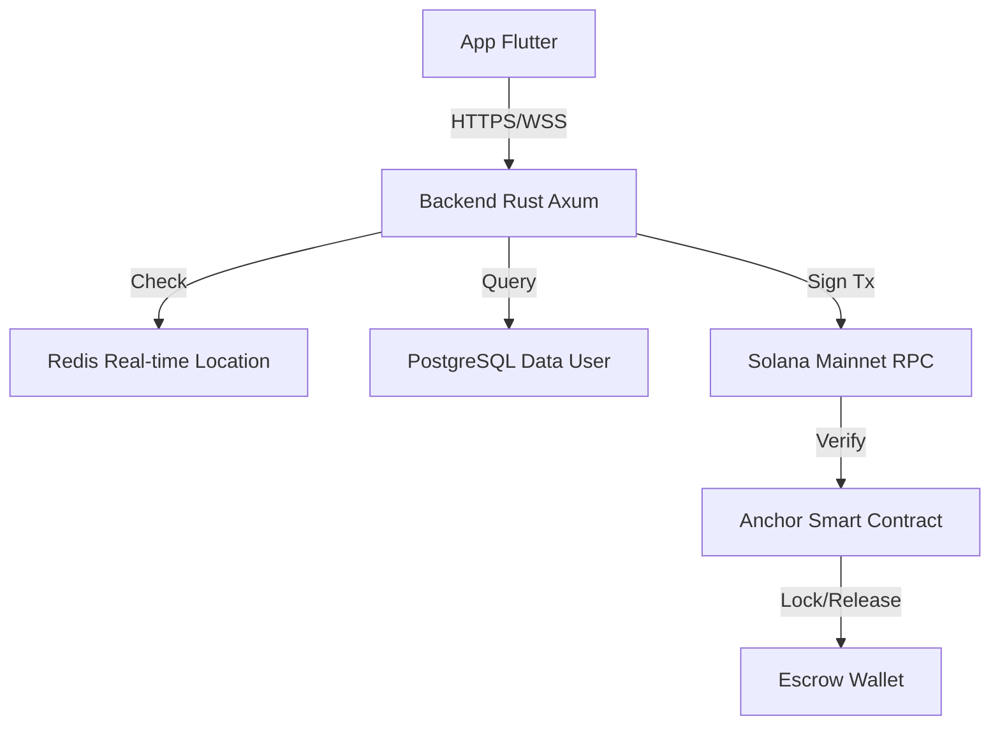

<div align="center">

# 🦀 SiapAja.id: The Invisible Blockchain Gig Economy
**"Scroll medsos dapet duit. Posting butuh bantuan langsung ada yang nyamber. 0% Komisi. 100% Keadilan."**

[](#)
[](#)
[](#)
[](#)
[](https://www.gnu.org/licenses/agpl-3.0)
[](#)

[Whitepaper (WIP)](#) • [Discord Devs](#) • [App Demo](#) • [Gabung Koperasi](#)

</div>

---

Selamat datang di *Ground Zero* pemberontakan gig economy. Repository ini bukan sekadar *source code* aplikasi ojol atau marketplace jasa biasa. Ini adalah **senjata digital** yang dibangun menggunakan performa brutal dari **Rust**, kecepatan antarmuka **Flutter**, dan desentralisasi finansial tanpa batas dari **Solana**. 

Kita membangun platform di mana **komisi pekerja adalah 0%**, harga dilindungi oleh AI dari perang tarif, transaksi aman pakai *Escrow Smart Contract* (tapi user tetap melihatnya sebagai Rupiah), dan setiap baris kode yang kalian sumbangkan akan diubah menjadi kepemilikan saham (*Equity*) masa depan.

---

## BAB 1: ✊ Manifesto & Filosofi (Kenapa Kita Ada?)

### 1.1. Krisis Gig Economy Saat Ini
Kalian sadar nggak kalau sistem ojol dan platform *freelance* hari ini sudah berubah jadi mandor digital yang kejam? 
*   **Eksploitasi 30%:** Dulu narik 8 jam bisa bawa pulang Rp300rb. Sekarang 12 jam di jalan cuma dapet Rp100rb karena dipotong komisi aplikasi, biaya layanan, biaya platform, sampai biaya "gacor".
*   **Ilusi Kemitraan:** Dipanggil "Mitra", tapi nggak punya hak suara. Kalau kena *suspend* sepihak oleh algoritma, pekerja nggak bisa bela diri. 
*   **Fenomena "Santo Suruh":** Publik akhirnya mulai balik ke cara konvensional (pesan jasa lewat WA/offline) karena muak dengan harga aplikasi yang makin mahal, tapi pekerjanya makin miskin.

**Manifesto Kita:** 
> *"Platform digital seharusnya menjadi infrastruktur publik layaknya jalan tol. Jalan tol memfasilitasi kendaraan, bukan meminta jatah preman 30% dari gaji supirnya."*

### 1.2. The SiapAja Solution (Demand-Only Feed)
Platform sebelah isinya katalog jasa. Tukang AC, *driver*, dan *cleaner* harus banting harga dan bayar iklan biar jasanya dilirik. 

SiapAja.id membalik logika itu. Kita pakai sistem **Demand-Only Feed** yang bentuknya persis kayak timeline X/Threads. Isinya bukan orang pamer liburan, tapi kumpulan orang di radius 5km yang teriak: *"Genset mati nih, siapa bisa benerin sekarang? Budget Rp200.000!"* Worker tinggal *scroll*, nemu yang cocok, klik "Terima", dan langsung berangkat.

### 1.3. Zero-Commission Reality (0% Potongan)
Ini bukan *gimmick* marketing. Kalau customer bayar Rp150.000, worker nerima **utuh Rp150.000**. 
Gimana platform hidup? Kita nggak ngambil untung dari keringat pekerja. Infrastruktur server kita sangat irit (karena pakai Rust), biaya blockchain hampir gratis (Solana), dan pendapatan platform murni dari:
1.  *Posting fee* receh dari customer.
2.  B2B API untuk korporasi besar.
3.  Lisensi komersial (SSPL) untuk BUMN/Korporat yang mau pakai *tech-stack* kita.

### 1.4. Anti-Bakar Duit (Guerrilla Bootstrapping)
Kita nggak punya VC (*Venture Capitalist*) yang ngasih triliunan buat bakar duit ngasih promo diskon. Dan kita emang nggak butuh.
Strategi kita adalah **Hyper-Local Density**. Kita nggak akan rilis se-Indonesia sekaligus. Kita kuasai satu kecamatan dulu, sampai semua ibu-ibu dan pemuda nongkrong di kecamatan itu pakai aplikasi ini. Kalau satu ekosistem lokal sudah nyala, dia akan membiayai pertumbuhannya sendiri.

---

## BAB 2: 🚀 Konsep Utama & Killer Features

### 2.1. Timeline "Pay-to-Post" (Anti-Spam Mutlak)
Di sini, nggak ada cerita "Customer PHP" atau nanya-nanya doang trus ngilang. 
Mau bikin postingan butuh bantuan? **Duitnya harus di-lock di depan.** Kalau budget kerjaannya Rp100.000, sistem akan narik saldo Rp100.000 itu detik itu juga dan dikunci di *Escrow Solana*. Feed kita 100% berisi duit mateng. Begitu worker klik "Selesai", dana otomatis cair. 

### 2.2. Invisible Blockchain (Solana Under The Hood)
Kita pakai Solana, tapi 99% user nggak akan sadar. 
*   Nggak ada tulisan *Crypto*, nggak ada *Seed Phrase*, nggak perlu install *Phantom Wallet*. 
*   User cuma lihat saldo "Rupiah". 
*   Di belakang layar, sistem otomatis membuatkan *wallet* terenkripsi lewat OTP No HP, dan melakukan *minting stablecoin* IDR. Biaya "Gas Fee" Solana yang cuma seperseribu perak itu ditanggung penuh oleh dompet *Relayer* perusahaan. *Magic!*

### 2.3. AI Man-Power Estimator (Perlindungan K3)
Sering terjadi: Customer pelit minta pindahan kosan 3 lantai, barangnya ada kulkas 2 pintu, tapi bayarnya cuma buat 1 orang.
Di SiapAja.id, AI berbasis NLP dan *Image Recognition* kita bakal baca postingan dan foto yang di-upload customer. 
*   **Output AI:** *"Deteksi beban >70kg + Tangga. Risiko cedera tinggi. Pekerjaan ini wajib dikerjakan minimal 3 Worker. Harga dasar dikunci di Rp350.000."*
*   Sistem menolak postingan jika customer memaksa menawar di bawah *Price Floor* (Harga Bawah) yang sudah dihitung AI. Kita jaga tulang punggung pekerja!

### 2.4. Time-Banking (Tukar Waktu Tanpa Rupiah)
Ekonomi lagi hancur? Orang nggak pegang Rupiah? Nggak masalah.
Kita punya fitur Barter Jasa. Si A (Tukang Listrik) benerin kabel di rumah Si B selama 2 jam. Si A dapet saldo `2 Jam Waktu`. Besoknya, Si A bisa pakai `2 Jam Waktu` itu buat bayar Si C (Mahasiswa) untuk ngajarin anaknya matematika. Semua dicatat transparan dan abadi di blockchain Solana. Ekonomi tetap berputar tanpa intervensi bank sentral.

### 2.5. Pembentukan Tim Otomatis (Squad Formation)
Kalau AI mendeteksi butuh 3 orang untuk angkat lemari raksasa, sistem nggak akan nge-lempar kerjaan ini ke 1 orang. Sistem otomatis bikin "Lobby" pencarian 3 worker terdekat. Begitu 3 orang kumpul, mereka jalan bareng. Setelah kerjaan selesai, Smart Contract Solana otomatis memecah pembayaran ke 3 *wallet* worker tersebut secara adil dalam waktu 400 milidetik. Nggak ada lagi rebutan jatah di lapangan.

---

## BAB 3: 🏗️ Arsitektur "God Mode" (The Tech Stack)

### 3.1. Filosofi Pemilihan Stack
Kita punya satu prinsip: **"Performance of C++, Safety of Rust, Speed of Solana, Cross-platform of Flutter."**
Kita nggak mau bakar duit puluhan juta tiap bulan cuma buat bayar server AWS kayak *startup* sebelah. Dengan tumpukan teknologi ini, kita bisa menampung transaksi satu negara hanya dengan biaya server setara harga kopi *specialty* sebulan.

### 3.2. Backend (Rust + Axum)
API Gateway dan *Matching Engine* kita ditulis 100% menggunakan **Rust** dengan framework **Axum** (dibangun oleh tim Tokio). 
*   **Kenapa Rust?** *Memory-safe*, nggak ada *Garbage Collector* yang bikin server *freeze* tiba-tiba, dan sanggup memproses ratusan ribu *concurrent requests* secara asinkron.
*   **Efisiensi Gila:** Backend kita bisa di-*deploy* di VPS seharga $5 (Rp75.000) per bulan dengan RAM cuma 1GB, tapi sanggup melayani puluhan ribu user aktif sekaligus. Bandingkan dengan platform sebelah yang butuh cluster server raksasa cuma buat nampung chat customer.

### 3.3. Frontend (Flutter + Rust Bridge FFI)
UI kita pakai **Flutter** biar bisa jalan di Android, iOS, dan Web (PWA) dari satu basis kode. Tapi, kita nggak mau logika enkripsi dan komunikasi blockchain bikin HP user panas.
*   **Rust FFI:** Logika paling berat (kriptografi, penandatanganan transaksi, enkripsi lokal) kita tulis pakai Rust dan kita "jembatani" ke Flutter via FFI (*Foreign Function Interface*). 
*   **Hasilnya:** Aplikasi enteng banget, animasi tetap 120 FPS biarpun HP user spek "kentang".

### 3.4. Database & Caching (PostgreSQL + Redis)
*   **PostgreSQL + SQLx:** Data permanen disimpan di Postgres. Kita pakai *SQLx* di Rust supaya query database dicek saat proses *compile*. Kalau ada typo di query, kodenya nggak akan bisa jadi aplikasi. Aman dari bug database!
*   **Redis:** Digunakan untuk *Matching Engine* real-time. Lokasi GPS jutaan worker di-*update* setiap detik di sini supaya proses pencarian worker terdekat jadi *instan*.

### 3.5. Blockchain Layer (Solana via Anchor)
Kenapa Solana? Karena kita butuh kecepatan 65.000 transaksi per detik dengan biaya yang lebih murah daripada harga sebungkus permen. Kita pakai **Anchor Framework** (Framework Rust untuk Solana) buat bikin Smart Contract yang aman dan teruji.

### 3.6. System Architecture Diagram


---

## BAB 4: 👻 Deep Dive: Invisible Blockchain & Account Abstraction

Banyak platform gagal karena maksa user simpan *Seed Phrase* 12 kata. Di SiapAja.id, itu semua **DIBUANG**.

### 4.1. The "Wallet-less" Experience
User login pakai No HP (OTP) atau Google Login. Di belakang layar, sistem kita menggunakan **Web3Auth** atau **Privy** yang diintegrasikan ke server Rust. 
*   **Identity to Key:** Identitas user diubah jadi kunci kriptografi secara otomatis. 
*   **User Knowledge:** User cuma tau mereka punya "Saldo Rupiah". Mereka nggak perlu tau kalau di belakangnya ada dompet digital Solana yang terenkripsi tingkat tinggi.

### 4.2. Relayer & Gasless Transactions
Masalah utama blockchain: **Siapa yang bayar biaya transaksi (Gas Fee)?**
Kita pakai teknik **Relayer**. 
1. Worker klik "Selesai".
2. Aplikasi minta tanda tangan digital user (lewat biometrik/PIN).
3. Server Rust kita nerima tanda tangan itu, nambahin biaya transaksi dari dompet "Kas Platform", lalu ngirim ke Solana.
*   **Hasilnya:** User nggak butuh punya koin SOL. Transaksi tetap jalan, biaya kita talangi (cuma Rp2 - Rp5 per transaksi, sangat murah buat platform).

### 4.3. Fiat-to-Stablecoin Bridge
Kita nggak pakai koin yang harganya naik-turun kayak *roller coaster*. Kita pakai **Stablecoin IDR**.
*   **Deposit:** Customer bayar Rp100.000 via GoPay/OVO/Virtual Account.
*   **Minting:** Sistem otomatis "mencetak" 100.000 Token IDR di Solana dan masukin ke Escrow.
*   **Withdraw:** Worker tarik saldo 100.000 Token IDR, sistem otomatis transfer Rupiah asli ke rekening mereka dan "membakar" tokennya. 100% akurat.

---

## BAB 5: 🤖 Deep Dive: AI & Algoritma Perlindungan

AI kita bukan cuma buat gaya-gayaan, tapi buat jadi "Bodyguard" pekerja.

### 5.1. Price Floor Mechanism (Anti-Perang Harga)
Kita benci kalau sesama worker saling banting harga cuma buat dapet kerjaan. 
*   **The Logic:** AI akan menghitung biaya hidup per wilayah, tingkat kesulitan kerja, dan jarak tempuh. 
*   Kalau AI bilang harga wajar benerin pompa air adalah Rp150.000, maka tombol "Bidding" di bawah angka itu akan **dimatikan**. Kita memastikan kompetisi terjadi di *kualitas*, bukan di *kemiskinan*.

### 5.2. NLP & Image Recognition Pipeline
Server Rust kita terhubung ke model AI (Llama-lite & YOLO) yang sudah dioptimasi.
*   **Scanning Deskripsi:** Kalau customer nulis "butuh orang buat nagih utang sambil bawa sajam", AI bakal otomatis nge-blok postingan itu karena melanggar hukum.
*   **Scanning Foto:** Kalau customer upload foto lemari yang gedenya nggak masuk akal buat diangkut satu orang, AI akan otomatis mengubah status kerjaan jadi "Multi-Worker Required".

---

## BAB 6: ⚖️ Decentralized Justice (Pengadilan Netizen)

Kalau ada masalah, kita nggak pake CS yang jawabannya "Mohon maaf atas ketidaknyamanannya". Kita pake hukum komunitas.

### 6.1. Alur Sengketa (Dispute Lifecycle)
1. Customer klaim: "Kerjaan nggak beres!" -> Dana di Escrow Solana otomatis **BEKU**.
2. Sistem mencari 7 Juri (User dengan Karma tinggi) secara acak.
3. Worker & Customer upload bukti foto/video.
4. Juri voting secara *anonymous*. 
5. Pemenang voting dapet dananya, Juri dapet komisi kecil sebagai imbalan kejujuran.

### 6.2. Algoritma Pemilihan Juri
*   Juri dipilih yang **nggak saling kenal** dan **nggak satu radius** dengan pelaku sengketa.
*   Juri nggak bisa lihat hasil voting juri lain sebelum dia sendiri submit. Ini buat menghindari "Ikut-ikutan" (*Herd Mentality*).

---

## BAB 7: 🎖️ Sistem Karma & Tata Kelola (Governance)

Di SiapAja.id, uang bukan alat ukur utama kesuksesan seorang pekerja, melainkan **KARMA**. Karma adalah aset reputasi yang direkam secara permanen (tapi anonim) di jaringan Solana.

### 7.1. Metrik Profesional vs Moral
Banyak yang takut sistem Karma kita bakal kayak "Skor Kredit Sosial" ala negara otoriter yang menilai orang dari pendapat politiknya. **Sama sekali tidak.**
*   **Karma Naik (+):** Tepat waktu sampai lokasi, rating bintang 5 dari *customer* (dinilai dari kualitas kerja), atau rajin jadi Juri sengketa yang adil.
*   **Karma Turun (-):** Batalin orderan sepihak setelah setuju (Cancel), telat parah tanpa alasan, atau terbukti curang dalam sengketa.

### 7.2. Karma Decay (Penyusutan Otomatis)
Kita percaya pada **Penebusan Dosa Digital**. Kalau worker pernah salah (Karma anjlok), mereka nggak dihukum seumur hidup.
*   Setiap 30 hari, poin Karma negatif akan otomatis mengalami "Decay" (menyusut) sebesar 20% jika worker terus berkelakuan baik. 
*   Sistem ini diatur oleh *CRON Job* di server Rust yang secara efisien mengkalkulasi jutaan data *ledger* Solana setiap akhir bulan.

### 7.3. Hak Suara (Voting Power)
Karma bukan cuma buat pamer. Semakin tinggi Karma, semakin besar **Hak Suara (Voting Power)** user dalam menentukan arah platform.
*   Mau naikin *Price Floor* (Harga Bawah) di kota Jakarta? Voting!
*   Mau uang denda di *Treasury* dipakai buat bagi-bagi sembako atau asuransi kecelakaan? Voting!
*   100 Karma = 1 Suara. Maksimal 10 Suara per orang (supaya *Sultan Karma* tidak bisa memonopoli keputusan).

---

## BAB 8: 💸 Tokenomics & "The Founder's Secret" (Model Bisnis)

*"Kalau komisi 0%, dari mana platform dan Founder dapet duit? Jangan-jangan cuma tipu-tipu bakar duit VC?"* 
Ini adalah rahasia terbesar kita. Kita nggak memeras recehan dari keringat tukang angkut barang, kita mengambil keuntungan dari **Ekosistem dan Korporat**.

### 8.1. Nol Rupiah dari Pekerja (Janji Suci)
Worker terima upah 100% utuh. Titik. Tidak ada "Biaya Layanan Tersembunyi" saat mereka menarik dana ke bank.

### 8.2. Revenue Stream Platform (Sumber Cuan Utama)
1.  **Posting Fee (Rp5.000):** Customer yang butuh jasa bayar biaya posting untuk memastikan *demand*-nya asli (Anti-PHP). Sebagian untuk biaya server Rust kita, sebagian masuk *Treasury Komunitas*.
2.  **Premium Verification (KYC):** User yang mau akunnya bercentang biru (sebagai tanda *Super Trusted Worker/Customer*) bayar biaya verifikasi sekali seumur hidup.
3.  **B2B API Integration:** Kalau ada Mall atau Apartemen besar yang mau pakai ribuan worker kita secara borongan via sistem mereka, mereka wajib langganan API berbayar (*Enterprise Tier*).

### 8.3. Dana Solidaritas (1% Auto-Deduction)
Setiap transaksi potong 1%, tapi **BUKAN UNTUK PLATFORM**. 
Uang ini otomatis masuk ke *Smart Contract* **Asuransi Komunitas (Solidarity Pool)**.
*   Kalau ada worker kecelakaan saat narik barang, klaim pengobatannya diambil dari *pool* ini lewat persetujuan (voting) pengurus Koperasi. 

### 8.4. Auto-Yield Treasury (Uang Mengembang)
Dana *Treasury* (dari denda dan sisa *fee*) yang belum terpakai tidak akan dibiarkan nganggur. 
*   Sistem otomatis memutar dana tersebut di instrumen Reksadana Pasar Uang atau *Yield Farming* Solana berisiko rendah. 
*   **Bunganya (Yield):** Dibagikan sebagai dividen bulanan kepada pemegang Karma tertinggi. Pekerja bukan cuma buruh, mereka adalah **Investor Ekosistem**.

### 8.5. Enterprise Licensing (SSPL - The Trillion Rupiah Path)
Ini cara Founder dan *Core Contributor* menjadi *Crazy Rich* secara elegan.
*   Teknologi SiapAja.id (Backend Rust + Solana) sangat canggih. Kalau ada BUMN, Perusahaan Tambang, atau Startup lain yang mau me-rakit ulang (*fork*) kode kita untuk bisnis **komersial/privat** mereka...
*   Mereka diikat oleh Lisensi **SSPL (Server Side Public License)**. Artinya: Mereka wajib *open source*-kan seluruh bisnis mereka, **ATAU** membayar **Lisensi Komersial Triliunan Rupiah** ke perusahaan kita. 

---

## BAB 9: 💻 Integrasi GitHub to App (The Zero-Capital Engine)

Kita nggak punya modal awal. Jadi, kita mengubah **Setiap Baris Kode Menjadi Modal**.

### 9.1. Konsep "Build in Public" via Webhook
Kami membongkar sekat antara Developer (di GitHub) dan User (di Aplikasi).
*   Setiap kali ada *Issue* baru di repo GitHub ini (misal: `"Fix bug GPS di Xiaomi"`), server Axum kita akan menangkap webhook-nya.
*   *Issue* tersebut otomatis diposting ke **Timeline Aplikasi** (Feed utama) dengan tag khusus `#DevTask`. 
*   User biasa bisa melihat bahwa platform ini sedang dirajut bersama-sama, menciptakan transparansi tingkat dewa yang tidak dimiliki platform ojol mana pun.

### 9.2. Labeling System & Bounty
Issue di GitHub diklasifikasikan dengan label:
*   `[VOLUNTEER]`: Pekerjaan sukarela untuk belajar.
*   `[URGENT]`: Prioritas tinggi.
*   `[BOUNTY]`: Ada hadiah Rupiah/Stablecoin jika *Community Pool* sedang memiliki saldo.

### 9.3. Sistem Tipping "Seikhlasnya"
Kita jujur dari awal: **Saat ini modal kita Rp0**. 
*   Kalau kamu (*Developer*) berkontribusi (*Pull Request* di-merge), jangan harap langsung cair Rp10 juta.
*   Namun, jika *Community Pool* (dari donasi/revenue platform) ada isinya, Founder atau Komunitas bisa mengklik tombol **"Appreciate"** pada kontributor tertentu. Token Solana akan otomatis mendarat di dompetmu sebagai bentuk terima kasih "seikhlasnya". Tanpa paksaan, tanpa eksploitasi.

---

## BAB 10: 🤝 Panduan Kontribusi (For Rustaceans & Flutter Devs)

Kita nggak lagi bangun *to-do list app* buat tugas kuliah. Kita bangun **Infrastruktur Finansial Alternatif**. Kalau kamu alergi baca dokumentasi, nggak peduli sama *memory safety*, atau cuma nyari gaji instan dari *startup* bakar duit—repo ini bukan buat kamu.

### 10.1. Syarat Mutlak Kontributor
*   **Rust (Backend):** Wajib paham *Ownership/Borrowing*, Axum routing, dan SQLx. Kalau kode kamu kena *panic!* di *runtime* padahal bisa di-*handle* pakai `Result`, PR kamu otomatis kita *reject*.
*   **Flutter (Frontend):** Paham *State Management* (Riverpod/Bloc) dan cara jembatanin FFI (*flutter_rust_bridge*) tanpa bikin UI *freeze*.
*   **Solana (Smart Contract):** Paham Anchor Framework dan PDAs (*Program Derived Addresses*). Jangan sampai ada celah buat *Drainer* nyuri dana Escrow kita.

### 10.2. Sistem "Karma Dev" & Token $SIAP (Ekuitas Keringat)
Karena kita mulai dari **Nol Rupiah**, kita bayar keringat kalian dengan **Ekuitas Masa Depan**.
*   Setiap kali Pull Request (PR) kamu di-*merge* ke cabang `main`, sistem CI/CD GitHub Actions kita akan memanggil *Smart Contract* Solana.
*   Dompet kamu otomatis dikirimi **Token $SIAP**.
*   **Apa itu Token $SIAP?** Saat ini harganya Rp0. Tapi, token ini merepresentasikan **Porsi Kepemilikan (Shares)** dari platform. Kalau besok SiapAja.id jualan Lisensi SSPL senilai Rp10 Miliar ke BUMN, keuntungan itu akan di-*airdrop* (dibagi dividen) secara otomatis ke dompet Solana para pemegang Token $SIAP, sepadan dengan jumlah *commit* kode mereka.
*   Ini bukan eksploitasi kerja gratis. Ini adalah **Fair Equity Distribution**. Kalian adalah *Co-Founders* telat.

### 10.3. Git Workflow & PR Template
1.  **Cari Issue:** Buka tab `Issues`, filter label `good first issue` atau `[BOUNTY]`.
2.  **Branching:** Jangan pernah push langsung ke `main`. Buat branch baru: `git checkout -b feature/nama-fitur-keren`.
3.  **Code & Test:** Tulis kode. Wajib sertakan *Unit Test*. Jalankan `cargo test` (untuk Rust) atau `flutter test`. Kalau *coverage* turun di bawah 85%, GitHub Actions akan nolak PR kamu secara kasar.
4.  **Pull Request (PR):** Gunakan template PR yang sudah disediakan. Jelaskan *kenapa* kode ini ditulis, bukan cuma *apa* yang ditulis.

---

## BAB 11: ⚙️ Local Development Setup (Instalasi)

Mau nyoba jalanin "The God Mode Engine" di laptop kamu? Ikuti langkah ini. 
*(Peringatan: Pastikan Docker, Rust toolchain 1.75+, Flutter SDK 3.19+, dan Solana CLI sudah terinstall).*

### 11.1. Menyiapkan Infrastruktur Dasar (Docker)
Kita butuh PostgreSQL untuk data persisten dan Redis untuk *real-time matching*.
```bash
git clone https://github.com/siapaja/siapaja-core.git
cd siapaja-core
# Spin up Postgres & Redis
docker-compose -f docker/docker-compose.yml up -d
```

### 11.2. Menjalankan Blockchain Lokal (Solana Testnet)
Kita nggak pakai *Mainnet* buat *development* biar nggak ngabisin duit.
```bash
# Jalankan Local Validator Solana
solana-test-validator
# Deploy Smart Contract (Anchor) ke localnet
cd backend/contracts
anchor build && anchor deploy
```

### 11.3. Menjalankan Axum Backend (Rust)
Set environment variables di `.env` (copy dari `.env.example`).
```bash
cd backend/api
# Compile dan jalankan server (Otomatis migrasi database)
cargo run --release
# Server menyala di http://localhost:8080 ⚡
```

### 11.4. Menjalankan Mobile App (Flutter)
```bash
cd frontend/mobile
# Generate FFI bridge (jika ada perubahan kode Rust client)
flutter_rust_bridge_codegen
# Jalankan aplikasi (Gunakan emulator Android/iOS)
flutter run
```

---

## BAB 12: 🔌 API Gateway Reference (Axum Specs)

Semua endpoint dilindungi oleh JWT dan terenkripsi. Berikut adalah *sneak peek* endpoint utama kita. Dokumentasi lengkap (OpenAPI/Swagger) bisa diakses di `/api/docs` saat server lokal berjalan.

### 12.1. Demand Creation API (Pay-to-Post)
`POST /api/v1/jobs/create`
*Endpoint ini dipanggil saat Customer menekan tombol "Posting Butuh Bantuan". Server Axum akan secara *invisible* menghubungi Solana untuk mengunci dana.*

**Payload (JSON):**
```json
{
  "title": "Benerin genteng bocor cepet!",
  "description": "Lantai 2, butuh tangga panjang. Hujan makin deras.",
  "category": "home_repair",
  "budget_idr": 150000,
  "gps_lat": -6.200000,
  "gps_lng": 106.816666
}
```

**Response (200 OK):**
```json
{
  "status": "locked_and_live",
  "job_id": "JOB-998-XTZ",
  "escrow_tx_signature": "5Xz...solana_hash...9qT",
  "ai_analysis": {
    "risk_level": "medium",
    "workers_required": 1,
    "price_floor_ok": true
  },
  "message": "Rp150.000 sukses ditarik ke Escrow Solana. Menyiarkan ke worker radius 2KM..."
}
```

### 12.2. GitHub Webhook Receiver
`POST /api/v1/webhooks/github`
*Ini adalah mesin "Build in Public" kita. GitHub memanggil endpoint ini saat ada PR baru atau Issue baru, lalu Axum akan me-masukkannya ke timeline Flutter lewat WebSocket.*

---

## BAB 13: 📜 Smart Contract Reference (Solana Anchor Specs)

Smart contract kita (ditulis dalam Rust) hanya melakukan 3 hal, tapi melakukannya dengan sempurna tanpa celah keamanan.

### 13.1. Escrow Initialization (InitJob)
*   **Fungsi:** Membuat *Program Derived Address* (PDA) khusus untuk satu pekerjaan.
*   **Keamanan:** Uang (Stablecoin IDR) dipindahkan dari dompet Customer ke PDA ini. Hanya instruksi `ReleaseFund` atau `Refund` dari platform (sebagai *Oracle*) yang bisa mengeluarkan uang ini.

### 13.2. Fund Release (CompleteJob)
*   **Fungsi:** Menyerahkan 100% uang ke Worker setelah Customer klik "Selesai", minus 1% (otomatis dipotong ke PDA *Solidarity Pool* untuk asuransi).
*   **Speed:** Transaksi selesai dan masuk ke saldo Worker dalam 400 milidetik.

### 13.3. Dispute Freeze (LockJob)
*   **Fungsi:** Kalau ada sengketa, status PDA diubah menjadi `FROZEN`. Uang tidak bisa ditarik oleh siapapun sampai 7 Juri Komunitas memberikan *voting* final ke server Rust kita.

---

## BAB 14: 🛡️ Keamanan & Mitigasi "Dark Economy"

Dunia gig economy itu keras. Kalau platform ini besar, mafia pangkalan, korporat sebelah, dan bot-bot jahat pasti akan nyerang. Kita sudah siapkan "Sabuk Hitam" di arsitektur kita.

### 14.1. Anti-Front-Running (Mencegah Bot Nyamber Orderan)
Kalau ada orderan renovasi senilai Rp5 Juta, pasti ada *developer* nakal yang bikin bot buat ngeklik "Terima" dalam 0.01 detik.
*   **Mitigasi Rust:** Server kita menerapkan *Delay-Jitter* acak (1-3 detik) sebelum melempar notifikasi orderan besar ke worker. Selain itu, worker dengan *Karma tinggi* dan *radius terdekat* akan mendapatkan notifikasi 5 detik lebih awal. Bot yang jaraknya jauh nggak akan dapet jatah.

### 14.2. Privasi Data Pekerja (Anti-Pinjol)
Di era di mana data adalah emas hitam, kita nggak akan jual data KTP atau histori penghasilan worker ke perusahaan Pinjol (meskipun godaannya miliaran).
*   **Enkripsi Zero-Knowledge:** Data penghasilan dan alamat tersimpan dalam bentuk *hash* di database Postgres. Pihak ketiga nggak bisa nge-*scraping* data profil worker untuk dijadiin target iklan kredit motor atau pinjaman *payday*.

### 14.3. Enkripsi Wallet HSM (Hardware Security Module)
Karena kita pakai "Invisible Solana" (user nggak pegang *Private Key*), server kitalah yang memegang kunci miliaran Rupiah di Escrow.
*   **Benteng Terakhir:** *Private Key* platform tidak pernah menyentuh memori RAM dalam bentuk *plaintext*. Semua penandatanganan transaksi (signing) dilakukan di dalam HSM atau layanan KMS (Key Management Service) yang terisolasi. Kalaupun server VPS kita di-hack, *hacker* nggak bisa mencuri uang di Escrow.

### 14.4. Rate Limiting di Axum (Anti-DDoS)
Axum dilengkapi dengan *middleware* `tower::limit` yang sangat agresif. Kalau kompetitor nyoba nge-DDoS endpoint `/api/v1/jobs/create` kita, Rust akan memblokir IP mereka di level *layer 4* (TCP) sebelum request itu sempat menyentuh logika aplikasi. *CPU kita bahkan nggak akan kerasa.*

---

## BAB 15: 🗺️ Roadmap Taktis (Eksekusi Bertahap)

Kita nggak halu pengen ngalahin Gojek besok pagi. Ini adalah maraton yang terukur.

### 15.1. Phase 1: Bootstrapping & Rust Core (Bulan 1-3) - *KITA DI SINI*
*   [x] Desain Arsitektur Axum + Solana.
*   [x] Basic UI/UX PWA Flutter (Demand Feed).
*   [ ] Integrasi *Invisible Wallet* (Web3Auth/Privy).
*   [ ] Rilis MVP di GitHub untuk *Community Testing*.

### 15.2. Phase 2: Beta "Micro-Economy" (Bulan 4-6)
*   [ ] Uji coba *real-money* di 1 Kecamatan padat penduduk (Misal: Pamulang atau Depok).
*   [ ] Peluncuran fitur "Pengadilan Netizen" (Jury Duty).
*   [ ] Integrasi Payment Gateway (Xendit/Midtrans) untuk Fiat-to-Stablecoin.

### 15.3. Phase 3: Skalabilitas & Solana Mainnet (Bulan 7-9)
*   [ ] Pemindahan Smart Contract dari *Devnet* ke *Solana Mainnet-Beta*.
*   [ ] Rilis fitur "Time-Banking" (Tukar jasa tanpa Rupiah).
*   [ ] Pembukaan lisensi B2B API untuk korporasi.

### 15.4. Phase 4: Koperasi Digital & Multi-City (Tahun ke-2)
*   [ ] Integrasi langsung ke BI-FAST (Meninggalkan ketergantungan pada E-Wallet swasta).
*   [ ] Ekspansi *Hyper-local* ke kota-kota lapis kedua di Indonesia.
*   [ ] Pembagian Dividen Perdana dari *Yield Treasury* ke pemegang Karma tertinggi.

---

## BAB 16: 🏛️ Struktur Legal & Koperasi

Kita nggak akan mendaftar sebagai PT (Perseroan Terbatas) konvensional yang tunduk pada *Venture Capital*. 
*   **Platform Cooperative Model:** SiapAja.id akan berbadan hukum **Koperasi Multi-Pihak**. 
*   Pekerja (Worker) bukan sekadar "Mitra", mereka adalah **Anggota Koperasi** yang sah di mata hukum Indonesia. Mereka berhak atas Sisa Hasil Usaha (SHU) tahunan yang didapat dari *Treasury* dan biaya API B2B.

---

## BAB 17: 📄 Lisensi (The Dual-License Strategy)

*Software* publik harus gratis untuk publik, tapi korporat yang mencari untung harus bayar.
1.  **Backend & Core (AGPL v3):** Bebas di-*fork*, dimodifikasi, dan dipakai oleh BEM Kampus, Karang Taruna, atau komunitas RT/RW secara **GRATIS**. Syaratnya: kalian harus *open source*-kan juga perubahannya.
2.  **Commercial/Enterprise (SSPL):** Kalau ada BUMN, korporat raksasa, atau perusahaan asing yang mau mengambil infrastruktur SiapAja.id ini untuk dijalankan secara tertutup (*Closed-source SaaS*) demi meraup triliunan... **Mereka wajib membeli lisensi komersial dari kami.** 

*(Disclaimer: Kontributor GitHub yang dibayar dengan Token $SIAP akan mendapatkan porsi bagi hasil dari setiap penjualan lisensi SSPL ini).*

---

## BAB 18: ❓ FAQ (Menjawab Para "Devil's Advocate")

**Q: Gimana kalau setelah ketemu di aplikasi, Worker dan Customer janjian *offline* lewat WA biar nggak usah pakai platform lagi?**
> A: *Bagus!* Silakan. Platform kita tidak memungut komisi, jadi kita tidak rugi apa-apa kalau kalian transaksi *offline*. Tapi ingat, transaksi *offline* berarti kalian **kehilangan perlindungan Escrow** (kalau ditipu uangnya hilang), **kehilangan Asuransi Kecelakaan 1%**, dan **tidak mendapat poin Karma**. Pilihan di tangan kalian.

**Q: Ini kan butuh modal gede buat promosi (bakar uang)?**
> A: Kita pakai strategi *Word-of-Mouth* hiper-lokal. Ketika seorang Ketua RT di satu komplek mewajibkan warganya pakai aplikasi ini untuk cari tukang atau satpam panggilan, aplikasi ini akan viral dengan sendirinya tanpa perlu baliho di jalan protokol.

**Q: Kenapa nggak pakai database MySQL biasa aja sih? Kenapa harus Solana?**
> A: Karena kita mau menghilangkan "Admin Nakal". Dengan Smart Contract Solana, bahkan *Founder* SiapAja.id sekalipun **tidak bisa** mencuri uang yang sedang terkunci di Escrow. Keadilan harus dijamin oleh kriptografi, bukan oleh janji manis perusahaan.

---

## BAB 19: 🧪 Testing & CI/CD (Biar Nggak Malu-Maluin)

Kita benci kode yang asal jalan.
*   **Rust (Backend):** Target *Test Coverage* minimal 85%. Jalankan `cargo clippy -- -D warnings` sebelum PR. Kalau ada *warning*, PR ditolak.
*   **Flutter (Frontend):** *Widget Testing* wajib ada untuk *flow* utama (Bidding & Payment).
*   **Solana (Anchor):** Gunakan `solana-bankrun` untuk mensimulasikan kegagalan Smart Contract secara instan tanpa perlu nunggu *localnet* sinkron.

---

## BAB 20: 📬 Komunikasi & Dukungan (Join The Rebellion)

Punya ide sinting? Nemu *bug* di sistem AI kita? Atau BUMN yang mau beli lisensi SSPL kita seharga Rp100 Miliar? Hubungi kami:

*   **Discord Developer (Rust/Solana/Flutter):** [Join the Backroom](#)
*   **Channel Telegram (Komunitas Worker/User):** [Warga SiapAja](#)
*   **Email Business & Licensing:** `core@siapaja.id`

---
<div align="center">

*"Kita tidak bisa menghancurkan monopoli raksasa dengan membakar uang. Kita menghancurkannya dengan membuat infrastruktur mereka menjadi usang."*

**Built with 🦀, 💙, and Anger in Indonesia. LFG!**

</div>
