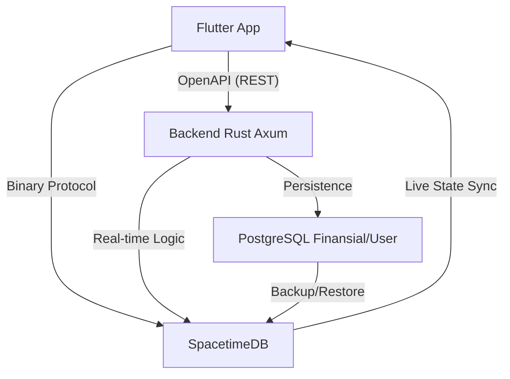

<div align="center">

# 🦀 SiapAja.id: The Ultra-Fast Real-time Gig Economy
**"Scroll medsos dapet duit. Posting butuh bantuan langsung ada yang nyamber. 0% Komisi. 100% Keadilan."**

[](#)
[](#)
[](#)
[](#)
[](#)
[](https://www.gnu.org/licenses/agpl-3.0)
[](#)

[Whitepaper (WIP)](#) • [Discord Devs](#) • [App Demo](#) • [Gabung Koperasi](#)

</div>

---

Selamat datang di *Ground Zero* pemberontakan gig economy. Repository ini bukan sekadar *source code* aplikasi ojol atau marketplace jasa biasa. Ini adalah **senjata digital** yang dibangun menggunakan performa brutal dari **Rust**, dan antarmuka mobile modern dari **Flutter**, serta real-time sync super cepat dari **SpacetimeDB**. 

Kita membangun platform di mana **komisi 0% untuk rakyat kecil, tiered fee untuk proyek besar**, harga dilindungi oleh AI dari perang tarif, transaksi aman pakai *Virtual Ledger Escrow* (tapi user tetap melihatnya sebagai Rupiah), dan setiap baris kode yang kalian sumbangkan akan diubah menjadi kepemilikan saham (*Equity*) masa depan.

---

## BAB 1: ✊ Manifesto & Filosofi (Kenapa Kita Ada?)

### 1.1. Krisis Gig Economy Saat Ini
Kalian sadar nggak kalau sistem ojol dan platform *freelance* hari ini sudah berubah jadi mandor digital yang kejam? 
*   **Eksploitasi 30%:** Dulu narik 8 jam bisa bawa pulang Rp300rb. Sekarang 12 jam di jalan cuma dapet Rp100rb karena dipotong komisi aplikasi, biaya layanan, biaya platform, sampai biaya "gacor".
*   **Ilusi Kemitraan:** Dipanggil "Mitra", tapi nggak punya hak suara. Kalau kena *suspend* sepihak oleh algoritma, pekerja nggak bisa bela diri. 
*   **Fenomena "Santo Suruh":** Publik akhirnya mulai balik ke cara konvensional (pesan jasa lewat WA/offline) karena muak dengan harga aplikasi yang makin mahal, tapi pekerjanya makin miskin.

**Manifesto Kita:** 
> *"Platform digital seharusnya menjadi infrastruktur publik layaknya jalan tol. Jalan tol memfasilitasi kendaraan, bukan meminta jatah preman 30% dari gaji supirnya."*

### 1.2. The SiapAja Solution (Demand-Only Feed)
Platform sebelah isinya katalog jasa. Tukang AC, *driver*, dan *cleaner* harus banting harga dan bayar iklan biar jasanya dilirik. 

SiapAja.id membalik logika itu. Kita pakai sistem **Demand-Only Feed** yang bentuknya persis kayak timeline X/Threads. Isinya bukan orang pamer liburan, tapi kumpulan orang di radius 5km yang teriak: *"Genset mati nih, siapa bisa benerin sekarang? Budget Rp200.000!"* Worker tinggal *scroll*, nemu yang cocok, klik "Terima", dan langsung berangkat.

### 1.3. Zero-Commission & Tiered Scalability
Platform tetap gratis buat rakyat kecil. Tapi untuk menjaga keberlanjutan infrastruktur, kita menerapkan **Tiered Fee** hanya untuk transaksi kelas menengah ke atas:

| Budget Pekerjaan | Fee Platform | Beban Biaya (Customer : Worker)
|------------------|--------------|--------------------------------
| Dibawah Rp500.000 | **3%** | 100% Customer (Worker 0% Fee)
| Rp500rb - Rp2jt | **5%** | 50% Customer : 50% Worker
| Rp2jt - Rp10jt | **7.5%** | 50% Customer : 50% Worker
| Diatas Rp10jt | **10%** | 50% Customer : 50% Worker

**Alokasi Fee Platform (The Distribution):**
* **40% Operational & Server:** Biaya infrastruktur Rust & SpacetimeDB.
* **30% Founder & Core Devs:** Jatah "Kaya Raya" buat para perancang sistem (Operational Carry).
* **20% Community Treasury:** Kas Koperasi untuk SHU & Dividen.
* **10% Solidarity Pool:** Asuransi kecelakaan/kesehatan anggota.

**Untuk transaksi di bawah Rp500.000, worker tetap terima 100% UTUH.**
Fee untuk transaksi besar dibebankan secara *adil* ke kedua belah pihak (split fee), bukan cuma memeras worker.

### 1.4. Anti-Bakar Duit (Guerrilla Bootstrapping)
Kita nggak punya VC (*Venture Capitalist*) yang ngasih triliunan buat bakar duit ngasih promo diskon. Dan kita emang nggak butuh.
Strategi kita adalah **Hyper-Local Density**. Kita nggak akan rilis se-Indonesia sekaligus. Kita kuasai satu kecamatan dulu, sampai semua ibu-ibu dan pemuda nongkrong di kecamatan itu pakai aplikasi ini. Kalau satu ekosistem lokal sudah nyala, dia akan membiayai pertumbuhannya sendiri.

---

## BAB 2: 🚀 Konsep Utama & Killer Features

### 2.1. Timeline "Pay-to-Post" (Anti-Spam Mutlak)
Di sini, nggak ada cerita "Customer PHP" atau nanya-nanya doang trus ngilang. 
Mau bikin postingan butuh bantuan? **Duitnya harus di-lock di depan.** Kalau budget kerjaannya Rp100.000, sistem akan narik saldo Rp100.000 itu detik itu juga dan dikunci di *Virtual Escrow*. Feed kita 100% berisi duit mateng. Begitu worker klik "Selesai", dana otomatis cair. 

### 2.2. Ultra-Fast State Sync
Data sinkron instan, tanpa loading, secepat aplikasi chat. User cuma lihat saldo "Rupiah", tapi di belakang layar sistem mengelola Virtual Ledger dengan latensi milidetik. Semua perubahan langsung terpropagasi ke semua client tanpa polling. *Magic!*

### 2.3. AI Man-Power Estimator (Perlindungan K3)
Sering terjadi: Customer pelit minta pindahan kosan 3 lantai, barangnya ada kulkas 2 pintu, tapi bayarnya cuma buat 1 orang.
Di SiapAja.id, **text-only LLM** (via OpenRouter API) membaca postingan untuk ekstraksi terstruktur.
*   **Output AI:** *"Deteksi beban >70kg + Tangga. Risiko cedera tinggi. Pekerjaan ini wajib dikerjakan minimal 3 Worker. Harga dasar dikunci di Rp350.000."*
*   Sistem menolak postingan jika customer memaksa menawar di bawah *Price Floor* (Harga Bawah) yang sudah dihitung AI. Kita jaga tulang punggung pekerja!

### 2.4. Pembentukan Tim Otomatis (Squad Formation)
Kalau AI mendeteksi butuh 3 orang untuk angkat lemari raksasa, sistem nggak akan nge-lempar kerjaan ini ke 1 orang. Sistem otomatis bikin "Lobby" pencarian 3 worker terdekat. Begitu 3 orang kumpul, mereka jalan bareng. Setelah kerjaan selesai, Virtual Ledger otomatis memecah pembayaran ke 3 akun worker tersebut secara adil dalam waktu milidetik. Nggak ada lagi rebutan jatah di lapangan.

---

## BAB 3: 🏗️ Arsitektur "God Mode" (The Tech Stack)

### 3.1. Filosofi Pemilihan Stack
Kita punya satu prinsip: **"Performance of C++, Safety of Rust, Speed of SpacetimeDB, Modern Mobile with Flutter."**
Kita nggak mau bakar duit puluhan juta tiap bulan cuma buat bayar server AWS kayak *startup* sebelah. Dengan tumpukan teknologi ini, kita bisa menampung transaksi satu negara hanya dengan biaya server setara harga kopi *specialty* sebulan.

### 3.2. Backend (Rust + Axum)
API Gateway dan *Matching Engine* kita ditulis 100% menggunakan **Rust** dengan framework **Axum** (dibangun oleh tim Tokio). 
*   **Kenapa Rust?** *Memory-safe*, nggak ada *Garbage Collector* yang bikin server *freeze* tiba-tiba, dan sanggup memproses ratusan ribu *concurrent requests* secara asinkron.
*   **Efisiensi Gila:** Backend kita bisa di-*deploy* di VPS seharga $5 (Rp75.000) per bulan dengan RAM cuma 1GB, tapi sanggup melayani puluhan ribu user aktif sekaligus. Bandingkan dengan platform sebelah yang butuh cluster server raksasa cuma buat nampung chat customer.

### 3.3. Frontend (Flutter + Riverpod + Dart)
UI kita pakai **Flutter 3+** dengan **Riverpod** untuk state management dan **Dart** sebagai bahasa pemrograman.
*   **Native Mobile:** Aplikasi berjalan sebagai native app di Android/iOS dengan performa tinggi.
*   **OpenAPI Generated Client:** Backend Rust auto-generate dokumentasi API. Client Dart di-generate otomatis dari spec OpenAPI.
*   **Type-Safe:** Full Dart dengan type-safe API calls, nggak ada manual JSON mapping.
*   **Native Features:** Akses penuh ke fitur native device seperti GPS, camera, dan push notifications.

### 3.4. Data Layer (PostgreSQL + SpacetimeDB)
*   **PostgreSQL:** Data permanen (profil, transaksi, saldo akhir). diakses via REST API dengan OpenAPI auto-generation.
*   **SpacetimeDB:** Data real-time (GPS, status order, matching). In-memory dengan persistence, diakses via binary protocol dengan community Dart SDK untuk Flutter.

### 3.5. System Architecture Diagram


---

## BAB 4: ⚡ Virtual Ledger & State Sync

User login pakai No HP (OTP) atau Google Login. Di belakang layar, sistem langsung membuat session real-time.

### 4.1. Real-time Sync
Perubahan data langsung terpropagasi ke semua client dalam milidetik. Worker klik "Selesai"? Customer langsung lihat update. Nggak ada polling, nggak ada refresh. UI selalu fresh.

### 4.2. Xendit Escrow System
Kita nggak pakai koin yang harganya naik-turun. Dana ditampung oleh **Xendit Escrow** (berizin OJK).
*   **Deposit:** Customer bayar Rp100.000 via GoPay/OVO/VA/QRIS ke Xendit.
*   **Escrow Lock:** Dana dikunci di escrow, tidak bisa diambil sampai pekerjaan selesai.
*   **Release:** Worker terima uang (dikurangi 1% solidarity pool) langsung ke rekening bank/e-wallet.

---

## BAB 5: 🤖 Deep Dive: AI & Algoritma Perlindungan

AI kita bukan cuma buat gaya-gayaan, tapi buat jadi "Bodyguard" pekerja.

### 5.1. Price Floor Mechanism (Anti-Perang Harga)
Kita benci kalau sesama worker saling banting harga cuma buat dapet kerjaan. 
*   **The Logic:** AI akan menghitung biaya hidup per wilayah, tingkat kesulitan kerja, dan jarak tempuh. 
*   Kalau AI bilang harga wajar benerin pompa air adalah Rp150.000, maka tombol "Bidding" di bawah angka itu akan **dimatikan**. Kita memastikan kompetisi terjadi di *kualitas*, bukan di *kemiskinan*.

### 5.2. Text-to-Structured LLM Pipeline
Server Rust kita terhubung ke **OpenRouter API** (Claude 3 Haiku, GPT-3.5) - text-only extraction.
*   **Scanning Deskripsi:** Kalau customer nulis "butuh orang buat nagih utang sambil bawa sajam", AI bakal otomatis nge-blok postingan itu karena melanggar hukum.
*   **Ekstraksi Data:** Dari teks tidak terstruktur ("bantu pindahan 3 lantai, kulkas 2 pintu") LLM mengekstrak budget, kategori, dan estimasi worker needed.

---

## BAB 6: ⚖️ Decentralized Justice (Pengadilan Netizen)

Kalau ada masalah, kita nggak pake CS yang jawabannya "Mohon maaf atas ketidaknyamanannya". Kita pake hukum komunitas.

### 6.1. Alur Sengketa (Dispute Lifecycle)
1. Customer klaim: "Kerjaan nggak beres!" -> Dana di Virtual Escrow otomatis **BEKU**.
2. Sistem mencari 7 Juri dengan **expertise di bidang yang sama**.
3. Worker & Customer upload bukti foto/video.
4. Juri voting secara *anonymous*. 
5. Pemenang voting dapet dananya, Juri dapet komisi kecil sebagai imbalan kejujuran.

### 6.2. Algoritma Pemilihan Juri (Expertise-Based)
*   Juri dipilih dari pool worker yang punya **track record di kategori job yang sama**.
*   Contoh: Sengketa job "Tukang AC" → Juri adalah worker dengan rating tinggi di kategori "AC & Elektronik".
*   Juri **nggak saling kenal** dan **nggak satu radius** dengan pelaku sengketa.
*   Juri nggak bisa lihat hasil voting juri lain sebelum dia sendiri submit. Ini buat menghindari "Ikut-ikutan" (*Herd Mentality*).

---

## BAB 7: 🎖️ Sistem Karma & Tata Kelola (Governance)

Di SiapAja.id, uang bukan alat ukur utama kesuksesan seorang pekerja, melainkan **KARMA**. Karma adalah aset reputasi yang direkam permanen (tapi anonim) di database.

### 7.1. Metrik Profesional vs Moral
Banyak yang takut sistem Karma kita bakal kayak "Skor Kredit Sosial" ala negara otoriter yang menilai orang dari pendapat politiknya. **Sama sekali tidak.**
*   **Karma Naik (+):** Tepat waktu sampai lokasi, rating bintang 5 dari *customer* (dinilai dari kualitas kerja), atau rajin jadi Juri sengketa yang adil.
*   **Karma Turun (-):** Batalin orderan sepihak setelah setuju (Cancel), telat parah tanpa alasan, atau terbukti curang dalam sengketa.

### 7.2. Karma Decay (Penyusutan Otomatis)
Kita percaya pada **Penebusan Dosa Digital**. Kalau worker pernah salah (Karma anjlok), mereka nggak dihukum seumur hidup.
*   Setiap 30 hari, poin Karma negatif akan otomatis mengalami "Decay" (menyusut) sebesar 15% jika worker terus berkelakuan baik.
*   Sistem ini diatur oleh *CRON Job* di server Rust yang secara efisien mengkalkulasi jutaan data setiap akhir bulan.

### 7.3. Hak Suara (Voting Power)
Karma bukan cuma buat pamer. Semakin tinggi Karma, semakin besar **Hak Suara (Voting Power)** user dalam menentukan arah platform.
*   Mau naikin *Price Floor* (Harga Bawah) di kota Jakarta? Voting!
*   Mau uang denda di *Treasury* dipakai buat bagi-bagi sembako atau asuransi kecelakaan? Voting!
*   100 Karma = 1 Suara. Maksimal 10 Suara per orang (supaya *Sultan Karma* tidak bisa memonopoli keputusan).

---

## BAB 8: 💸 Tokenomics & "The Founder's Secret" (Model Bisnis)

*"Kalau komisi 0%, dari mana platform dan Founder dapet duit? Jangan-jangan cuma tipu-tipu bakar duit VC?"* 
Ini adalah rahasia terbesar kita. Kita nggak memeras recehan dari keringat tukang angkut barang, kita mengambil keuntungan dari **Ekosistem dan Korporat**.

### 8.1. Tiered Protection (Janji Suci)
Untuk pekerja kecil (transaksi di bawah Rp500rb), worker terima **100% utuh**. Titik. Tidak ada "Biaya Layanan Tersembunyi".

Fee hanya dikenakan untuk transaksi kelas menengah ke atas, dan dibebankan secara **adil ke kedua belah pihak** (split 50:50 customer-worker), bukan cuma memeras worker.

### 8.2. The Sustainable Revenue Triple-Engine
1.  **Tiered Transaction Fee:** Dari proyek besar (renovasi, borongan kantor). Pekerja harian tetap bebas potongan.
2.  **Premium Blue Check (Trust Signal):** User bisa beli verifikasi centang biru. **PENTING:** Ini murni *signal*, BUKAN garansi. Platform TIDAK bertanggung jawab atas kerugian finansial/fisik. Sengketa diselesaikan Juri Netizen.
3.  **Hyper-Local Ads Marketplace:** Warung, laundry, toko bangunan di radius 2km bisa pasang iklan kontekstual di Feed. Iklan muncul pas user scroll nyari jasa relevan. Contoh: User cari "Tukang AC" → Sistem tampilin iklan "Toko Sparepart AC Terdekat".
4.  **B2B API Integration:** Mall atau Apartemen yang mau pakai worker kita secara borongan wajib langganan API (*Enterprise Tier*).

### 8.3. Dana Solidaritas (1% Auto-Deduction)
Setiap transaksi potong 1%, tapi **BUKAN UNTUK PLATFORM**. 
Uang ini otomatis masuk ke **Asuransi Komunitas (Solidarity Pool)** di Virtual Ledger.
*   Kalau ada worker kecelakaan saat narik barang, klaim pengobatannya diambil dari *pool* ini lewat persetujuan (voting) pengurus Koperasi. 

### 8.4. Auto-Yield Treasury (Uang Mengembang)
Dana *Treasury* (dari denda dan sisa *fee*) yang belum terpakai tidak akan dibiarkan nganggur. 
*   Sistem otomatis memutar dana tersebut di instrumen Reksadana Pasar Uang berisiko rendah. 
*   **Bunganya (Yield):** Dibagikan sebagai dividen bulanan kepada pemegang Karma tertinggi. Pekerja bukan cuma buruh, mereka adalah **Investor Ekosistem**.

### 8.5. Enterprise Licensing (SSPL - The Trillion Rupiah Path)
Ini cara Founder dan *Core Contributor* menjadi *Crazy Rich* secara elegan.
*   Teknologi SiapAja.id (stack Rust modern) sangat canggih. Kalau ada BUMN, Perusahaan Tambang, atau Startup lain yang mau me-rakit ulang (*fork*) kode kita untuk bisnis **komersial/privat** mereka...
*   Mereka diikat oleh Lisensi **SSPL (Server Side Public License)**. Artinya: Mereka wajib *open source*-kan seluruh bisnis mereka, **ATAU** membayar **Lisensi Komersial Triliunan Rupiah** ke perusahaan kita. 

---

## BAB 9: 💻 Integrasi GitHub to App (The Zero-Capital Engine)

Kita nggak punya modal awal. Jadi, kita mengubah **Setiap Baris Kode Menjadi Modal**.

### 9.1. Konsep "Build in Public" via Webhook
Kami membongkar sekat antara Developer (di GitHub) dan User (di Aplikasi).
*   Setiap kali ada *Issue* baru di repo GitHub ini (misal: `"Fix bug GPS di Xiaomi"`), server Axum kita akan menangkap webhook-nya.
*   *Issue* tersebut otomatis diposting ke **Timeline Aplikasi** (Feed utama) dengan tag khusus `#DevTask`. 
*   User biasa bisa melihat bahwa platform ini sedang dirajut bersama-sama, menciptakan transparansi tingkat dewa yang tidak dimiliki platform ojol mana pun.

### 9.2. Labeling System & Bounty
Issue di GitHub diklasifikasikan dengan label:
*   `[VOLUNTEER]`: Pekerjaan sukarela untuk belajar.
*   `[URGENT]`: Prioritas tinggi.
*   `[BOUNTY]`: Ada hadiah Rupiah jika *Community Pool* sedang memiliki saldo.

### 9.3. Sistem Tipping "Seikhlasnya"
Kita jujur dari awal: **Saat ini modal kita Rp0**. 
*   Kalau kamu (*Developer*) berkontribusi (*Pull Request* di-merge), jangan harap langsung cair Rp10 juta.
*   Namun, jika *Community Pool* (dari donasi/revenue platform) ada isinya, Founder atau Komunitas bisa mengklik tombol **"Appreciate"** pada kontributor tertentu. Bonus Rupiah akan otomatis masuk ke saldo akunmu sebagai bentuk terima kasih "seikhlasnya". Tanpa paksaan, tanpa eksploitasi.

---

## BAB 10: 🤝 Panduan Kontribusi (For Rustaceans & React Devs)

Kita nggak lagi bangun *to-do list app* buat tugas kuliah. Kita bangun **Infrastruktur Finansial Alternatif**. Kalau kamu alergi baca dokumentasi, nggak peduli sama *memory safety*, atau cuma nyari gaji instan dari *startup* bakar duit—repo ini bukan buat kamu.

### 10.1. Syarat Mutlak Kontributor
*   **Rust (Backend):** Wajib paham *Ownership/Borrowing*, Axum routing, dan SQLx. Kalau kode kamu kena *panic!* di *runtime* padahal bisa di-*handle* pakai `Result`, PR kamu otomatis kita *reject*.
*   **Flutter/Frontend:** Paham Flutter 3+ (Widgets, Riverpod), Dart, dan cara pakai generated code dari OpenAPI.
*   **Real-time Layer:** Paham cara kerja WebSocket subscriptions dan state sync. Jangan sampai ada race condition di matching engine kita.

### 10.2. Sistem "Karma Dev" & Karma Equity Points (Ekuitas Keringat)
Karena kita mulai dari **Nol Rupiah**, kita bayar keringat kalian dengan **Ekuitas Masa Depan**.
*   Setiap kali Pull Request (PR) kamu di-*merge* ke cabang `main`, sistem CI/CD GitHub Actions kita akan mencatat kontribusi kamu.
*   Akun kamu otomatis dikirimi **Karma Equity Points**.
*   **Apa itu Karma Equity Points?** Saat ini harganya Rp0. Tapi, poin ini merepresentasikan **Porsi Kepemilikan (Shares)** dari platform. Kalau besok SiapAja.id jualan Lisensi SSPL senilai Rp10 Miliar ke BUMN, keuntungan itu akan dibagi dividen secara otomatis ke para pemegang Karma Equity Points, sepadan dengan jumlah *commit* kode mereka.
*   Ini bukan eksploitasi kerja gratis. Ini adalah **Fair Equity Distribution**. Kalian adalah *Co-Founders* telat.

### 10.3. Git Workflow & PR Template
1.  **Cari Issue:** Buka tab `Issues`, filter label `good first issue` atau `[BOUNTY]`.
2.  **Branching:** Jangan pernah push langsung ke `main`. Buat branch baru: `git checkout -b feature/nama-fitur-keren`.
3.  **Code & Test:** Tulis kode. Wajib sertakan *Unit Test*. Jalankan `cargo test` (untuk Rust) atau `pnpm test` (untuk React). Kalau *coverage* turun di bawah 85%, GitHub Actions akan nolak PR kamu secara kasar.
4.  **Pull Request (PR):** Gunakan template PR yang sudah disediakan. Jelaskan *kenapa* kode ini ditulis, bukan cuma *apa* yang ditulis.

---

## BAB 11: ⚙️ Local Development Setup (Instalasi)

Mau nyoba jalanin "The God Mode Engine" di laptop kamu? Ikuti langkah ini.
*(Prasyarat: Docker, Rust 1.75+, Flutter SDK 3+)*

### 11.1. Menyiapkan Infrastruktur
Kita butuh PostgreSQL untuk data persisten dan SpacetimeDB untuk real-time.
```bash
git clone https://github.com/siapaja/siapaja-core.git
cd siapaja-core
docker-compose up -d
```

### 11.2. Menjalankan Backend (Rust Workspace)
```bash
# Clone dan setup
git clone https://github.com/siapaja/siapaja-core.git
cd siapaja-core

# Build workspace
cargo build --release

# Jalankan API server (sa-api crate)
cargo run -p sa-api
# Server menyala di http://localhost:8080 ⚡
```

### 11.3. Menjalankan Mobile App (Flutter)
```bash
cd frontend/mobile
flutter pub get
flutter run
# Dev server menyala di emulator/device ⚡
```

### 11.4. Generate API Client dari OpenAPI
Backend auto-generate dokumentasi OpenAPI.
```bash
# Download spec
curl http://localhost:8080/api/docs/openapi.json -o openapi.json
# Generate Dart client (pakai openapi_generator)
flutter pub run build_runner build
```

---

## BAB 12: 🔌 API Gateway Reference (Axum Specs)

Semua endpoint dilindungi oleh JWT dan terenkripsi. Berikut adalah *sneak peek* endpoint utama kita. Dokumentasi lengkap (OpenAPI/Swagger) bisa diakses di `/api/docs` saat server lokal berjalan.

### 12.1. Demand Creation API (Pay-to-Post)
`POST /api/v1/jobs/create`
*Endpoint ini dipanggil saat Customer menekan tombol "Posting Butuh Bantuan". Server Axum akan mengunci dana di Virtual Escrow.*

**Payload (JSON):**
```json
{
  "title": "Benerin genteng bocor cepet!",
  "description": "Lantai 2, butuh tangga panjang. Hujan makin deras.",
  "category": "home_repair",
  "budget_idr": 150000,
  "gps_lat": -6.200000,
  "gps_lng": 106.816666
}
```

**Response (200 OK):**
```json
{
  "status": "locked_and_live",
  "job_id": "JOB-998-XTZ",
  "escrow_id": "ESC-12345-ABC",
  "ai_analysis": {
    "risk_level": "medium",
    "workers_required": 1,
    "price_floor_ok": true
  },
  "message": "Rp150.000 sukses ditarik ke Virtual Escrow. Menyiarkan ke worker radius 2KM..."
}
```

### 12.2. GitHub Webhook Receiver
`POST /api/v1/webhooks/github`
*Ini adalah mesin "Build in Public" kita. GitHub memanggil endpoint ini saat ada PR baru atau Issue baru, lalu Axum akan me-masukkannya ke timeline React PWA lewat WebSocket.*

---

## BAB 13: 📜 Virtual Ledger Reference (Escrow System)

Virtual Ledger kita (ditulis dalam Rust) hanya melakukan 3 hal, tapi melakukannya dengan sempurna tanpa celah keamanan.

### 13.1. Escrow Initialization (InitJob)
*   **Fungsi:** Membuat *Escrow Account* khusus untuk satu pekerjaan.
*   **Keamanan:** Uang (IDR) dipindahkan dari saldo Customer ke Escrow ini. Hanya instruksi `ReleaseFund` atau `Refund` dari platform yang bisa mengeluarkan uang ini.

### 13.2. Fund Release (CompleteJob)
*   **Fungsi:** Menyerahkan 100% uang ke Worker setelah Customer klik "Selesai", minus 1% (otomatis dipotong ke *Solidarity Pool* untuk asuransi).
*   **Speed:** Transaksi selesai dan masuk ke saldo Worker dalam milidetik.

### 13.3. Dispute Freeze (LockJob)
*   **Fungsi:** Kalau ada sengketa, status Escrow diubah menjadi `FROZEN`. Uang tidak bisa ditarik oleh siapapun sampai 7 Juri Komunitas memberikan *voting* final ke server Rust kita.

---

## BAB 14: 🛡️ Keamanan & Mitigasi "Dark Economy"

Dunia gig economy itu keras. Kalau platform ini besar, mafia pangkalan, korporat sebelah, dan bot-bot jahat pasti akan nyerang. Kita sudah siapkan "Sabuk Hitam" di arsitektur kita.

### 14.1. Anti-Front-Running (Mencegah Bot Nyamber Orderan)
Kalau ada orderan renovasi senilai Rp5 Juta, pasti ada *developer* nakal yang bikin bot buat ngeklik "Terima" dalam 0.01 detik.
*   **Mitigasi Rust:** Server kita menerapkan *Delay-Jitter* acak (1-3 detik) sebelum melempar notifikasi orderan besar ke worker. Selain itu, worker dengan *Karma tinggi* dan *radius terdekat* akan mendapatkan notifikasi 5 detik lebih awal. Bot yang jaraknya jauh nggak akan dapet jatah.

### 14.2. Privasi Data Pekerja (Anti-Pinjol)
Di era di mana data adalah emas hitam, kita nggak akan jual data KTP atau histori penghasilan worker ke perusahaan Pinjol (meskipun godaannya miliaran).
*   **Enkripsi Zero-Knowledge:** Data penghasilan dan alamat tersimpan dalam bentuk *hash* di database Postgres. Pihak ketiga nggak bisa nge-*scraping* data profil worker untuk dijadiin target iklan kredit motor atau pinjaman *payday*.

### 14.3. Enkripsi Database & Security
Karena kita pakai Virtual Ledger (user nggak pegang *Private Key*), server kitalah yang mengelola miliaran Rupiah di Escrow.
*   **Benteng Terakhir:** Data sensitif tidak pernah menyentuh memori RAM dalam bentuk *plaintext*. Semua operasi kriptografi dilakukan di dalam HSM atau layanan KMS (Key Management Service) yang terisolasi. Kalaupun server VPS kita di-hack, *hacker* nggak bisa mencuri uang di Escrow.

### 14.4. Rate Limiting di Axum (Anti-DDoS)
Axum dilengkapi dengan *middleware* `tower::limit` yang sangat agresif. Kalau kompetitor nyoba nge-DDoS endpoint `/api/v1/jobs/create` kita, Rust akan memblokir IP mereka di level *layer 4* (TCP) sebelum request itu sempat menyentuh logika aplikasi. *CPU kita bahkan nggak akan kerasa.*

---

## BAB 15: 🗺️ Roadmap Taktis (Eksekusi Bertahap)

Kita nggak halu pengen ngalahin Gojek besok pagi. Ini adalah maraton yang terukur.

### 15.1. Phase 1: Bootstrapping (Bulan 1-3) - *Kita Di Sini*
*   [x] Desain arsitektur.
*   [x] Basic UI/UX Flutter.
*   [ ] Integrasi Virtual Ledger.
*   [ ] Rilis MVP.

### 15.2. Phase 2: Beta Lokal (Bulan 4-6)
*   [ ] Uji coba *real-money* di 1 Kecamatan.
*   [ ] Fitur "Pengadilan Netizen".
*   [ ] Integrasi Payment Gateway.

### 15.3. Phase 3: Skalabilitas (Bulan 7-9)
*   [ ] Optimasi performa.
*   [ ] B2B API untuk korporasi.

### 15.4. Phase 4: Ekspansi (Tahun ke-2)
*   [ ] Integrasi BI-FAST.
*   [ ] Ekspansi ke kota-kota lapis kedua.
*   [ ] Dividen perdana untuk pemegang Karma.

---

## BAB 16: 🏛️ Struktur Legal, Koperasi & Non-Liability

### 16.1. Platform Cooperative Model
Kita nggak akan mendaftar sebagai PT (Perseroan Terbatas) konvensional yang tunduk pada *Venture Capital*. 
*   SiapAja.id akan berbadan hukum **Koperasi Multi-Pihak**. 
*   Pekerja (Worker) bukan sekadar "Mitra", mereka adalah **Anggota Koperasi** yang sah di mata hukum Indonesia. Mereka berhak atas Sisa Hasil Usaha (SHU) tahunan.

### 16.2. ⚠️ Non-Liability Disclaimer (FFFI Principle)
SiapAja.id bertindak **MURNI sebagai penyedia infrastruktur kode** (Software-as-a-Service).

*   **Zero Responsibility:** Platform TIDAK bertanggung jawab atas:
    - Kualitas hasil kerja
    - Penipuan antar user
    - Kecelakaan kerja
    - Kerugian finansial/fisik apapun
*   **Jury-Led Resolution:** Semua sengketa diselesaikan secara *peer-to-peer* melalui sistem Juri Netizen. Keputusan juri adalah **FINAL** dan mengikat secara algoritma (auto-execute di Virtual Ledger).
*   **User Autonomy:** Dengan menggunakan aplikasi ini, user setuju bahwa penggunaan adalah **atas resiko sendiri** (*Use at your own risk*).
*   **Blue Check ≠ Guarantee:** Verifikasi centang biru hanyalah *trust signal* bahwa identitas sudah diverifikasi, BUKAN jaminan kualitas atau karakter user.

---

## BAB 17: 📄 Lisensi (The Dual-License Strategy)

*Software* publik harus gratis untuk publik, tapi korporat yang mencari untung harus bayar.
1.  **Backend & Core (AGPL v3):** Bebas di-*fork*, dimodifikasi, dan dipakai oleh BEM Kampus, Karang Taruna, atau komunitas RT/RW secara **GRATIS**. Syaratnya: kalian harus *open source*-kan juga perubahannya.
2.  **Commercial/Enterprise (SSPL):** Kalau ada BUMN, korporat raksasa, atau perusahaan asing yang mau mengambil infrastruktur SiapAja.id ini untuk dijalankan secara tertutup (*Closed-source SaaS*) demi meraup triliunan... **Mereka wajib membeli lisensi komersial dari kami.** 

*(Disclaimer: Kontributor GitHub yang dibayar dengan Karma Equity Points akan mendapatkan porsi bagi hasil dari setiap penjualan lisensi SSPL ini).*

---

## BAB 18: ❓ FAQ (Menjawab Para "Devil's Advocate")

**Q: Gimana kalau setelah ketemu di aplikasi, Worker dan Customer janjian *offline* lewat WA biar nggak usah pakai platform lagi?**
> A: *Bagus!* Silakan. Platform kita tidak memungut komisi, jadi kita tidak rugi apa-apa kalau kalian transaksi *offline*. Tapi ingat, transaksi *offline* berarti kalian **kehilangan perlindungan Escrow** (kalau ditipu uangnya hilang), **kehilangan Asuransi Kecelakaan 1%**, dan **tidak mendapat poin Karma**. Pilihan di tangan kalian.

**Q: Ini kan butuh modal gede buat promosi (bakar uang)?**
> A: Kita pakai strategi *Word-of-Mouth* hiper-lokal. Ketika seorang Ketua RT di satu komplek mewajibkan warganya pakai aplikasi ini untuk cari tukang atau satpam panggilan, aplikasi ini akan viral dengan sendirinya tanpa perlu baliho di jalan protokol.

**Q: Kenapa nggak pakai database biasa aja?**
> A: Karena kita butuh kecepatan real-time. Data sinkron instan tanpa polling. Matching engine bisa proses jutaan lokasi GPS per detik. Performa adalah prioritas utama.

---

## BAB 19: 🧪 Testing & CI/CD (Biar Nggak Malu-Maluin)

Kita benci kode yang asal jalan.
*   **Rust:** Coverage minimal 85%. `cargo clippy -- -D warnings` sebelum PR.
*   **Flutter/Dart:** Widget testing wajib untuk flow utama. `flutter test` sebelum PR.
*   **Real-time:** Module testing untuk state transitions.

---

## BAB 20: 📬 Komunikasi & Dukungan (Join The Rebellion)

Punya ide sinting? Nemu *bug* di sistem AI kita? Atau BUMN yang mau beli lisensi SSPL kita seharga Rp100 Miliar? Hubungi kami:

*   **Discord Developer:** [Join the Backroom](#)
*   **Channel Telegram (Komunitas Worker/User):** [Warga SiapAja](#)
*   **Email Business & Licensing:** `core@siapaja.id`

---
<div align="center">

*"Kita tidak bisa menghancurkan monopoli raksasa dengan membakar uang. Kita menghancurkannya dengan membuat infrastruktur mereka menjadi usang."*

**Built with 🦀, 💙, and Anger in Indonesia. LFG!**

</div>
